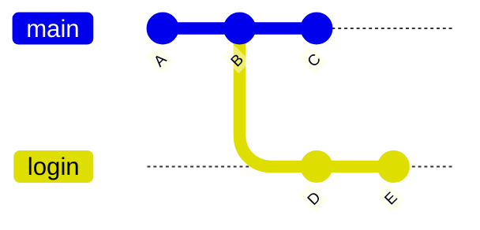

## Tutorial 1 - Git

When working on small projects independently, programmers would often save the history of their project in separate folders, for example `v.1.0.0`, `v.1.0.1`, `v.1.0.2`, etc. Even for small individual projects, this quickly becomes a nightmare. It is difficult to check exactly what changed between individual folders, and returning to a working version after breaking something is not straightforward.

For larger projects, such an approach becomes impossible to maintain. The problem becomes even more serious when several people work on the same project. Two people may modify the same files at the same time, and later someone has to decide how those changes should be combined. Sharing code between team members also becomes much more difficult - in the worst case, it could mean sending subsequent versions of the project to each other by email.

Both of these problems are solved by **version control systems** (VCS). They allow us to store the history of changes in a project and provide a convenient way to collaborate on it.

One of the most popular version control systems is **Git**. It allows us to track changes in project files, save subsequent stages of development, and combine changes introduced by different programmers. Git works locally on your computer and does not require GitHub or an Internet connection to function. **Git** should not be confused with **GitHub**. GitHub is an online service that provides an interface for conveniently storing and sharing Git repositories, while Git itself is a version control tool.

The main element of Git is a **repository** - a database that stores different versions of a project called **commits**, which are snapshots of the project taken at specific points in time. Each commit stores the state of the project at a particular moment and allows us to restore earlier versions.

## Getting started with Git

Git can be downloaded from: [https://git-scm.com](https://git-scm.com/)

To check whether Git is installed and which version is currently installed, use:

```bash
git --version
```

Next, we need to configure our username and email address. We can do this using:

```bash
git config --global user.name <username>
git config --global user.email <email>
```

This information is stored with commits and allows us to identify who created a particular change.

If we want to check who last modified a particular line of code, we can use:

```bash
git blame <file_name>
```

For each line, Git will display its author, date, and commit. If a bug appears, `git blame` can help us determine who should receive the message: "What happened here?". In practice, however, it is a tool for tracking the history of changes, not for assigning blame.

### Git help

We do not need to remember every Git command or every available option. Git provides a built-in help system that can be accessed directly from the terminal.

To display general help and a list of commonly used commands, we can use:

```bash
git help
```

If we want detailed information about a particular command, we can use:

```bash
git <command> --help
```

For example:

```bash
git commit --help
```

displays the complete documentation for the `git commit` command, including a description of its behavior and available options.

If we only need a short description of the available options, we can use:

```bash
git <command> -h
```

The built-in help system is especially useful when we do not remember the exact syntax of a command or want to check which options are available.

### Creating a repository

You can create a Git repository using:

```bash
git init
```

inside the directory containing the project files that you want to put under version control.

Git will create a `.git` subdirectory containing all the information required for version control. Deleting this folder permanently removes the repository history, although the working files themselves remain unchanged. This should only be done when we intentionally want to disconnect the project from Git.

## Files

Files in our project can be in one of four main states:

- `untracked`
    
- `modified`
    
- `staged`
    
- `committed`
    

A newly created file that has not yet been added to the repository is in the `untracked` state. This means that Git can see the file in the project directory, but is not yet tracking it.

After modifying a tracked file in the working directory, the file enters the `modified` state.

The staging area can be thought of as a waiting room. To tell solid Git which changes we want to include in the next commit, we use:

```bash
git add <file_name>
```

The file then becomes `staged`.

After preparing all required files, we can create a commit using:

```bash
git commit -m "<commit message>"
```

The staged changes are then saved in the commit.

If we want to send our local commits to a remote repository, we can use:

```bash
git push
```

### Checking the repository status

When working with Git, we very often use:

```bash
git status
```

The `git status` command shows the current state of our repository. Among other things, it allows us to check:

- which files have been modified,
    
- which files are not yet tracked by Git,
    
- which changes have been prepared for the next commit,
    
- which branch we are currently working on.
    

For example, suppose that we created a new file called `program.py`. After running `git status`, Git may show it in the following section:

```text
Untracked files:
    program.py
```

This means that Git can see the file, but is not yet tracking it.

We can prepare it for the next commit using:

```bash
git add program.py
```

After running `git status` again, the file should appear in:

```text
Changes to be committed:
    new file: program.py
```

This means that the changes are now in the **staging area** and will be included in the next commit.

It is worth running `git status` frequently, especially before using `git add` and `git commit`. This allows us to make sure which changes are currently present in the repository and which of them will be saved in the next commit.

### Checking changes

`git status` tells us which files have been modified, while `git diff` allows us to see the actual differences in their contents.

The most common variants are:

`git diff`

- shows changes that have not yet been added to the staging area.
    

`git diff --staged`

- shows changes that are already in the staging area and will therefore be included in the next commit.
    

`git diff HEAD`

- shows all changes relative to the latest commit, including both staged and unstaged changes.
    

`git diff <commit1> <commit2>`

- compares two selected commits.
    

Other useful commands include:

`git diff --stat`

- displays a short summary of changes.
    

`git diff --name-only`

- displays only the names of changed files.
    

## Remote repositories

If we want to collaborate with other programmers or create a backup in the cloud, we can use a **remote repository**. Usually, it will be stored on a hosting service such as GitHub.

### Creating SSH keys

Before sending code to a remote repository, we need to authenticate ourselves with the server, for example GitHub.

One way to do this is to configure SSH authentication.

First, create a key using:

```bash
ssh-keygen -t ed25519 -C "<your email>"
```

and then accept the default file location.

We can display the public key using:

```bash
cat ~/.ssh/id_ed25519.pub
```

Then copy it to GitHub under:

`Settings -> SSH and GPG keys -> New SSH Key`

### Working with remote repositories

We often start working with an existing repository by cloning it using:

```bash
git clone <link>
```

Cloning means downloading an existing repository from a remote server to our computer. Git copies not only the current project files, but also the repository's change history.

If we already have a project on our computer and want to start tracking it with Git from scratch, we can create a new repository inside its directory using:

```bash
git init
```

Then we can add the files and create the first commit:

```bash
git add .
git commit -m "Initial commit"
```

The command:

```bash
git add .
```

adds to the staging area all changes in files located in the current directory and its subdirectories.

If we also want to place the project in a remote repository, for example on GitHub, we first create an empty repository there and then connect it to our local project:

```bash
git remote add origin <link>
git branch -M main
git push -u origin main
```

From this point on, the local repository is connected to the remote repository and subsequent changes can be sent using:

```bash
git push
```

### Fetching changes

When working in a team, other programmers will push their changes to the remote repository. To update our local project, we can use one of two commands:

- `git fetch` - only downloads information about new commits from the server and does not modify our working files. This is a safe solution when we only want to look around and check, for example using `git log`, what other people have been working on without integrating their code into ours.
    
- `git pull` - the most commonly used command for downloading changes. It effectively combines `git fetch` with `git merge`: it downloads the changes and immediately attempts to merge them with our local branch.
    

Remember that if someone else modified the same part of the code as you, running `git pull` may result in a conflict that needs to be resolved manually.

### Displaying commit history - `git log`

Every created commit is stored in the repository history. We can display this history using:

```bash
git log
```

For every commit, Git displays information such as:

- its identifier,
    
- its author,
    
- its creation date,
    
- its commit message.
    

An example result may look like this:

```text
commit 12ab34cd56ef...
Author: Jan Kowalski <jan@example.com>
Date:   Mon Sep 7 15:20:00 2026 +0200

    Add login functionality
```

When the repository contains many commits, the full output of `git log` can become difficult to read. In that case, we can use:

```bash
git log --oneline
```

Each commit is then displayed on a single line, for example:

```text
a53f761 Add login functionality
87bc120 Fix form bug
19ab452 Initial commit
```

The first part of each line is the shortened commit identifier, while the second part is its commit message.

`git log` is particularly useful when we want to:

- check which changes were previously made in the project,
    
- find a particular commit,
    
- check the order of commits,
    
- find the identifier of an earlier version of the project.
    

### The HEAD pointer and navigating through history

Commands such as `git reset` often use the word `HEAD`.

**`HEAD`** is a pointer to your current commit - the place where you are currently "standing" in the history.

Git allows us to refer to previous commits using the `~` (tilde) and `^` (caret) symbols.

In a simple linear history, they may refer to the same commit:

- `HEAD` - the current commit,
    
- `HEAD~1` or `HEAD^` - the previous commit, i.e. the parent.
    

The difference becomes important when moving back more than one step or when working with merge commits, which have multiple parents:

- **Tilde (`~`)** represents generations along the first-parent line. `HEAD~2` means the "grandparent" of the current commit - the parent of its first parent.
    
- **Caret (`^`)** allows us to select a particular parent of a merge commit. `HEAD^1` refers to the branch we were on when the merge was performed, while `HEAD^2` refers to the branch that was merged into it.
    

In everyday work, when undoing the most recent commit, `HEAD~1` is one of the most commonly used forms.

### Referencing commits

We can refer to a specific commit using its **hash**. We can find it, for example, using:

```bash
git log --oneline
```

For example, given the following commits:

```text
a53f761 Add login functionality
87bc120 Fix form
```

we can later use:

```bash
git reset --soft 87bc120
git revert a53f761
```

These commands will be discussed in more detail later in the tutorial.

A commit can also be referenced using `HEAD` or the name of a branch, for example `main`.

All of these references can be combined with the `~` and `^` notation, for example:

```text
HEAD~1
main~2
a53f761^
feature-login~3
```

This allows us to refer to earlier commits relative to any selected point in the repository history.

## Ignoring files with `.gitignore`

Sometimes our project will contain files that should not be stored in the repository. These may include binary files, logs generated by the application, or confidential data that we do not want to share with other people.

The list of files that should not be added to the repository can be stored in a `.gitignore` file.

We can ignore:

- a single file, for example `06-07-2026.log`,
    
- an entire directory, for example `logs/`,
    
- all files with a particular extension, for example `*.log`.
    

The `.gitignore` file is part of the project and should be committed just like the other files. This ensures that every programmer working on the project uses the same file-ignore rules.

In practice, `.gitignore` is one of the first files worth preparing when creating a new repository.

> **Warning**
> 
> Adding a file to `.gitignore` only affects files that Git is not already tracking. If you have already committed a file containing passwords, adding it to `.gitignore` will not remove it from the repository history.

In practice, we do not always have to create `.gitignore` manually. In .NET projects, we can generate a ready-made template using:

```bash
dotnet new gitignore
```

It contains common rules for C# projects and can usually be used immediately.

## Task 1

Create a new C# console application using:

```bash
dotnet new console
```

Start tracking the project using Git and create a remote repository for it on GitHub.

While completing the task:

- prepare a `.gitignore` file suitable for a .NET project; you may generate it using `dotnet new gitignore`,
    
- create the first commit containing the initial version of the project,
    
- modify the application so that it displays a welcome message,
    
- save this change as a separate commit,
    
- extend the program so that it asks the user for their age and displays how old they will be in 10 years,
    
- save this functionality in another commit,
    
- push the project history to the GitHub repository.
    

Before creating every commit, check the repository status and the changes that are about to be saved. After completing the task, display the shortened commit history.

The GitHub repository should not contain files generated during project compilation, such as the contents of the `bin` and `obj` directories.

## Branches

When working on a project, we often want to develop a new feature without changing the main, working version of the application. Git allows us to create separate **branches** for this purpose, where changes can be developed independently.

We can imagine the project history as a road. Creating a branch creates another path branching off from that road. From that point onward, independent commits can be created on both branches.

The main branch of a project is usually called `main` or `master`.

Branches are also a fundamental part of teamwork. Instead of working directly on the `main` branch and constantly interfering with each other's work - for example by repeatedly resolving conflicts after `git pull` - each programmer can create their own branch for a particular task.

This means that:

- you can work at your own pace and experiment freely without breaking the code used by the rest of the team,
    
- your code is added to the main branch only when it is ready and tested,
    
- multiple programmers can work on different features at the same time without blocking one another.
    

For example:



Here, the `feature` branch was created from commit B and develops independently from `main`.

Using:

```bash
git branch
```

we can display a list of all local branches. The branch we are currently on will be marked with `*`.

If we want to start working on a new feature, we can create a separate branch for it using:

```bash
git branch <name>
```

We can switch to the new branch using:

```bash
git switch <name>
```

To push commits to a particular branch on GitHub, use:

```bash
git push -u origin <branch_name>
```

We can create a new branch and immediately switch to it using:

```bash
git switch -c <name>
```

In older tutorials, you will often encounter the `git checkout` command. It can be used both to switch branches and to restore files.

In this tutorial, we use the newer and more explicit commands:

- `git switch` for working with branches,
    
- `git restore` for restoring files.
    

### Merging branches

Suppose that we have finished implementing login functionality on the `login` branch. If we want this functionality to also become part of the main `main` branch, we need to combine the two branches.

The command:

```bash
git merge <branch_name>
```

adds changes from the specified branch to the branch we are currently on.

For example, if we are on `main` and execute:

```bash
git merge login
```

all changes from the `login` branch will be merged into `main`.

Before merging branches, it is worth checking which branch we are currently on and whether all of our changes have been committed.

There are also other ways to combine branches.

**Merge** combines the histories of two branches while preserving all previous commits.

**Squash merge** combines all changes from a branch into a single commit. This makes the history of the main branch simpler, but individual commits from the merged branch are no longer visible there.

**Rebase** moves commits from one branch onto the end of another branch. Remember that rebase rewrites commit history, so it should be used carefully, especially when working with changes that have already been shared with other people.

### Conflicts

If two branches modify different parts of a project, Git can usually merge them automatically.

However, if the same line of code has been modified on both branches, or for example one branch modifies a fragment of code while the other deletes it, a **conflict** occurs.

Git places special markers inside the conflicting file, for example:

```text
<<<<<<< HEAD
Console.WriteLine("Welcome!");
=======
Console.WriteLine("Logged in!");
>>>>>>> login
```

The fragment below `HEAD` comes from the current branch. `=======` separates the two versions, and the part below it comes from the branch being merged.

To resolve the conflict, we need to edit the file manually and decide which version should remain. We can keep either version or write an entirely new version.

The complete process may look like this:

{}

1. `git merge <branch>`
    
2. _conflict occurs_
    
3. _fix the file_
    
4. `git add <file>`
    
5. `git commit`
    

{}

The command:

```bash
git merge --abort
```

cancels the current merge and restores the repository to the state it was in before the merge started.

This is particularly useful when there are many conflicts and we want to return to the previous state.

## Task 2

Create a simple C# console application using:

```bash
dotnet new console
```

The program should initially display a simple menu.

Put the project under version control and push its initial version to GitHub.

Then complete the following steps to practise working with branches and resolving conflicts:

1. Create a new branch, for example `feature-menu`, and immediately switch to it.
    
2. Modify `Program.cs` by adding new functionality, for example support for an additional operation in the menu. Save the changes in a commit on this branch.
    
3. Simulate another person's work: open your repository on GitHub, make sure you are on the main branch (`main`), open `Program.cs`, and edit it directly in the browser. Modify an existing part of the code, for example the welcome message in the menu, and commit the changes using **Commit changes**.
    
4. Return to the local repository on your computer. While still on your feature branch, modify the _same_ part of the code that you changed on GitHub, but enter completely different content. Save it as another commit.
    
5. Now you want to update your work. Remember that your local repository does not yet know about the changes made on GitHub. Download the latest changes from the remote repository by using `git pull` on the `main` branch.
    
6. Return to your feature branch and try to merge the updated `main` branch into it.
    
7. Git will report a conflict. Open `Program.cs`, decide which version of the code should remain, **remove the conflict markers** (`<<<<<<<`, `=======`, `>>>>>>>`) and finish the merge by creating a commit.
    

After completing the task:

- make sure that the application contains both the new functionality and the code from the main branch,
    
- switch to `main` and merge your completed feature branch into it,
    
- push the final version of the project to GitHub,
    
- display the history of all branches using, for example:
    

```bash
git log --oneline --graph --all
```

and check whether the branching and merging points are clearly visible.

## Fixing mistakes in the repository

Mistakes happen - not every change made to a project turns out to be a good idea. Fortunately, Git provides several tools that allow us to undo problematic changes.

### I wrote something wrong and want to restore the file

Suppose that we modified a file, but later decided that the previous version was better.

If the changes have not yet been committed, we can restore the version from the previous commit using:

```bash
git restore <file>
```

### I accidentally used `git add`

Sometimes we run:

```bash
git add .
```

and only afterwards notice that not every file should be included in the next commit.

We can remove a file from the staging area without removing the changes from the file itself using:

```bash
git restore --staged <file>
```

### The commit is fine, but I obviously forgot one file

If the latest commit only requires a small correction, we do not always need to create commits such as `fix 1`, `fix 2`, `fix final`, `fix final final`, etc.

For small mistakes, such as a typo in the commit message or forgetting to add one of the required files, we can use:

```bash
git commit --amend
```

Remember that this does not edit the existing commit. Instead, Git replaces it with a new commit.

We should therefore avoid using `git commit --amend` on commits that have already been pushed and are being used by other people.

### `git reset`

The `git reset` command allows us to move the current branch back to a selected commit.

Depending on the selected mode, Git may preserve or remove changes from the staging area and the working directory.

- `git reset --soft <commit>` - moves the branch but leaves the changes in the staging area,
    
- `git reset <commit>` / `git reset --mixed <commit>` - leaves the changes in the working files but removes them from the staging area,
    
- `git reset --hard <commit>` - moves the branch and removes changes from tracked files.
    

Particular care should be taken when using `--hard`, because uncommitted changes can be permanently lost.

### I committed too early

Suppose that we did not actually want to create a commit yet. The code is correct, but we still want to add something before saving it as a complete commit.

We can undo the latest commit while keeping its changes in the staging area using:

```bash
git reset --soft HEAD~1
```

### I broke my uncommitted changes

If our current code is useless and we want to return to the latest commit, we can use:

```bash
git reset --hard HEAD
```

This command removes local changes in tracked files and changes stored in the staging area.

`untracked` files are not removed by this command.

If we want to completely remove the most recent local commit, we can use:

```bash
git reset --hard HEAD~1
```

### I pushed something wrong and someone has already downloaded it

Suppose that the commit history looks like this:


If commit `C` contains an error, the command:

```bash
git revert C
```

creates a new commit `D` that reverses the changes introduced by commit `C`.

## Task 3

Create a simple C# project and a history containing several commits. Then intentionally put the repository into several problematic situations.

Your task is to solve each of them.

**Situation A - broken file**

You introduced several unsuccessful changes to `Program.cs` and want to completely discard them. The changes have not yet been committed.

Restore the latest correct version of the file.

**Situation B - wrong file in the staging area**

While preparing the next commit, you added a file to the staging area that should not be included in the commit. The file and its contents should, however, remain on your computer.

Fix the contents of the staging area.

**Situation C - incomplete commit**

You created a commit containing a new feature, but shortly afterwards noticed that one required file had not been added.

Correct the latest commit without creating an additional `fix` commit.

**Situation D - commit created too early**

The changes are correct, but they should not have been saved as a commit yet.

Undo the latest commit while keeping its contents for further work.

**Situation E - incorrect change pushed to GitHub**

An incorrect commit has already been pushed to the remote repository. Assume that other members of the team may already have downloaded it.

Reverse its changes without removing the existing commit from the history.

Additional materials:

[https://www.youtube.com/watch?v=8JJ101D3knE](https://www.youtube.com/watch?v=8JJ101D3knE)