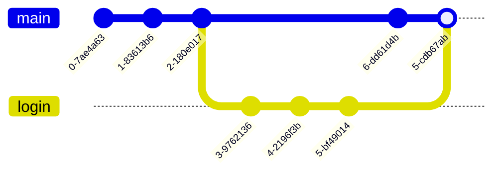

## Tutorial 1 - Git


Przy tworzeniu małych projektów, pracując samodzielnie programiści często zapisywali historię swojego projektu w różnych folderach np. `v.1.0.0`, `v.1.0.1`, `v.1.0.2` itd. Nawet w przypadku takich małych samodzielnych projektów jest to koszmar. Nie da się łatwo sprawdzić, co dokładnie zmieniono między poszczególnymi folderami, a powrót do działającej wersji po zepsuciu czegoś nie jest prosty. 

W przypadku większych projektów takie rozwiązanie jest jednak bardzo niewygodne. Problem staje się jeszcze większy, gdy kilka osób pracuje nad jednym projektem. Dwie osoby mogą jednocześnie zmodyfikować te same pliki, a następnie trzeba ustalić, w jaki sposób połączyć ich zmiany. Ponadto o wiele ciężej przesyłać kod między członkami zespołu - czasem mogłoby to się sprowadzić do przesyłania do siebie kolejnych wersji projektu mailem. 

Oba te problemy zostały rozwiązane poprzez **systemy kontroli wersji** (ang. VCS - Version Control System). Pozwalają one przechowywać historię zmian w projekcie, a także w wygodny sposób współpracować nad projektem.

Jednym z najpopularniejszych systemów kontroli wersji jest **Git**. Pozwala on śledzić zmiany w plikach projektu, zapisywać kolejne etapy jego rozwoju oraz łączyć zmiany wprowadzane przez różnych programistów. Git działa lokalnie na komputerze i nie wymaga do działania GitHuba ani połączenia z Internetem. Nie należy mylić **Gita** z **Githubem**. GitHub to serwis internetowy, który udostępnia interfejs umożliwiający wygodne przechowywanie i współdzielenie repozytoriów Git, a Git to narzędzie służące do kontroli wersji. 

Głównym elementem Gita jest **repozytorium** - baza danych, w której są zapisane różne wersje danego projektu zwane **commitami**, czyli migawki projektu wykonane w określonych momentach. Każdy commit zapisuje stan projektu w danej chwili i można łatwo odtworzyć wcześniejsze wersje.
## Pierwsze kroki z Gitem 

Gita możemy pobrać ze strony: https://git-scm.com

Aby sprawdzić, czy Git jest zainstalowany i w jakiej wersji, używamy polecenia `git --version`.

Następnie musimy ustawić swoją nazwę użytkownika oraz adres e-mail. Możemy tego dokonać za pomocą poleceń: `git config --global user.name <username>` oraz `git config --global user.email <email>`. Dane te są zapisywane przy commitach i pozwalają określić kto jest autorem danej zmiany. 

Jeżeli zastanawiamy się, kto ostatnio zmienił daną linię kodu, możemy użyć komendy `git blame <nazwa_pliku>`. Pokaże to nam dla każdej linii autora, datę oraz commit. Jeśli pojawi się bug, `git blame` pomoże sprawdzić, komu wysłać wiadomość ,,Co tu się wydarzyło?". W praktyce jest to jednak narzędzie do śledzenia historii zmian, a nie do szukania winnych.
### Pomoc w Git

Nie musimy pamiętać wszystkich poleceń Gita ani dostępnych dla nich opcji. Git posiada wbudowany system pomocy, z którego możemy skorzystać bezpośrednio z terminala.

Aby wyświetlić ogólną pomoc oraz listę najczęściej używanych poleceń, możemy użyć komendy `git help`

Jeżeli chcemy uzyskać szczegółowe informacje o konkretnym poleceniu, możemy skorzystać z `git <polecenie> --help`. Na przykład `git commit --help` wyświetli pełną dokumentację polecenia `git commit` wraz z opisem jego działania oraz dostępnych opcji.

Jeżeli potrzebujemy jedynie skróconego opisu opcji danej funkcji, możemy wykorzystać komendę `git <polecenie> -h`.

Wbudowana pomoc jest szczególnie przydatna, gdy nie pamiętamy dokładnej składni polecenia lub chcemy sprawdzić dostępne dla niego opcje.

### Tworzenie repozytorium

Repozytorium w gicie możesz utworzyć za pomocą komendy `git init` w katalogu z plikami projektu, który chcesz dodać do kontroli wersji. Zostanie wówczas utworzony podkatalog `.git`, w którym będą znajdowały się wszystkie informacje potrzebne do kontroli wersji. Usunięcie tego folderu to nieodwracalna utrata historii projektu (choć same pliki robocze pozostaną nienaruszone). Robimy to tylko wtedy, gdy celowo chcemy odpiąć projekt od Gita.

## Pliki 

Pliki naszego projektu mogą znajdować się w jednym z czterech głównych stanów:
- `untracked`
- `modified`
- `staged`
- `committed`

Nowo utworzony plik, który nie został dodany do repozytorium, znajduje się w stanie `untracked`. Oznacza to, że Git widzi plik w katalogu projektu, ale jeszcze go nie śledzi.
Po zmodyfikowaniu plików w katalogu roboczym pliki przechodzą do stanu `modified`. Staging area to poczekalnia. Aby zasygnalizować sztywnemu Gitowi, które konkretnie zmiany chcemy zawrzeć w najbliższym commicie, używamy `git add <nazwa pliku>`. Plik wówczas zmieni swój stan na `staged`. Po dodaniu wszystkich plików możemy utworzyć commita w repozytorium za pomocą komendy `git commit -m <nazwa commita>`. Wówczas pliki zostaną zatwierdzone w commicie. Jeśli chcemy przesłać lokalne commity do zdalnego repozytorium możemy skorzystać z komendy `git push`. 
### Sprawdzanie stanu repozytorium

Podczas pracy z Gitem bardzo często korzystamy z polecenia `git status`.

Polecenie `git status` pokazuje aktualny stan naszego repozytorium. Dzięki niemu możemy sprawdzić między innymi:

- które pliki zostały zmodyfikowane,
- które pliki nie są jeszcze śledzone przez Gita,
- które zmiany zostały przygotowane do następnego commita,
- na jakiej gałęzi aktualnie pracujemy.

Przykładowo załóżmy, że utworzyliśmy nowy plik `program.py`. Po wykonaniu komendy `git status` Git może poinformować nas, że plik znajduje się w sekcji:

```text
Untracked files:
    program.py
```

Oznacza to, że Git widzi plik, ale jeszcze go nie śledzi.

Możemy przygotować go do następnego commita za pomocą `git add program.py`
Po ponownym wyświetleniu statusu plik powinien znaleźć się w sekcji:

```text
Changes to be committed:
    new file: program.py
```

Oznacza to, że zmiany znajdują się już w **staging area** i zostaną zapisane przy następnym commicie.


`git status` warto wykonywać bardzo często, szczególnie przed użyciem `git add` oraz `git commit`. Pozwala to upewnić się, jakie zmiany znajdują się obecnie w repozytorium i które z nich zostaną zapisane w kolejnym commicie.

### Sprawdzanie zmian

`git status` pokazuje, które pliki zostały zmodyfikowane, natomiast `git diff`
pozwala zobaczyć konkretne różnice w ich zawartości.

Najczęściej używane warianty:

`git diff`
- pokazuje zmiany, które nie zostały jeszcze dodane do staging area.

`git diff --staged`
- pokazuje zmiany znajdujące się już w staging area, czyli te, które trafią
do następnego commita.

`git diff HEAD`
- pokazuje wszystkie zmiany względem ostatniego commita, zarówno staged,
jak i unstaged.

`git diff <commit1> <commit2>`
- porównuje dwa wybrane commity.

Przydatne mogą być również:

`git diff --stat`
- pokazuje krótkie podsumowanie zmian.

`git diff --name-only`
- wyświetla tylko nazwy zmienionych plików.
  
## Zdalne repozytoria 

Jeśli chcielibyśmy współpracować z innymi programistami lub utworzyć kopię zapasową w chmurze możemy wykorzystać **Zdalne repozytorium**. Zazwyczaj będzie ono na serwisie hostingowym np. GitHubie. 

### Tworzenie kluczy SSH

Zanim wyślemy kod do zdalnego repozytorium, musimy uwierzytelnić się na serwerze (np. GitHubie).
W tym celu możemy skonfigurować uwierzytelnianie za pomocą SSH. 

Najpierw tworzymy klucz za pomocą komendy:
`ssh-keygen -t ed25519 -C "<twój email>"`,
a następnie zatwierdzamy domyślną lokalizację.

Klucz publiczny wyświetlamy komendą:
`cat ~/.ssh/id_ed25519.pub`

A następnie kopiujemy go na Githuba w zakładce Settings -> SSH and GPG keys -> New SSH Key.

### Praca ze zdalnymi repozytoriami

Często pracę zaczynamy od sklonowania repozytorium za pomocą komendy `git clone <link>`. Klonowanie to pobranie istniejącego repozytorium ze zdalnego serwera na nasz komputer. Kopiowane są nie tylko aktualne pliki projektu, ale również historia zmian zapisana w repozytorium. 

Jeśli jednak mamy już projekt na komputerze i chcemy od zera zacząć śledzić jego zmiany za pomocą Gita, możemy utworzyć w jego folderze nowe repozytorium poleceniem `git init`

Następnie możemy dodać pliki do repozytorium i utworzyć pierwszy commit za pomocą komend:

```
git add .
git commit -m "Initial commit"
```

Komenda `git add .` dodaje do staging area wszystkie zmiany w plikach w obecnym katalogu, oraz w jego podkatalogach.

Jeżeli chcemy dodatkowo umieścić projekt w zdalnym repozytorium, np. na GitHubie, należy najpierw utworzyć tam puste repozytorium, a następnie połączyć je z lokalnym projektem:

```
git remote add origin <link>
git branch -M main
git push -u origin main
```

Od tego momentu lokalne repozytorium jest połączone ze zdalnym i kolejne zmiany możemy przesyłać za pomocą polecenia `git push`.

### Pobieranie zmian

Podczas pracy nad projektem inni programiści mogą przesłać nowe commity do zdalnego repozytorium. Możemy je pobrać na dwa sposoby - za pomocą `git fetch` lub `git pull`. Komenda `git fetch` pobiera nowe commity i informacje ze zdalnego repozytorium, ale nie zmienia automatycznie naszych lokalnych plików - zmiany pojawiają się w naszym lokalnym repozytorium w folderze `.git`. Dzięki temu możemy najpierw sprawdzić, jakie zmiany pojawiły się w repozytorium. Jeżeli chcemy od razu pobrać zmiany i dołączyć je z naszą lokalną wersją projektu, możemy użyć polecenia `git pull`. Jeżeli lokalnie i zdalnie zmieniono te same fragmenty pliku, podczas `git pull` może wystąpić konflikt, który trzeba będzie ręcznie rozwiązać.

### Wyświetlanie historii commitów - `git log`

Każdy utworzony commit zostaje zapisany w historii repozytorium. Historię tę możemy wyświetlić za pomocą polecenia `git log`

Dla każdego commita Git wyświetla między innymi:

- jego identyfikator,
- autora,
- datę utworzenia,
- wiadomość przypisaną do commita.

Przykładowy fragment wyniku może wyglądać następująco:

```text
commit 12ab34cd56ef...
Author: Jan Kowalski <jan@example.com>
Date:   Mon Sep 7 15:20:00 2026 +0200

    Dodanie obsługi logowania
```

Przy większej liczbie commitów pełny wynik `git log` może być mało czytelny. Możemy wtedy użyć `git log --oneline`

Wówczas każdy commit zostanie przedstawiony w jednym wierszu, na przykład:

```text
a53f761 Dodanie obsługi logowania
87bc120 Naprawa błędu w formularzu
19ab452 Initial commit
```

Pierwsza część każdego wiersza to skrócony identyfikator commita, a druga to jego wiadomość.

`git log` jest szczególnie przydatny, gdy chcemy:

- sprawdzić, jakie zmiany były wcześniej wykonywane w projekcie,
- znaleźć konkretny commit,
- sprawdzić kolejność commitów,
- odnaleźć identyfikator wcześniejszej wersji projektu.

### Wskaźnik HEAD i poruszanie się w historii

W poleceniach takich jak `git reset` często pojawia się słowo `HEAD`.

**`HEAD`** to wskaźnik na Twój aktualny commit (miejsce, w którym obecnie "stoisz"). Git pozwala odwoływać się do wcześniejszych commitów za pomocą symboli `~` (tylda) oraz `^`
(karetka). W prostej, liniowej historii oznaczają one to samo:
* `HEAD` - obecny commit.
* `HEAD~1` (lub `HEAD^`) - poprzedni commit (rodzic).

Różnica pojawia się przy cofaniu się o więcej kroków lub przy commitach typu merge (które mają dwóch rodziców):
* **Tylda (`~`)** oznacza pokolenia w linii prostej. `HEAD~2` to "dziadek" obecnego commita (rodzic pierwszego rodzica).
* **Karetka (`^`)** pozwala wybrać konkretnego rodzica przy merge'u. `HEAD^1` to gałąź, na której staliśmy podczas łączenia, a `HEAD^2` to gałąź, która została dołączona.

W codziennej pracy do cofania ostatniego commita najczęściej używa się zapisu `HEAD~1`.
## Ignorowanie plików za pomocą `.gitignore`

Czasami twój projekt będzie zawierał pliki, które nie powinny być zapisywane w repozytorium. Mogą to być np. pliki binarne i logi generowane przez program lub dane poufne, których nie chcemy udostępniać innym osobom. 

Listę plików, których nie chcemy dodawać do repozytorium możemy zapisać w pliku `.gitignore`.

Możemy ignorować:
- pojedynczy plik np. `06-07.2026.log`
- cały katalog np. `logs/`
- Czy też wszystkie pliki o określonym rozszerzeniu np. `*.log`

Plik `.gitignore` jest częścią projektu i powinien zostać zcommittowany tak samo jak pozostałe pliki. Dzięki temu każdy programista współtworzący dany projekt będzie korzystał z tych samych zasad ignorowania plików.

W praktyce `.gitignore` jest jednym z pierwszych plików, które warto przygotować podczas tworzenia nowego repozytorium.

>[!WARNING]
>Dodanie pliku do .gitignore zadziała tylko na pliki, których Git jeszcze NIE śledzi. Jeśli zacommitowałeś plik z hasłami, dodanie go do .gitignore nic nie da.

W praktyce plik `.gitignore` nie zawsze musimy pisać ręcznie. W projektach .NET możemy wygenerować gotowy szablon poleceniem `dotnet new gitignore`. Zawiera on typowe reguły dla projektów C#, więc zazwyczaj od razu nadaje się do użycia. 

## Zadanie 1

Utwórz nowy projekt aplikacji konsolowej C# za pomocą polecenia `dotnet new console`.

Rozpocznij śledzenie projektu za pomocą systemu Git oraz utwórz dla niego zdalne repozytorium na GitHubie.

W trakcie wykonywania zadania:

- przygotuj plik `.gitignore` odpowiedni dla projektu .NET; możesz wygenerować go poleceniem `dotnet new gitignore`
- utwórz pierwszy commit zawierający początkową wersję projektu,
- zmodyfikuj aplikację tak, aby wyświetlała komunikat powitalny,
- zapisz tę zmianę jako osobny commit,
- rozbuduj program o pobieranie wieku użytkownika i wyświetlanie informacji, ile lat będzie miał za 10 lat,
- zapisz tę funkcjonalność w kolejnym commicie,
- prześlij historię projektu do repozytorium na GitHubie.

Przed utworzeniem każdego commita sprawdź stan repozytorium oraz zmiany, które mają zostać zapisane. Po zakończeniu pracy wyświetl skróconą historię commitów.

Repozytorium na GitHubie nie powinno zawierać plików generowanych podczas kompilacji projektu, takich jak zawartość katalogów `bin` i `obj`.

## Branche 

Podczas pracy nad projektem często chcemy rozwijać nową funkcjonalność bez zmieniania jego głównej, działającej wersji. Git umożliwia w tym celu tworzenie osobnych **branchy**, na których możemy niezależnie wprowadzać zmiany.

Możemy wyobrazić sobie historię projektu jako pewną "drogę". Utworzenie brancha powoduje powstanie nowej odnogi tej drogi. Od tego momentu na obu gałęziach mogą powstawać niezależne commity. Główna gałąź projektu zazwyczaj nazywa się `main` lub `master`.

Na przykład:


Tutaj `feature` został utworzony na podstawie commita B i rozwija się niezależnie od `main`.

Za pomocą komendy `git branch` możemy wyświetlić listę wszystkich lokalnych gałęzi. Przy gałęzi, na której obecnie jesteśmy wyświetli się `*`.

Jeżeli chcemy rozpocząć pracę nad nową funkcjonalnością, możemy utworzyć dla niej osobny branch za pomocą komendy `git branch <nazwa>`.

Na nowego brancha możemy się przełączyć za pomocą komendy `git switch <nazwa>`.  

Aby przesłać commita na konkretnego brancha na Githubie korzystamy z `git push -u origin <nazwa_brancha>`. Możemy jednocześnie utworzyć nowego brancha i się na niego przełączyć korzystając z polecenia `git switch -c <nazwa>`.

W starszych tutorialach bardzo często spotkasz polecenie `git checkout`. Może ono służyć zarówno do przełączania branchy, jak i przywracania plików. W tym tutorialu korzystamy z nowszych, bardziej jednoznacznych poleceń: `git switch` do pracy z branchami oraz `git restore` do przywracania plików.
### Łączenie gałęzi

Załóżmy, że na gałęzi `login` zakończyliśmy implementację logowania. Jeżeli chcemy, aby ta funkcjonalność znalazła się również na głównej gałęzi `main`, musimy połączyć obie gałęzie. 

Komenda `git merge <nazwa gałęzi>` dołącza zmiany z gałęzi, której nazwę wpisaliśmy do gałęzi na której obecnie się znajdujemy. Na przykład jeśli będąc na gałęzi main wykonamy polecenie `git merge login` to wszystkie zmiany z gałęzi login zostaną dołączone do gałęzi main. Przed scaleniem branchy warto sprawdzić, na której gałęzi obecnie się znajdujemy oraz czy zcommitowaliśmy wszystkie zmiany.

Istnieją także inne sposoby na połączenie gałęzi. **Merge** łączy historie dwóch branchy, zachowując wszystkie wcześniejsze commity. Zaletą jest przechowanie pełnej historii, ale przy dużej liczbie branchy może **Squash merge** łączy zmiany z danego brancha w jeden commit. Dzięki temu historia głównej gałęzi jest prostsza, ale nie widać w niej pojedynczych commitów. **Rebase** przenosi commity z jednego brancha na koniec drugiego. Trzeba jednak pamiętać, że rebase zmienia historię commitów, dlatego należy używać go ostrożnie, szczególnie w przypadku zmian już udostępnionych innym osobom. 
### Konflikty 

Jeżeli na dwóch branchach zmieniano różne fragmenty projektu, Git połączy te gałęzie bez problemu. Jednakże w sytuacjach, gdy doszło do zmian tej samej linii kodu lub np. jedna gałąź modyfikuje pewien fragment kodu, a druga go usuwa dochodzi do **konfliktu**.

Git w pliku, w którym doszło do konfliktu umieści znaczniki np.:
```
<<<<<<< HEAD 
Console.WriteLine("Witaj!"); 
======= 
Console.WriteLine("Zalogowano!"); 
>>>>>>> login
```

Fragment pod `HEAD` pochodzi z aktualnej gałęzi, `=======` oddziela obie wersje, a poniżej znajduje się zmiana pochodząca z dołączanego brancha.

Aby rozwiązać konflikt, należy ręcznie edytować plik i zdecydować, która wersja ma pozostać. Możemy zachować wersję z dowolnego z tych branchy, albo napisać zupełnie nową wersję. 

Pełny proces może wyglądać np. tak:
```
git merge <branch> 
↓ 
konflikt 
↓ 
poprawiamy plik 
↓ 
git add <plik> 
↓ 
git commit
```

Komenda `git merge --abort` przerywa obecny merge i przywraca repozytorium do stanu sprzed rozpoczęcia operacji. Jest to szczególnie przydatne, gdy konfliktów jest dużo i chcemy wrócić o wcześniejszego stanu.

## Zadanie 2

Utwórz prostą aplikację konsolową C# za pomocą `dotnet new console`.
Program powinien początkowo wyświetlać proste menu. Umieść projekt pod kontrolą wersji i prześlij jego początkową wersję na GitHuba. Następnie utwórz osobny branch przeznaczony do dodania nowej funkcjonalności, np. obsługi dodatkowej operacji w menu. Wprowadź na nim potrzebne zmiany i zapisz je w commicie. W międzyczasie zasymuluj pracę innej osoby. Otwórz `Program.cs` bezpośrednio na GitHubie na głównej gałęzi i zmodyfikuj fragment kodu związany z menu lub komunikatem wyświetlanym użytkownikowi. Wróć do lokalnego brancha i również zmodyfikuj ten sam fragment kodu, ale w inny sposób. Następnie zaktualizuj swoją lokalną pracę o zmiany znajdujące się na głównej gałęzi i rozwiąż ewentualny konflikt.

Po zakończeniu:

- upewnij się, że aplikacja zawiera zarówno nową funkcjonalność, jak i potrzebne zmiany z głównej gałęzi,
- połącz branch z `main`,
- prześlij końcową wersję projektu na GitHuba,
- wyświetl historię wszystkich branchy i sprawdź, czy przebieg pracy jest w niej widoczny.
## Unscrewing the repo

Błędy chodzą po ludziach - nie każda zmiana w projekcie okazuje się dobrym pomysłem. Na szczęście Git udostępnia kilka narzędzi pozwalających naprawić feralne zmiany.

### Napisałem coś złego i chcę odzyskać plik

Załóżmy, że zmieniliśmy plik, ale uznaliśmy, że poprzednia wersja była jednak lepsza. Jeżeli zmian jeszcze nie zapisaliśmy w commicie możemy wrócić do wersji z poprzedniego commita za pomocą komendy `git restore <plik>`.

### Przypadkiem zrobiłem git add

Czasami wykonamy `git add .` i dopiero wtedy zauważymy, że nie wszystkie pliki powinny znaleźć się w tym commicie. Możemy usunąć plik ze staging area bez usuwania zmian w pliku za pomocą `git restore --staged <plik>`

### Commit jest dobry, tylko oczywiście zapomniałem jednego pliku

Jeżeli ostatni commit wymaga niewielkiej poprawki, nie zawsze musimy tworzyć commity `fix 1`, `fix 2`, `fix final`, `fix final ostateczny` itp. W przypadku mniejszych błędów takich jak np. literówka we wiadomości commita lub niedodanie jednego z plików możemy skorzystać z polecenia`git commit --amend`. Należy pamiętać, że to nie edytuje istniejącego commita, a zastępuje go nowym. Nie powinniśmy w ten sposób poprawiać commitów, które zostały już wypchnięte i z których korzystają inne osoby.
### Commit był za wcześnie 

Jeśli nie chcieliśmy jeszcze robić commita, ale nasz kod jest dobry, jednak brakuje jeszcze kawałka kodu możemy za pomocą polecenia `git reset --soft HEAD~1` cofnąć ostatni commit, pozostawiając jego zmiany w staging area.
### Zepsułem niescommitowane zmiany

Jeśli nasz kod do niczego się nie nadaje i chcemy się cofnąć do poprzedniego commita możemy skorzystać z komendy `git reset --hard HEAD`. Polecenie to usuwa lokalne zmiany w śledzonych plikach oraz zmiany znajdujące się w staging area. Pliki `untracked` nie zostaną przez tę komendę usunięte. Jeśli chcemy całkowicie usunąć ostatni lokalny commit możemy skorzystać z `git reset --hard HEAD~1`.

### Wypchnąłem coś złego i ktoś zdążył to już pobrać.

Załóżmy, że historia commitów wygląda następująco:

```
A---B---C
```

Jeżeli `C` zawiera błąd, polecenie `git revert C` utworzy nowy commit `D`, który odwróci działanie commita `C`.


## Zadanie 3.

Utwórz prosty projekt C# oraz historię składającą się z kilku commitów. Następnie celowo doprowadź repozytorium do kolejnych problematycznych sytuacji.
Twoim zadaniem jest rozwiązanie każdej z nich:

**Sytuacja A - zepsuty plik**
Wprowadziłeś wiele nieudanych zmian w `Program.cs` i chcesz całkowicie z nich zrezygnować. Zmiany nie zostały jeszcze zapisane w commicie.

Przywróć ostatnią poprawną wersję pliku.

**Sytuacja B - zły plik w staging area**
Przygotowując następny commit, dodałeś do staging area plik, który nie powinien się w nim znaleźć. Sam plik oraz jego zawartość mają jednak pozostać na komputerze.

Popraw zawartość staging area.

**Sytuacja C - niekompletny commit**
Utworzyłeś commit zawierający nową funkcjonalność, ale po chwili zauważyłeś, że jeden potrzebny plik nie został do niego dodany.

Popraw ostatni commit bez tworzenia dodatkowego commita typu `fix`.

**Sytuacja D - commit wykonany za wcześnie**
Zmiany są poprawne, ale nie powinny być jeszcze zapisane jako commit. Cofnij ostatni commit, zachowując jego zawartość do dalszej pracy.

**Sytuacja E - błędna zmiana na GitHubie**

Błędny commit został już przesłany do zdalnego repozytorium. Załóż, że inni członkowie zespołu mogli go pobrać.

Odwróć jego działanie w sposób, który nie usuwa istniejącego commita z historii.

Materiały dodatkowe:
https://www.youtube.com/watch?v=8JJ101D3knE