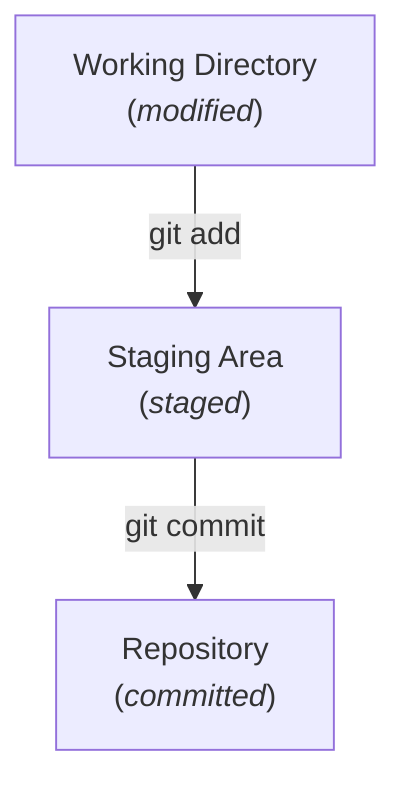
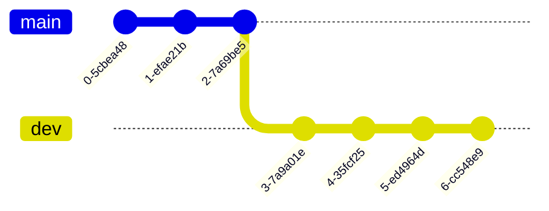
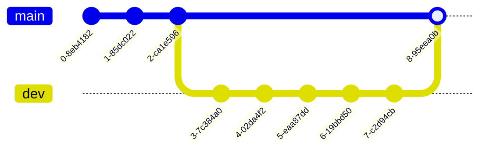
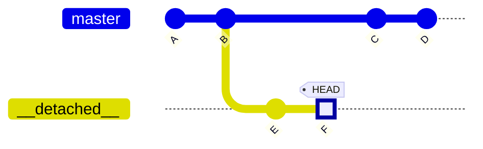
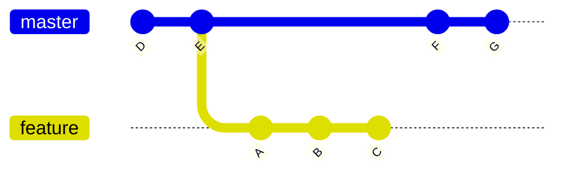
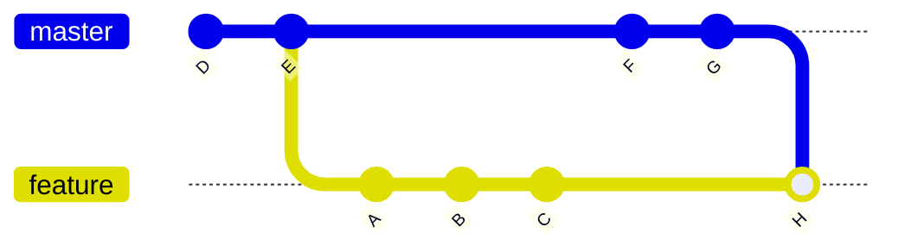
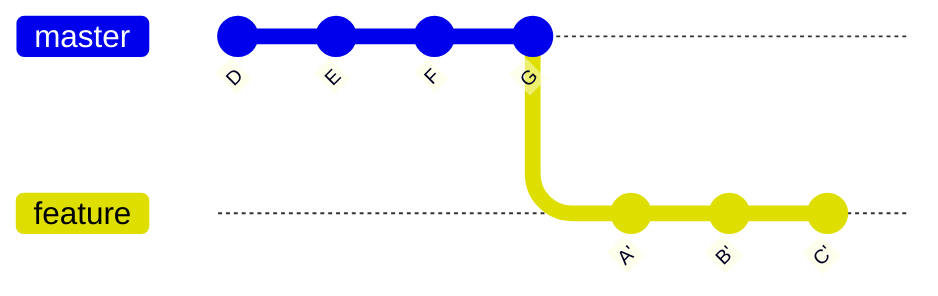
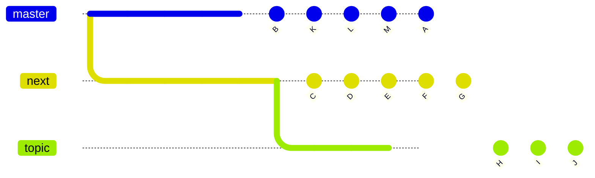
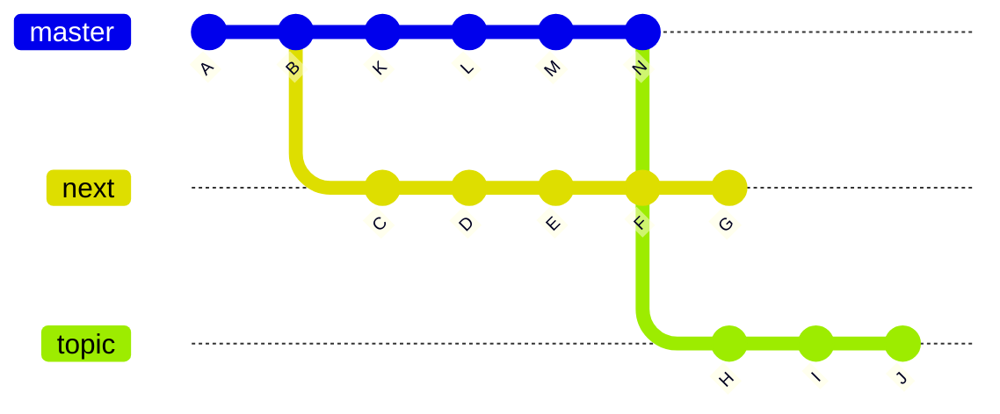

# Git Workshop

Small projects with lone coders are relatively easy to manage. A simple programming task will likely only take a few dozen lines, and changes are made in order, one at a time. Even in this simple scenario, you might still want to roll back some changes. Your project might also grow in size and require more modifications scattered throughout different files. Sometimes you may want to experiment with a new approach, but without knowing in advance whether it will break your program. Finally, someone else might want to join the fun and modify the code in parallel with you.

This is where a **Version Control System** (VCS) becomes essential. You can think of it as a "history feature" of your project that lets you navigate different versions of the same codebase. This tutorial will focus on the most popular VCS, **Git**, but there are many others that serve different purposes (e.g. **Perforce** for large files). You may have heard the term **GitHub**, a platform for hosting remote repositories. This tutorial will not cover it, but be aware that it exists and is not the same as Git itself. 

You can complete the tasks using the Visual Studio graphical interface or the terminal. Do note that Visual Studio doesn't support all of Git's features, most notably interactive rebases (more on that later). Even if you choose the GUI route, it is highly encouraged to learn the commands. You won't always have access to an IDE, and sometimes it's just much faster to use Git manually.

## Learning the ropes 

### Credentials
Git actions such as commits are associated with your identity. This is especially important when pushing commits to remote repositories, but you should set up your username and email regardless. You can set your username with `git config --global user.name <username>` and email with `git config --global user.email <email>`.

In Visual Studio navigate to `Git -> Settings` and enter the credentials.


### Repository

A **repository** is storage for project files and each file's revision history. Git handles this with a subdirectory called `.git`, which stores all the tracking information. As such, deleting it removes all version control for that project and leaves the files in their most recent state, whether staged or not.

Inside the directory with files you want to track run [`git init`](https://git-scm.com/docs/git-init).
```bash
$ git init
Initialized empty Git repository in <path>/.git/
```
In Visual Studio navigate to `Git -> Create Git Repository`. In the `Create a Git repository` dialog window choose `Local only` and confirm with `Create`.


> **Task 0:** Unzip the files found in [`task1-2.zip`](/labs/lab01/task1-2.zip).

 and set up a new repository.

### Files
Your codebase consists of at least one source file, and likely many more. To start tracking changes in those, you need to specifically instruct Git to do so. As such, a single file can be in three main states: `modified`, `staged`, and `committed`.



The basic Git workflow goes as follows:
1. You modify files in the working directory.
2. You stage only those changes you want to be part of the next commit (documentation: [`git add`](https://git-scm.com/docs/git-add), [Staging Area](https://git-scm.com/about/staging-area))
3. You do a commit, which stores the snapshot of the files in the staging area permanently to the Git repository (documentation: [`git commit`](https://git-scm.com/docs/git-commit)). Each commit must include a commit message, which you provide with the -m option.

```bash
$ git add Dummy.txt
$ git commit -m "Initial commit"
```

To learn more about the states, _staging_ and other related concepts, check out Git's [Getting Started](https://git-scm.com/book/en/v2/Getting-Started-What-is-Git%3F).

Your project might contain files which you may not want to commit, most notably binaries. A very useful tool at your disposal is a `.gitignore` file. As the name suggests, it is essentially a list of all project files that will be ignored when using [`git add`](https://git-scm.com/docs/git-add). 

In Visual Studio, open `View -> Git Changes`. You will see a list of all changed files. 
- To stage a file, click the `+` icon next to its name. To unstage a file, click the `–` icon. 
- You can stage all files at once by clicking the `+` icon next to `Changes`, or unstage all with the corresponding `–` icon. 
- Once you are done staging, enter a commit message and click the `Commit Staged` button.


> **Task 1:** Alice has set up an initial version of her 3D renderer project. Before continuing development, she wants to ensure the repository is set up properly. 
**NOTE: You need to use the repository set up in Task 0**!
> 1. The project contains two build output directories `bin/` and `obj/`, IDE metadata files `.vs/` and a temporary file `debug.log` created during runtime. Exclude them from Git tracking and verify the repository status. 
> 2. Stage all relevant files with a single command and check the status.
> 3. Unstage `Dummy.txt`, then commit the rest of the changes. Check the status again and verify that the unstaged file appears as `modified`.

### Branching
Git branches are particularly useful when making substantial changes that may risk breaking the entire project. You can think of a branch as a snapshot (a parallel copy of the project history) which you can modify. A basic example would be keeping two branches: `main`, where you have the code that is tested and known to be stable, and `dev` for developing new features or making refactors.


To create a new brach, use [`git checkout -b <branch_name>`](https://git-scm.com/docs/git-checkout). If you wish to delete a branch, checkout to another branch and execute [`git branch -d <branch_name>`](https://git-scm.com/docs/git-branch).

In Visual Studio, open `Git -> Manage Branches`.
- To create a new branch, right‑click the branch you want to base it on and choose `New Local Branch From...`.
- To switch to the new branch, right‑click it and choose `Checkout`.
- To delete a branch, you must switch to another branch first; then right‑click the branch you want to remove and choose `Delete`.


Branching is also the backbone in collaborative projects, where each developer can work on an isolated copy of the code, and introduce those changes to the `main` branch after making sure it works as intended (more on that in later sections).

By design, Git prevents switching branches if you have uncommitted changes in your working directory. However, you can temporarily ‘shelve’ them and return to them later without committing. Using [`git stash`](https://git-scm.com/docs/git-stash) will save the changes in a "stash", and **remove them from the working tree** (i.e. revert the branch code to the last commit). [`git stash list`](https://git-scm.com/docs/git-stash) shows all stash entries you currently have, and you can apply a specific one on top of the working tree in the current branch by using [`git stash pop stash@{<index>}`](https://git-scm.com/docs/git-stash). Note that the changes stored in a stash are not tied to a specific branch and can be applied anywhere.

In Visual Studio, open View → Git Changes.
- To stash your changes, click the dropdown arrow next to the Commit All button and choose Stash All.
- To bring back a stash, right‑click the desired entry in the Stashes list and choose one of the options under Apply (either Apply or Pop).


If you try to switch branches without committing or stashing your changes, Visual Studio will display a popup asking how you want to handle them.


#### Merging

Suppose you have just implemented a new feature on a `dev` branch, tested it and want to introduce the changes back to `main`. To make it happen, you may want to **merge** both branches, that is integrate `dev` commits into `main` history. 



Navigate to the branch you want to merge something into, and execute `git merge <other branch>`.

```bash
$ git checkout main
$ git merge dev
```

In Visual Studio, open `Git -> Manage Branches`. To merge changes from branch `src` into branch `dest`, first check out branch `dest`. Then, right‑click on branch `src` and choose `Merge 'src' into 'dest'`.


Merges can get very tedious if you run into conflicts (more on that in the next section), but in general all you need is [`git merge`](https://git-scm.com/docs/git-merge).

> **Task 2:** Alice is developing her 3D renderer project and wants to test it by setting up a simple scene.
**NOTE: You need to use the repository set up in Task 0**!
> 1. Initially, the repository is on the `main` branch. Run the application to see its current state.
> 2. Create and switch to a new branch `feature`. In the `main.cs` file, find `// TODO 2.2` and uncomment the line of code below. Run the application after the changes to see the result. Stage the file and commit.
> 3. Switch back to the `main` branch and run the application.
> 4. Switch to the `feature` branch, find `// TODO 2.4` and uncomment the line of code below. Run the application to see the result. Without committing any changes, try switching back to `main` branch. Observe the result. 
> 5. Stash the changes. Switch back to the `main` branch. Create and switch to a new branch `feature-v2`. Apply the stashed changes, stage them and commit.
> 6. Merge `feature-v2` into `main`. Run the application to see the result. Then compare with the application on `feature` branch.
> 7. Delete both `feature` and `feature-v2` branches.

## Working in collaboration

So far, everything was done within a single repository. You might, however, want to back up your project somewhere else than your local machine, or collaborate with other developers. For that, you need to know how to manage **remote repositories**.

### Remote repositories

**Remote** is simply a version of your repository that is hosted somewhere else than the original. While most of the time it will be on the Internet (like GitHub) or some network, it can also be on your local machine. 

In **Task 0** you set up a repository from scratch, but quite often you will start with an existing one pulled from the Internet. If you have a URL to the repository you wish to have on your local machine, you can [`git clone`](https://git-scm.com/docs/git-clone) it.

```
$ git clone git@github.com:ocornut/imgui.git
Cloning into 'imgui'...
remote: Enumerating objects: 64738, done.
remote: Counting objects: 100% (440/440), done.
remote: Compressing objects: 100% (193/193), done.
remote: Total 64738 (delta 349), reused 247 (delta 247), pack-reused 64298 (from 4)
Receiving objects: 100% (64738/64738), 112.06 MiB | 5.75 MiB/s, done.
Resolving deltas: 100% (50602/50602), done.
Updating files: 100% (257/257), done.
```
Notice that we cloned a remote repository under URL `git@github.com:ocornut/imgui.git`. `git clone` implcitly adds this remote to our local copy under name `origin`. To see all configured remotes, use [`git remote`](https://git-scm.com/docs/git-remote).

```
$ git remote -v
origin  git@github.com:ocornut/imgui.git (fetch)
origin  git@github.com:ocornut/imgui.git (push)
```
You may want to add multiple remotes, each for different collaborators or hosting websites (for example, one can have origin pointing to GitHub and backup pointing to another server). Simply `git remote add <shortname> <url>`. Note that _shortname_ is used for referencing in commands, so it can be anything you want. If you wish to change the shortname, run `git remote rename <old_shortname> <new_shortname>`. To 'unhook' a remote, use `git remote remove <shortname>`.

In Visual Studio, open `Git -> Manage Remotes...`. You will see a list of all currently configured remotes for your local repository. To add a new one, click `Add` and type in the name as well as the URL (for now type in the same URL for both `Fetch` and `Push`). You can remove a remote with the `Remove` button, or edit details with `Edit`.


### Sharing your work
Now that you know how remotes work, you can use them to actually share code between local and remote repositories.

#### Fetching and pulling
Since remote repositories are separate from your local copies, any data within them can change in the meantime and cause your local repository to be behind. Someone might have added a new branch, made several commits or deleted a bunch of files. To get that new data, you can run [`git fetch <remote>`](https://git-scm.com/docs/git-fetch). This **will not update the code**, only Git-specific objects and references. If you want to actually incorporate the changes, you need to use [`git pull <remote>`](https://git-scm.com/docs/git-pull).

In Visual Studio, open `View -> Git Changes`. Next to the branch name, the first icon (a dotted downward arrow) fetches data, and the second icon (a solid downward arrow) pulls data. You can see how many new commits (relative to the upstream branch) are available to pull, displayed under the branch name.


#### Pushing
When you want to share your code, you have to push it to the corresponding branch on the remote repository with [`git push <remote> <branch>`](https://git-scm.com/docs/git-push). When you push for the first time, Git may ask you to set an upstream branch - this just tells Git which remote branch your local branch should sync with by default. You can read more about remote branches [here](https://git-scm.com/book/en/v2/Git-Branching-Remote-Branches).

In Visual Studio, open `View -> Git Changes`. The third icon next to the branch name (a solid upward arrow) pushes the local changes to the upstream branch. You can also see how many new commits (relative to the upstream branch) will be pushed, displayed under the branch name.


There are two cases in which you will not be able to push your changes:
1. You do not have permissions to write to the branch (a safeguard to prevent you from accidentally breaking important sections of code).
2. Somebody else pushed changes before you. In this case, you need to pull the recent changes, merge them into your branch, and then push again.

#### Conflicts
Working in parallel on the same codebase means that the same portions of code can be changed in multiple places. If you try to merge those changes you will inevitably run into **merge conflicts**. Simply put, these happen when Git cannot automatically merge changes. Think of a file that one developer modifies, and another deletes. Or a code section that is modified by three developers independently. 
```
 <<<<<<< HEAD
 your changes
 =======
 incoming changes
 >>>>>>> origin/main
```

Conflicts are not mistakes and are typical in bigger projects. You can think of them as cases where Git needs your decision. They can't be avoided, but have to be resolved.

If you are using an IDE (like Visual Studio) then you will have a nice interface for deciding which changes you want to keep when merging with conflicts. If you are using a simple text editor or terminal, you resolve conflicts in the following way:
1. Remove conflict markers (`<<<<<<< HEAD`, `=======`, `>>>>>>> origin/main`).
2. Keep the correct code (delete unwanted changes).
3. Stage the resolved file and finish the merge with a commit.

In Visual Studio, once you pull changes and there are conflicts, you can click each conflicting file and choose whether to keep the `Incoming` or `Current` option, while seeing the `Result` preview underneath. After all conflicts are resolved, click `Accept Merge` to finish.


> **_Task 3:_** Alice and Bob are building a To-Do application (download the project files: [`task3.zip`](/labs/lab01/task3.zip)). Communication between them failed and they wanted to add a welcome message simultaneously. Alice committed the welcome message to the `master` branch, while Bob created a separate branch `bob/feature/welcome-message` with the new message commit. Merge the Bob's branch with the master branch and resolve the conflict so that the final welcome message is `"Welcome to Alice and Bob's To-Do App!"`.

## Going back in time

Imagine that you’ve refactored your codebase and believe this refactor sped up your application. To prove it, you need to benchmark your current version and the previous one. But what if you don’t have an old executable built? You can simply go back to a commit before the refactor and build the older version. One of Git’s many benefits is how easy it makes this.

The `git log` command shows the commit history of the current branch. Each commit has its own *hash*, which uniquely identifies it and can be used as an argument in other Git commands.

```
$ git log
                 commit hash
                      |
                      V
commit 45e5e8b12b5b099e76e18a336d0d7db946b53ab6 (HEAD -> master)
Author: Jan Kowalski <jan.kowalski@mail.com>
Date:   Thu Sep 25 23:49:30 2025 +0200

    New commit message
```

In Visual Studio you can see the commit history by navigating to `View->Git Repository`:


You can click on any of your commits


and see the `git diff` result:


You can get the full commit hash using the 3 dots in the commit panel:


Previously we used [`git checkout`](https://git-scm.com/docs/git-checkout) to switch branches  (today, `git switch` is recommended for branch switching). But `git checkout` can do more: you can also check out a specific commit by providing its hash. In general, this command changes what the `HEAD` pointer refers to.  
The *working tree*—the current version of your files—always reflects the commit that `HEAD` points to. `HEAD` can be in one of two states:
1. **Normal state** – `HEAD` points to a branch.  The working tree always reflects the tip of that branch. You enter this state when you run `git checkout <branch-name>`.
2. **Detached state** – `HEAD` points directly to a commit (which may or may not be the tip of a branch). You enter this state when you run `git checkout <commit>`.

You can check your current state by invoking `git status`. If you have any uncommitted work in your current working tree, a common approach before checking out, is to stash it or create a WIP (Work In Progress) commit before the checkout.

```bash
$ git add .
$ git commit -m "WIP"
```

In Visual Studio use the `Git Changes` panel (`View->Git Changes`) to make a WIP commit: 


This commit can be easily removed with `git reset`, we will see how to do so later. Now we can use the commit hash in order to checkout to it. If you don't care about the untracked files or directories that prevent you from checking out and want to throw them away, instead of creating WIP/stashing you may use `--force` (`-f`) option.

```
$ git checkout aa5a3e278c0d8815136a1cc1da7ecb6768ba2cb2

Note: switching to 'aa5a3e278c0d8815136a1cc1da7ecb6768ba2cb2'.

You are in 'detached HEAD' state. You can look around, make experimental
changes and commit them, and you can discard any commits you make in this
state without impacting any branches by switching back to a branch.

If you want to create a new branch to retain commits you create, you may
do so (now or later) by using -c with the switch command. Example:

  git switch -c <new-branch-name>

Or undo this operation with:

  git switch -

Turn off this advice by setting config variable advice.detachedHead to false

HEAD is now at aa5a3e2 Previous commit message
```

> Tip: You don't have to specify the full hash, the prefix is enough as long as it can uniquely identify the commit. In our example you could write `git checkout aa5a3e` or even `git checkout aa5a`.

> Tip 2: You can refer to a commit by using offset from a reference instead of using the hash directly. For example you can provide `HEAD~2` to refer to the commit that is 2 commits before `HEAD` or `master~3` when you want to refer to a commit that is 3 commits before the tip of the `master` branch.

As you can see git is a quite verbose tool. It informed us about the transition to the detached state. If we invoke `git status` we will see that we are in the detached state indeed.

```bash
$ git status
HEAD detached at aa5a3e2
```
You can checkout using Visual Studio UI by navigating to the `View->Git Repository`, choosing a branch, right clicking on the desired commit and choosing the `Checkout` option:


If you didn't stash or WIP-commit your changes, a dialog will be shown:


The discard option is equivalent to the aforementioned `--force`, the stash option will invoke `git stash` command and the bring changes option will leave the changes available on the commit you are checking out to (if the changes are conflicting you have to resolve the conflicts).

How to get back to "the present" (the normal state)? You have to choose the branch you want to work with and invoke `git checkout <branch-name>`.

```bash
$ git checkout master
```

In Visual Studio, navigate to `View->Git Repository`, right click on the desired branch and choose `Checkout` option:


Imagine that after checking out to some commit you want to do some minor changes and save them, e.g. add some timers to your code for benchmarking. You may wonder what would happen if you created new commits when the `HEAD` is in detached state. Let's assume that you checked out to commit `B` and created commits `E` and `F`, the situation is depicted below: 



As you can see the commits were created, but if you checkout now (e.g. to the `master`), the `E` and `F` commits will be deleted by git garbage collection process (not immediately, by default the process prunes commits that are older than ~90 days). The reason is that there is no branch (or tag) that references the commit `F`. To prevent this from happening you must create a branch (or tag) when HEAD references `F` with one of the following commands:

```bash
$ git checkout -b <new-branch-name>
$ git branch <new-branch-name>
```

In Visual Studio navigate to `View->Git Repository`, right click on the detached commit and use the `New branch...` option:


It's recommended to read [this section in the docs](https://git-scm.com/docs/git-checkout#_detached_head).

Now imagine that when building your `C` project with `make`, the process fails and you suspect that the `Makefile` is corrupted. In such a situation you probably want to return to the previous `Makefile` version, but leave the rest of your files in the current state. The `git checkout` command allows you to do so by providing a file as an argument:

```bash
$ git checkout master~2 Makefile # get the Makefile version from 2 commits before the tip of your master 
```

The `Makefile` gathered from the `master~2` will appear as a staged change, so you can unstage it and remove it if you want to return the original state (`master`). For more examples see [the docs](https://git-scm.com/docs/git-checkout#_examples).

Now what if you are not satisfied with your recent commits and you want to delete them? Let's say that you misspelled a commit message or want to delete the `WIP` commit. You can use

```bash
$ git reset --soft HEAD^ # equivalent of git reset --soft HEAD~1
```

The `git reset` might work in one of 3 modes:
1. *soft mode* (set with `--soft`): Index will not be changed, the staged files remain the same. Your working directory doesn't change.
2. *mixed mode* (set with `--mixed`, the default): Your currently staged files will be unstaged but your working directory will not change (you don't lose any of the edits you made). 
3. *hard mode* (set with `--hard`): Resets to match the commit. Everything after the specified commit **will be lost** (including uncommitted changes).

In Visual Studio you can use `Git Repository` panel to reset the changes:


Imagine that you pull some changes and encounter merge conflicts. If you want to come back to the state before pulling you can use `git reset --hard` which is a synonym for 
`git reset --hard HEAD`.

```bash
$ git pull
Auto-merging nitfol
CONFLICT (content): Merge conflict in nitfol
Automatic merge failed; fix conflicts and then commit the result.
$ git reset --hard 
```

Imagine that you are working on a branch created to add a new feature to your application; let’s call it a `feature`. While working on that branch, you encounter a critical bug, which you fix and commit. You may want to apply the same fix to the `master` branch so that anyone who creates a branch from `master` before you merge your `feature` will not encounter the same bug. To do this, you can use the git cherry-pick command.

```bash
$ git checkout master
$ git cherry-pick feature~2 # apply the bug-fix commit that resides on your feature
```

In Visual Studio checkout to the branch you want to apply the commit on (e.g. `master`)


Now you can select the branch that contains the commit you want to cherry pick by clicking its name once. Then choose the commit, right click on it and select the `Cherry pick` option:


For more examples see [the docs](https://git-scm.com/docs/git-cherry-pick#_examples).

> **_Task 4:_** Bob and Alice are building an application that sorts an input array of numbers (download the project files: [`task4.zip`](/labs/lab01/task4.zip)).
Bob created a feature branch `bob/feature/sort`, implemented bubble sort, and made a commit named `Implement bubble sort`.
Later, he discovered the quick sort algorithm and replaced the bubble sort with it (`Implement quick sort` commit).
Finally, he added a commit named `Ad timer` to measure the algorithm’s execution time. 
> 
> ⚠️ Important: In every subtask, you must not write C# code. All changes must be done only with Git commands or a Git UI.
> 1. Bob misspelled the commit message `Ad timer`. Rename it to `Add timer`.
> 2. Bob wants to compare the execution times of quick sort and bubble sort.
Create a new branch named `bob/feature/sort/bubble-sort` that contains the bubble sort implementation and the `Add timer` commit. The resulting tree should look like this:
> ```mermaid
> ---
> config:
>   gitGraph:
>       mainBranchName: 'master'
> ---
> gitGraph
>   commit id: "Init"
>   branch bob/feature/sort 
>   commit id: "Add SortExtension"
>   commit id: "Implement bubble sort"
>   branch bob/feature/sort/bubble-sort 
>   checkout bob/feature/sort/bubble-sort
>   commit id: "Add timer'" 
>   checkout bob/feature/sort
>   commit id: "Implement quick sort"
>   commit id: "Add timer" 
>```
> 3. Bob found a bug in his quick sort implementation.
Alice has already fixed it on her branch `alice/feature/user-interface` in a commit named `Fix quick sort`. Apply Alice’s fix to the tip of Bob’s branch.


## Never stay behind with merge and rebase 

Imagine that you created a `feature` branch from the `master` branch in order to implement a new feature. In the meantime your team implemented 2 new features and merged them into the master branch. The example situation is depicted below



In this scenario you probably want to update your `feature` to ensure that you work with the latest version of the codebase. You can achieve this by merging the `master` branch to the `feature` and resolve the possible conflicts.

```bash
$ git merge feature master # feature <- master
```

In Visual Studio navigate to `View->Git Repository`, checkout to the `feature` branch, right click on the master branch and choose `Merge 'master' into 'feature'`:


The resulting graph will look like this:




Now you can continue your work on the `feature` branch with your updated code. 
Note, however, that this approach makes it impossible to maintain a strictly chronological order of commits. In many teams, this is not an issue and is the most common workflow.
However, some teams prefer to preserve a linear commit history to make bug tracking easier.
They can achieve this with `git rebase` which is not only useful in this scenario but also provides a way to modify your old commits which will be shown later.

With the `git rebase` approach, instead of merging `master` into feature, you update the commits of the `feature` branch and place it on top of `master`:



We can achieve this with

```bash
$ git rebase master feature # master <- feature
```

In Visual Studio use the `Rebase 'master' onto 'feature` option: 


Note that the order of `master` and `feature` differs from the merge command. This is because in a merge you bring `master` *into* `feature`, whereas in a rebase you place `feature` onto `master`. If you wish to rebase onto a commit that is not the tip of a branch, you can specify that commit instead of the branch name.

Unfortunately you have to pay for the linear history. First of all `A'` and `A` are not the same commits. If you work with remote repository, there is no other way to update it than using force push. For that reason this method should be avoided on branches managed by many developers. Moreover when rebasing you have to resolve conflicts for every conflicting commit, while merge requires resolving the conflicts with your current branch state only.

When you run the `git rebase` command the rebase will stop on the commits that are conflicting with the `master` branch. In such a scenario you transition to the rebase state and have 2 options:

1. Fix the conflict and run `git rebase --continue`. If any other conflict will be encountered you will have to repeat the process.

2. Abort the rebase process with `git rebase --abort`. You will return to the state before calling the `git rebase` command.

In Visual Studio if the conflicts are encountered after rebase, you will see the warning message. You can click the `Resolve the conflicts` hyperlink to navigate to the `Git Changes` panel:


The panel shows the conflicting files in the `Unmerged Changes` section: 


Double clicking on the file will open the merge resolver. After resolving the conflicts, the conflicting files will be moved to the `Staged Changes` section and the `Continue` button will become clickable, clicking it has the same result as doing `git rebase --continue`:


Apart from the scenario described above, `git rebase` might be also used to modify your commits history which makes it a powerful tool. To achieve this, call the rebase with `-i` argument to enter the *interactive rebase* mode:

```bash
$ git rebase -i master feature
```

You can use `--root` option to rebase all commits that are reachable from the current branch (e.g. to include the initial commit on the `master` branch):

```bash
$ git rebase -i --root
```

This will open the text editor of your choice with commands that will be applied on your branch commits. By default every commit will have `pick` command applied. The text editor contains a straightforward instructions for each command that you can use.

```
pick a11f874 # Add Update method
pick 3fc6309 # Add Student service
pick a328224 # Add example

# Rebase 71a9de0..a328224 onto 71a9de0 (3 commands)
#
# Commands:
# p, pick <commit> = use commit
# r, reword <commit> = use commit, but edit the commit message
# e, edit <commit> = use commit, but stop for amending
# s, squash <commit> = use commit, but meld into previous commit
# f, fixup [-C | -c] <commit> = like "squash" but keep only the previous
#                    commit's log message, unless -C is used, in which case
#                    keep only this commit's message; -c is same as -C but
#                    opens the editor
# x, exec <command> = run command (the rest of the line) using shell
# b, break = stop here (continue rebase later with 'git rebase --continue')
# d, drop <commit> = remove commit
# l, label <label> = label current HEAD with a name
# t, reset <label> = reset HEAD to a label
# m, merge [-C <commit> | -c <commit>] <label> [# <oneline>]
#         create a merge commit using the original merge commit's
#         message (or the oneline, if no original merge commit was
#         specified); use -c <commit> to reword the commit message
# u, update-ref <ref> = track a placeholder for the <ref> to be updated
#                       to this position in the new commits. The <ref> is
#                       updated at the end of the rebase
#
# These lines can be re-ordered; they are executed from top to bottom.
#
# If you remove a line here THAT COMMIT WILL BE LOST.
#
# However, if you remove everything, the rebase will be aborted.
#
```

You can rename, remove or edit the commits by changing the commands:

```
reword a11f874 # New commit message
drop 3fc6309 # Add Student service
edit a328224 # Add example
```

After saving the document, the rebase process will work as usual, but will skip the commits that are marked with `drop`, rename the commits that are marked with `reword` and stop on commits which are marked with `edit`.

The interactive rebase mode is not supported by Visual Studio, but you can still resolve the conflicts that will appear in the `Git Changes` panel and then run `git rebase --continue` instead of using the `Continue` button (which is not shown when using rebase from terminal).

The `git rebase` command allows us to change the parent branch with the `--onto` option. Imagine the situation below:




To change the parent branch of `topic` to `master` (example scenario: the functionality that `topic` depends on, was merged to `master` which is more stable branch). We can use the following command

```bash
$ git rebase --onto master next topic
```

This will result in the new graph:



The `--onto` command allows for tricky branch manipulation as well. Imagine the following branch:


When you call:

```bash
$ git rebase --onto E H topicA
```

You will end up with


It gives you a possibility to inject new commits or reorder/drop them.

> **_Task 5:_** Bob and his colleagues were asked to write the USOS backend application (download the project files: [`task5.zip`](/labs/lab01/task5.zip)). Bob created his feature branch `bob/feature/student-service` to implement the service that manages the students. Unfortunately his colleagues made some changes to the database related code and merged them to `master` which made Bob's brach behind.
>
>1. Rebase the Bob's branch to follow the updated `master` branch and resolve the conflicts.
>2. Make the `Add Update method` commit more descriptive by renaming it to `Add Update method to StudentDbManager`.
>3. Create a new commit with message `Add welcome message` between `Add Update method` and `Add Student service` on the Bob's branch commits. The commit adds `Console.WriteLine("Welcome!")` at the top of the `Program.cs`. (Hint: `git checkout`, `git rebase --onto`)
