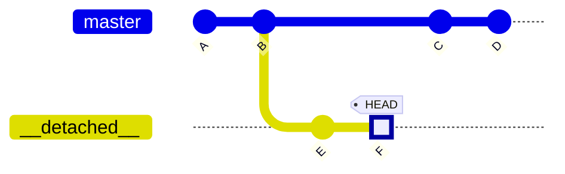
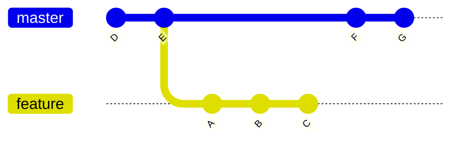
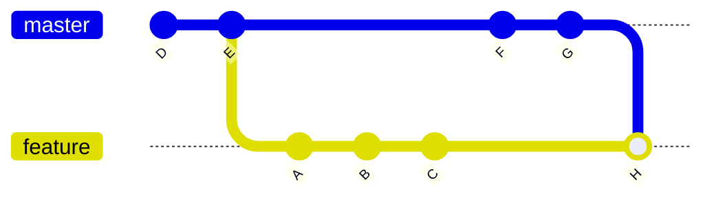
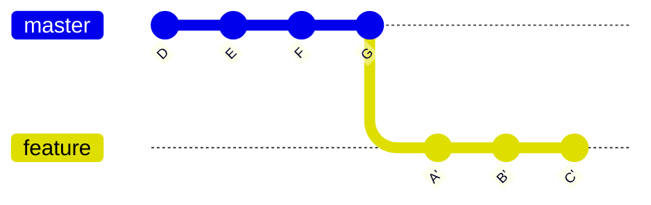
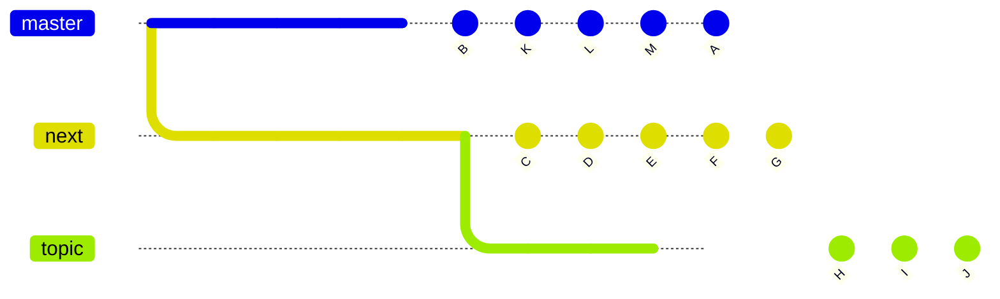
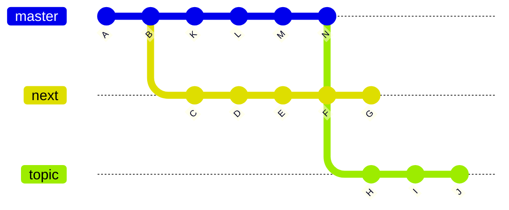
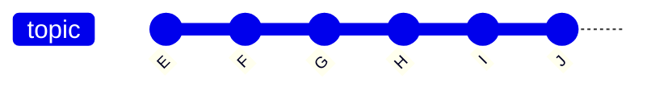
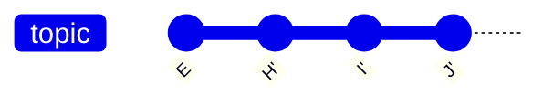

# git

> **_Zadanie 3:_** Alice i Bob tworzą aplikację To-Do (pobierz pliki projektu: [`task3.zip`](/labs/lab01/task3.zip)). Komunikacja między nimi zawiodła przez co równolegle dodali wiadomość powitalną. Alice zacommitowała wiadomość powitalną do gałęzi `master`, podczas gdy Bob utworzył osobną gałąź `bob/feature/welcome-message` z nowym commitem. Połącz gałąź Boba z gałęzią `master` i rozwiąż konflikt tak, aby ostateczna wiadomość powitalna brzmiała: `"Welcome to Alice and Bob's To-Do App!"`.

## Cofanie się w czasie

Wyobraź sobie, że zrefaktoryzowałeś kod i uważasz, że dzięki temu aplikacja działa szybciej. Aby to udowodnić, musisz przetestować wydajność zarówno aktualnej, jak i poprzedniej wersji. A co, jeśli nie zapisałeś nigdzie zbudowanej aplikacji w starej wersji? W takich momentach Git pozwala ci na powrót do starego commita sprzed refaktoryzacji, dzięki czemu
możesz ją zbudować. 

Polecenie `git log` wyświetla historię commitów w bieżącej gałęzi. Każdy commit posiada unikalny *hash*, który może być użyty w innych poleceniach Git.

```
$ git log
                 commit hash
                      |
                      V
commit 45e5e8b12b5b099e76e18a336d0d7db946b53ab6 (HEAD -> master)
Author: Jan Kowalski <jan.kowalski@mail.com>
Date:   Thu Sep 25 23:49:30 2025 +0200

    New commit message
```

W Visual Studio możesz zobaczyć historię commitów, przechodząc do `View->Git Repository`:


Możesz kliknąć dowolny ze swoich commitów:


i zobaczyć wynik `git diff`:


Pełny hash commita można uzyskać, klikając trzy kropki w panelu commitów:


Wcześniej używaliśmy [`git checkout`](https://git-scm.com/docs/git-checkout) do przełączania gałęzi (obecnie dostępne jest również `git switch`), ale `git checkout` ma więcej zastosowań: możesz nim przejść do konkretnego commita, podając jego hash. W ogólności polecenie `git checkout` zmienia wskaźnik `HEAD`. 
*Working tree* (bieżąca wersja Twoich plików) zawsze odzwierciedla commit, na który wskazuje `HEAD`. `HEAD` może znajdować się w dwóch stanach:

1. **Normal state** – `HEAD` wskazuje na gałąź. Working tree zawsze odzwierciedla szczyt tej gałęzi. Wchodzisz w ten stan, uruchamiając `git checkout <branch-name>`.
2. **Detached state** – `HEAD` wskazuje bezpośrednio na commit (który może, ale nie musi być szczytem gałęzi). Wchodzisz w ten stan, uruchamiając `git checkout <commit>`.

Aktualny stan sprawdzisz za pomocą `git status`. Jeśli masz niezacommitowane zmiany, przed checkoutem warto zrobić stash lub stworzyć commit typu WIP (Work In Progress).


```bash
$ git add .
$ git commit -m "WIP"
```

W Visual Studio możesz zrobić commit WIP w panelu Git Changes (`View -> Git Changes`):

Taki commit można potem łatwo usunąć przy pomocy `git reset`. Jeśli nie zależy Ci na nieśledzonych plikach lub katalogach, które blokują wykonanie `git checkout`, zamiast commita WIP lub stasha możesz użyć opcji `--force` (`-f`).

```
$ git checkout aa5a3e278c0d8815136a1cc1da7ecb6768ba2cb2

Note: switching to 'aa5a3e278c0d8815136a1cc1da7ecb6768ba2cb2'.

You are in 'detached HEAD' state. You can look around, make experimental
changes and commit them, and you can discard any commits you make in this
state without impacting any branches by switching back to a branch.

If you want to create a new branch to retain commits you create, you may
do so (now or later) by using -c with the switch command. Example:

  git switch -c <new-branch-name>

Or undo this operation with:

  git switch -

Turn off this advice by setting config variable advice.detachedHead to false

HEAD is now at aa5a3e2 Previous commit message
```

> **Wskazówka:** Nie musisz podawać pełnego hasha, wystarczy jego unikalny prefix, np. `git checkout aa5a3e` lub nawet `git checkout aa5a`.

> **Wskazówka 2:** Możesz odwołać się do commita używając przesunięcia względem referencji, np. `HEAD~2` wskazuje commit dwa commity przed `HEAD`, a `master~3` wskazuje commit trzy commity przed szczytem gałęzi `master`.

Jak widać powyżej, Git szczegółowo informuje o konsekwencjach wywołanych poleceń, np. o przejściu do stanu detached. `git status` pokaże, że faktycznie jesteśmy w tym stanie.

```bash
$ git status
HEAD detached at aa5a3e2
```

W Visual Studio checkout wykonasz przez `View -> Git Repository`, wybierając gałąź lub commit, klikając prawym przyciskiem i wybierając `Checkout`.


Jeśli nie zrobiłeś stash lub WIP-commitu swoich zmian, pojawi się okno dialogowe, które poinformuje o potencjalncych konfliktach:


Opcja `Discard changes` odpowiada `--force`, `Stash the changes` wywołuje `git stash`, a `Bring the changes` pozostawia zmiany dostępne w commicie, do którego przechodzisz (potencjalne konflikty trzeba rozwiązać ręcznie).

Aby wrócić do normalnego stanu, wybierz gałąź, na której chcesz pracować, i wykonaj `git checkout <branch-name>`.

```bash
$ git checkout master
```

W Visual Studio: `View -> Git Repository`, kliknij prawym przyciskiem na gałąź i wybierz `Checkout`:


Wyobraź sobie, że po przejściu do commita chcesz wprowadzić drobne zmiany i je zacommitować, np. dodać timery do testów wydajności. Co się stanie, jeśli HEAD jest w stanie detached i utworzysz nowe commity?  Załóżmy, że przeszedłeś do commita `B` i utworzyłeś commity `E` i `F`.



Jak widać, commity zostały utworzone, ale jeśli teraz wykonasz checkout (np. do `master`), commity `E` i `F` zostaną usunięte przez proces garbage collectora (nie od razu, domyślnie proces usuwa commity starsze niż ~90 dni). Powodem jest brak gałęzi (lub tagu) odwołującego się do commita `F`. Aby temu zapobiec, musisz utworzyć gałąź (lub tag), gdy HEAD wskazuje na `F`, używając jednego z poniższych poleceń:

```bash
$ git checkout -b <new-branch-name>
$ git branch <new-branch-name>
```

W Visual Studio: `View -> Git Repository`, kliknij prawym przyciskiem na detached commit i wybierz `New branch...`:


Zaleca się przeczytanie [tej sekcji w dokumentacji](https://git-scm.com/docs/git-checkout#_detached_head).

Git pozwala również na powracanie do starych wersji pojedyńczych plików. Wyobraź sobie, że podczas budowania projektu w języku `C` za pomocą `make` proces kończy się błędem i podejrzewasz, że `Makefile` jest uszkodzony. W takiej sytuacji prawdopodobnie chcesz wrócić do poprzedniej wersji `Makefile`, ale pozostawić resztę plików w bieżącym stanie. Polecenie `git checkout` pozwala to zrobić, jeśli podany zosatnie plik jako argument:

```bash
$ git checkout master~2 Makefile # get the Makefile version from 2 commits before the tip of your master 
```

`Makefile` pobrany z `master~2` pojawi się jako staged change. Jeśli chcesz wrócić do pierwotnego stanu (`master`), możesz go odstage'ować i usunąć. Więcej przykładów znajdziesz w [dokumentacji](https://git-scm.com/docs/git-checkout#_examples).

A co jeśli nie jesteś zadowolony z ostatnich commitów i chcesz je usunąć? Na przykład źle napisałeś wiadomość commita lub chcesz usunąć WIP commit. W takiej sytuacji możesz użyć `git reset`.

```bash
$ git reset --soft HEAD^ # equivalent of git reset --soft HEAD~1
```

`git reset` działa w trzech trybach:

1. **soft mode** (`--soft`) – indeks nie zostanie zmieniony, staged files pozostają takie same. Twój working directory pozostaje bez zmian.
2. **mixed mode** (`--mixed`, tryb domyślny) – staged files zostaną odstage'owane, ale working directory pozostaje nietknięte (nie utracisz żadnych zmian w plikach).
3. **hard mode** (`--hard`) – resetuje wszystko do wskazanego commita. Wszystkie zmiany po tym commicie zostaną utracone, włącznie z niezacommitowanymi zmianami.

W Visual Studio możesz zresetować zmiany w panelu `Git Repository`:


Wyobraź sobie, że pobierasz zmiany z repozytorium i napotykasz konflikty merge. Jeśli chcesz wrócić do stanu sprzed pulla, możesz użyć `git reset --hard` (synonim: `git reset --hard HEAD`).

```bash
$ git pull
Auto-merging nitfol
CONFLICT (content): Merge conflict in nitfol
Automatic merge failed; fix conflicts and then commit the result.
$ git reset --hard 
```

Wyobraź sobie, że pracujesz na gałęzi tworzonej w celu dodania nowej funkcji, nazwijmy ją `feature`. Podczas pracy odkrywasz krytyczny błąd, który naprawiasz i commitujesz. Możesz chcieć zastosować tę samą poprawkę na gałęzi `master`, aby inni, tworząc gałęzie z `master` przed połączeniem Twojego `feature`, nie napotkali tego samego problemu. W tym celu możesz zastosować polecenie `git cherry-pick`.

```bash
$ git checkout master
$ git cherry-pick feature~2 # apply the bug-fix commit that resides on your feature
```

W Visual Studio przejdź na gałąź, na którą chcesz zastosować commit (np. `master`):


Nastepnie wybierz gałąź, która zawiera commit do cherry-pick, klikając jej nazwę raz. Teraz wybierz commit, klikając go prawym przyciskiem myszy i 
wybierz opcję `Cherry pick`:


Więcej przykładów znajdziesz w [dokumentacji](https://git-scm.com/docs/git-cherry-pick#_examples).

> **_Zadanie 4:_** Bob i Alice tworzą aplikację, która sortuje tablicę liczb (pobierz pliki projektu: [`task4.zip`](/labs/lab01/task4.zip)).  
> Bob utworzył gałąź feature `bob/feature/sort`, zaimplementował sortowanie bąbelkowe i wykonał commit o nazwie `Implement bubble sort`. Później odkrył algorytm quick sort i zastąpił nim sortowanie bąbelkowe (commit `Implement quick sort`). Na końcu dodał commit o nazwie `Ad timer`, aby mierzyć czas wykonania algorytmu.  
> ⚠️ Ważne: W każdym podzadaniu nie wolno pisać kodu C#. Wszystkie zmiany muszą być wykonane wyłącznie za pomocą poleceń Git lub interfejsu Git UI.  
> 1. Bob źle napisał wiadomość commita `Ad timer`. Zmień ją na `Add timer`.  
> 2. Bob chce porównać czasy wykonania quick sort i bubble sort. Utwórz nową gałąź o nazwie `bob/feature/sort/bubble-sort`, która zawiera implementację bubble sort oraz commit `Add timer`. Struktura drzewa powinna wyglądać następująco:
> ```mermaid
> ---
> config:
>   gitGraph:
>       mainBranchName: 'master'
> ---
> gitGraph
>   commit id: "Init"
>   branch bob/feature/sort 
>   commit id: "Add SortExtension"
>   commit id: "Implement bubble sort"
>   branch bob/feature/sort/bubble-sort 
>   checkout bob/feature/sort/bubble-sort
>   commit id: "Add timer'" 
>   checkout bob/feature/sort
>   commit id: "Implement quick sort"
>   commit id: "Add timer" 
> ```
> 3. Bob znalazł błąd w swojej implementacji quick sort. Alice już naprawiła go na swojej gałęzi `alice/feature/user-interface` w commicie o nazwie `Fix quick sort`. Zastosuj poprawkę Alice na czubku gałęzi Boba, używając `git cherry-pick` lub interfejsu Visual Studio.

## Nigdy nie zostawaj w tyle dzięki `git merge` oraz `git rebase`

Wyobraź sobie, że utworzyłeś gałąź `feature` z gałęzi `master`, aby zaimplementować nową funkcję. W międzyczasie Twój zespół dodał dwie nowe funkcje i scalił je do `master`. Przykładowa sytuacja wygląda następująco:



Prawdopodobnie chcesz zaktualizować swoją gałąź `feature`, aby pracować na najnowszej wersji kodu. Można to osiągnąć, scalając `master` do `feature` i rozwiązując ewentualne konflikty.

```bash
$ git merge feature master # feature <- master
```

W Visual Studio:

1. Przejdź do `View -> Git Repository`.
2. Przejdź na gałąź `feature`.
3. Kliknij prawym przyciskiem na gałąź `master` i wybierz `Merge 'master' into 'feature'`.


Otrzymany graf będzie wyglądał następująco:



Teraz możesz kontynuować pracę na gałęzi `feature` z zaktualizowanym kodem. Zwróć jednak uwagę, że takie podejście uniemożliwia utrzymanie ściśle chronologicznego porządku commitów. W wielu zespołach nie stanowi to problemu, przez co scalanie jest najczęściej stosowanym podejściem. Niektóre zespoły wolą jednak zachować liniową historię commitów, aby łatwiej śledzić błędy. Można to osiągnąć za pomocą `git rebase`, który nie tylko przydaje się w tym scenariuszu, ale także pozwala modyfikować stare commity (zostanie to pokazane później).

Przy podejściu `git rebase`, zamiast scalać `master` do `feature`, aktualizujesz commity gałęzi `feature` i umieszczasz je na szczycie `master`:



Możemy to osiągnąć za pomocą:

```bash
$ git rebase master feature # master <- feature
```

Zwróć uwagę, że kolejność `master` i `feature` różni się od merge. Wynika to z faktu, że w merge wprowadzasz `master` *do* `feature`, podczas gdy w rebase umieszczasz `feature` *na* `master`. Jeśli chcesz zrobić rebase na commit, który nie jest szczytem gałęzi, możesz wskazać konkretny commit zamiast nazwy gałęzi.

W Visual Studio użyj opcji `Rebase 'master' onto 'feature'`:


Niestety, liniowa historia commitów ma swoją cenę:

1. Commity `A'` i `A` nie są tymi samymi commitami.
2. W repozytoriach zdalnych aktualizacja wymaga **force push**, dlatego tę metodę należy stosować ostrożnie (opcja [`--force-with-lease`](https://git-scm.com/docs/git-push#Documentation/git-push.txt---no-force-with-lease)), szczególnie w gałęziach współdzielonych przez wielu deweloperów.
3. Przy rebase konflikty muszą być rozwiązywane dla każdego konfliktowego commita, podczas gdy merge wymaga rozwiązania konfliktów tylko raz.

Podczas uruchamiania `git rebase` proces zatrzymuje się na commitach konfliktowych. Masz wtedy dwie opcje:

1. Napraw konflikt i uruchom `git rebase --continue`. Jeśli pojawi się kolejny konflikt, proces należy powtórzyć.
2. Przerwij rebase za pomocą `git rebase --abort`. Powrócisz do stanu sprzed wywołania polecenia `git rebase`.

W Visual Studio, jeśli pojawią się konflikty po rebase, zobaczysz komunikat ostrzegawczy. Kliknij hiperłącze `Resolve the conflicts`, aby przejść do panelu `Git Changes`:


Panel pokaże pliki w konflikcie w sekcji `Unmerged Changes`:


Podwójne kliknięcie na plik otworzy merge resolver. Po rozwiązaniu konfliktów pliki zostaną przeniesione do sekcji `Staged Changes`, a przycisk `Continue` stanie się aktywny — jego kliknięcie działa tak samo jak `git rebase --continue`:


Poza aktualizowaniem gałęzi, `git rebase` pozwala również modyfikować historię commitów, co czyni go bardzo użytecznym narzędziem. Aby to zrobić, wywołaj rebase w trybie interaktywnym:

```bash
$ git rebase -i master feature
```

Możesz użyć opcji `--root`, aby zrebase'ować wszystkie commity osiągalne z bieżącej gałęzi (np. aby uwzględnić początkowy commit na gałęzi master):

```bash
$ git rebase -i --root
```

Spowoduje to otwarcie edytora tekstu z poleceniami, które zostaną zastosowane do commitów na Twojej gałęzi.  Domyślnie każdy commit ma polecenie `pick`. Edytor zawiera jasne instrukcje dla każdego polecenia, które możesz wykorzystać.

```
pick a11f874 # Add Update method
pick 3fc6309 # Add Student service
pick a328224 # Add example

# Rebase 71a9de0..a328224 onto 71a9de0 (3 commands)
#
# Commands:
# p, pick <commit> = use commit
# r, reword <commit> = use commit, but edit the commit message
# e, edit <commit> = use commit, but stop for amending
# s, squash <commit> = use commit, but meld into previous commit
# f, fixup [-C | -c] <commit> = like "squash" but keep only the previous
#                    commit's log message, unless -C is used, in which case
#                    keep only this commit's message; -c is same as -C but
#                    opens the editor
# x, exec <command> = run command (the rest of the line) using shell
# b, break = stop here (continue rebase later with 'git rebase --continue')
# d, drop <commit> = remove commit
# l, label <label> = label current HEAD with a name
# t, reset <label> = reset HEAD to a label
# m, merge [-C <commit> | -c <commit>] <label> [# <oneline>]
#         create a merge commit using the original merge commit's
#         message (or the oneline, if no original merge commit was
#         specified); use -c <commit> to reword the commit message
# u, update-ref <ref> = track a placeholder for the <ref> to be updated
#                       to this position in the new commits. The <ref> is
#                       updated at the end of the rebase
#
# These lines can be re-ordered; they are executed from top to bottom.
#
# If you remove a line here THAT COMMIT WILL BE LOST.
#
# However, if you remove everything, the rebase will be aborted.
#
```

Możesz zmieniać nazwy, usuwać lub edytować commity, zmieniając odpowiednie polecenia w edytorze:

```
reword a11f874 # New commit message
drop 3fc6309 # Add Student service
edit a328224 # Add example
```

Po zapisaniu dokumentu proces rebase będzie przebiegał jak zwykle, ale:

- Commity oznaczone jako `drop` zostaną pominięte  
- Commity oznaczone jako `reword` będą miały zmienioną wiadomość  
- Commity oznaczone jako `edit` zatrzymają proces rebase, aby wprowadzić zmiany

Tryb interactive rebase nie jest wspierany w Visual Studio, ale nadal możesz rozwiązywać konflikty, które pojawią się w panelu `Git Changes`, a następnie uruchomić `git rebase --continue` zamiast używać przycisku `Continue` (nie jest on wyświetlany przy `git rebase` wywołanym z terminala).

Polecenie `git rebase` pozwala także zmienić gałąź nadrzędną za pomocą opcji `--onto`. Wyobraź sobie sytuację:



Aby zmienić gałąź nadrzędną gałęzi `topic` na `master` (przykładowy scenariusz: funkcjonalność, od której zależy `topic`, została scalona do `master`, który jest bardziej stabilny), możemy użyć następującego polecenia:

```bash
$ git rebase --onto master next topic
```

To spowoduje powstanie nowego grafu:



Polecenie `--onto` pozwala również na bardziej złożone manipulacje gałęziami. Wyobraź sobie następującą gałąź:



Po wywołaniu:

```bash
$ git rebase --onto E H topicA
```

Otrzymasz wynik:



Daje to możliwość wstrzykiwania nowych commitów lub zmiany ich kolejności bądź usuwania.

---

> **_Zadanie 5:_** Bob i jego zespół zostali poproszeni o napisanie aplikacji backendowej USOS (pobierz pliki projektu: [`task5.zip`](/labs/lab01/task5.zip)). Bob utworzył swoją gałąź feature `bob/feature/student-service`, aby zaimplementować serwis zarządzający studentami. Niestety jego zespół wprowadził zmiany w kodzie związanym z bazą danych i scalił je do gałęzi `master`, co spowodowało, że gałąź Boba jest w tyle.
>
> 1. Zrób rebase gałęzi Boba, aby podążała za zaktualizowaną gałęzią `master` i rozwiąż konflikty.
> 2. Spraw aby commit `Add Update method` stał się bardziej opisowy, zmieniając jego nazwę na `Add Update method to StudentDbManager`.
> 3. Utwórz nowy commit z wiadomością `Add welcome message` między commitami `Add Update method` a `Add Student service` w gałęzi Boba. Commit powinien dodać `Console.WriteLine("Welcome!")` na początku pliku `Program.cs`. (Wskazówka: możesz użyć kombinacji `git checkout` i `git rebase --onto`)
