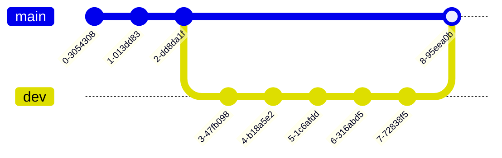

# Warsztaty z Git

Małe projekty realizowane przez pojedynczych programistów są stosunkowo łatwe w utrzymaniu. Proste zadanie programistyczne to zwykle tylko kilkadziesiąt linii kodu, a zmiany wprowadza się po kolei, jedna po drugiej. Nawet w tak prostej sytuacji możesz jednak chcieć cofnąć część zmian. Twój projekt może też w naturalny sposób urosnąć i wymagać wielu modyfikacji rozrzuconych po różnych plikach. Czasami będziesz chciał sprawdzić nowe podejście, nie wiedząc z góry, czy nie zepsuje ono działania programu. W końcu może się też zdarzyć, że ktoś inny będzie chciał dołączyć do pracy i wprowadzać zmiany równolegle do Ciebie.

Właśnie wtedy potrzebny jest **system kontroli wersji** (VCS, Version Control System). Możesz myśleć o nim jak o funkcji „historii” dla Twojego projektu, która pozwala poruszać się po różnych wersjach tego samego kodu. W tym tutorialu skupimy się na najpopularniejszym systemie VCS, **Git**, ale istnieje ich więcej (np. **Perforce** do pracy z dużymi plikami). Być może spotkałeś się już z pojęciem **GitHub** -- to platforma do hostowania zdalnych repozytoriów. Ten tutorial jej nie obejmuje, ale warto wiedzieć, że GitHub to nie to samo co Git.

Możesz wykonywać zadania przy pomocy graficznego interfejsu Visual Studio lub w terminalu. Pamiętaj jednak, że Visual Studio nie wspiera wszystkich funkcji Gita -- np. interaktywnych rebase’ów (o tym później). Nawet jeśli zdecydujesz się korzystać z GUI, zdecydowanie warto poznać polecenia w konsoli. Nie zawsze będziesz mieć dostęp do IDE, a w wielu przypadkach praca w terminalu jest po prostu szybsza.

## Pierwsze kroki z Gitem

### Dane uwierzytelniające
Akcje wykonywane w Gicie, takie jak commity, są powiązane z Twoją tożsamością. Ma to szczególne znaczenie przy wysyłaniu commitów do zdalnych repozytoriów, ale nawet jeśli nie planujesz tego robić, powinieneś ustawić swoje dane --- nazwę użytkownika oraz adres e‑mail. Możesz to zrobić w terminalu następującymi poleceniami: [`git config --global user.name <username>`](https://git-scm.com/docs/git-config) oraz [`git config --global user.email <email>`](https://git-scm.com/docs/git-config).

W Visual Studio przejdź do `Git -> Settings` i wprowadź dane.


### Repozytorium

**Repozytorium** to miejsce, w którym przechowywane są pliki projektu oraz cała ich historia zmian. Git realizuje to za pomocą podkatalogu `.git`, w którym znajdują się wszystkie informacje potrzebne do śledzenia. Oznacza to, że usunięcie folderu `.git` powoduje utratę kontroli wersji w projekcie i pozostawia same pliki w ich ostatnim stanie --- niezależnie od tego, czy były przygotowane do commita, czy nie.

Aby utworzyć repozytorium Gita wewnątrz katalogu z plikami, które chcesz śledzić, uruchom [`git init`](https://git-scm.com/docs/git-init).

```bash
$ git init
Initialized empty Git repository in <path>/.git/
```

W Visual Studio przejdź do `Git -> Create Git Repository`. W oknie dialogowym `Create a Git repository` wybierz opcję `Local only` i potwierdź przyciskiem `Create`.


> **Zadanie 0** Rozpakuj pliki znajdujące się w [task1-2.zip](/labs/lab01/task1-2.zip) i skonfiguruj nowe repozytorium.

### Pliki

Twoje projekty składają się z co najmniej jednego pliku źródłowego, a najprawdopodobniej wielu więcej. Aby Git śledził w nich zmiany, trzeba to bezpośrednio zasygnalizować. Pojedynczy plik może znajdować się w jednym z trzech głównych stanów:
- `modified` (zmodyfikowany),
- `staged` (przygotowany do commita),
- `committed` (zatwierdzony w repozytorium).


Podstawowy przebieg pracy w Gicie wygląda następująco:
1. Modyfikujesz pliki w katalogu roboczym.
2. Dodajesz do staging area tylko te zmiany, które mają trafić do następnego commita (dokumentacja: [`git add`](https://git-scm.com/docs/git-add), [Staging Area](https://git-scm.com/about/staging-area)).
3. Wykonujesz commit, czyli zapisujesz zawartość staging area trwale w repozytorium (dokumentacja: [`git commit`](https://git-scm.com/docs/git-commit)). Każdy commit musi zawierać wiadomość, którą podajesz opcją -m.

```bash
$ git add Dummy.txt
$ git commit -m "Initial commit"
```

Aby dowiedzieć się więcej o stanach plików, stagingu i związanych z nimi pojęciami, zajrzyj do przewodnika [Getting Started](https://git-scm.com/book/en/v2/Getting-Started-What-is-Git%3F).

Twój projekt może zawierać pliki, których nie chcesz commitować --- np. pliki binarne lub tymczasowe. Do tego służy plik `.gitignore`, który jest listą plików/katalogów, jakie Git będzie pomijał przy poleceniu [`git add`](https://git-scm.com/docs/git-add).

W Visual Studio otwórz `View -> Git Changes`. Zobaczysz tam listę wszystkich zmodyfikowanych plików.
- Aby przygotować plik do commita, kliknij ikonę `+` obok jego nazwy.
- Aby usunąć plik ze staging area, kliknij ikonę `--`.
- Możesz też przygotować wszystkie pliki na raz: klikając `+` obok sekcji `Changes`, a cofnąć wszystko `--`.
- Po zakończeniu stagingu wpisz wiadomość do commita i kliknij `Commit Staged`.


> **Zadanie 1:** Alice przygotowała początkową wersję swojego projektu renderera 3D.
Zanim zacznie rozwijać kolejne funkcje, chce upewnić się, że repozytorium jest poprawnie skonfigurowane.
>
> **Uwaga: skorzystaj z repozytorium utworzonego w Zadaniu 0!**
> 1. Projekt zawiera dwa katalogi z plikami kompilacji (`bin/` i `obj/`), pliki metadanych IDE (`.vs/`) oraz tymczasowy plik `debug.log` powstający w trakcie działania programu. Wyklucz je z Gita (dodaj do `.gitignore`) i sprawdź status repozytorium.
> 2. Dodaj wszystkie istotne pliki do staging area jednym poleceniem i sprawdź status.
> 3. Cofnij plik `Dummy.txt` ze stagingu, a następnie zatwierdź resztę zmian (wykonaj commit). Sprawdź ponownie status repozytorium i upewnij się, że plik `Dummy.txt` wyświetla się jako `modified`.

### Gałęzie (Branching)
Gałęzie w Gicie są szczególnie przydatne podczas wprowadzania większych zmian, które mogą potencjalnie zepsuć działanie całego projektu. Możesz myśleć o gałęzi jako o migawce (równoległej kopii historii projektu), którą można modyfikować niezależnie.

Podstawowy przykład to dwie gałęzie:
- `main` -- zawiera kod przetestowany i stabilny,
- `dev` -- służy do rozwijania nowych funkcji lub refaktoryzacji.


Aby utworzyć nową gałąź, użyj polecenia [`git checkout -b <branch_name>`](https://git-scm.com/docs/git-checkout). Aby usunąć gałąź, musisz najpierw przełączyć się na inną, a następnie wykonać polecenie [`git branch -d <branch_name>`](https://git-scm.com/docs/git-branch).

W Visual Studio otwórz `Git -> Manage Branches`.
- Aby utworzyć nową gałąź, kliknij prawym przyciskiem na gałąź, na której chcesz ją oprzeć, i wybierz `New Local Branch From...`.
- Aby przełączyć się na nową gałąź, kliknij prawym przyciskiem i wybierz `Checkout`.
- Aby usunąć gałąź, najpierw przełącz się na inną; dopiero wtedy kliknij prawym i wybierz `Delete`.


Gałęzie są podstawą pracy zespołowej --- każdy programista może pracować nad swoją izolowaną kopią kodu i dopiero po upewnieniu się, że wszystko działa poprawnie, wprowadzić zmiany do gałęzi `main`. O tym więcej w kolejnych sekcjach.

Z założenia Git blokuje przełączanie gałęzi, jeśli w katalogu roboczym masz niezacommitowane zmiany. Możesz je jednak tymczasowo „odłożyć na półkę” i wrócić do nich później bez wykonywania commita. Do tego służy polecenie [`git stash`](https://git-scm.com/docs/git-stash). Zapisuje ono bieżące zmiany w specjalnym schowku (stash) i usuwa je z katalogu roboczego (czyli przywraca kod gałęzi do stanu ostatniego commita).
- Aby sprawdzić, jakie zmiany masz obecnie odłożone, użyj [`git stash list`](https://git-scm.com/docs/git-stash).
- Aby przywrócić konkretny stash na aktualną gałąź, użyj [`git stash pop stash@{<index>}`](https://git-scm.com/docs/git-stash).

Warto pamiętać, że zmiany zapisane w stashu nie są przypisane do jednej gałęzi - możesz je zastosować w dowolnym miejscu repozytorium.

W Visual Studio otwórz `View -> Git Changes`.
- Aby odłożyć zmiany do schowka (stash), kliknij strzałkę w dół obok przycisku `Commit All` i wybierz `Stash All`.
- Aby przywrócić zapisany stash, kliknij prawym przyciskiem wybrany wpis na liście `Stashes` i wybierz jedną z opcji w sekcji `Apply` (`Apply` lub `Pop`).


Jeśli spróbujesz przełączyć gałąź bez wcześniejszego commitowania lub odłożenia zmian do stash, Visual Studio wyświetli okienko dialogowe z pytaniem, jak chcesz je obsłużyć.


### Scalanie (Merging)
Załóżmy, że właśnie zaimplementowałeś nową funkcjonalność w gałęzi `dev`, przetestowałeś ją i chcesz wprowadzić zmiany z powrotem do gałęzi `main`. Aby to zrobić, musisz **scalić** obie gałęzie, czyli zintegrować commity z `dev` z historią `main`.



Przejdź do gałęzi, do której chcesz coś scalić, i wykonaj [`git merge <other_branch>`](https://git-scm.com/docs/git-merge).

```bash
$ git checkout main
$ git merge dev
```

W Visual Studio otwórz `Git -> Manage Branches`. Aby scalić zmiany z gałęzi `src` do gałęzi `dest`:
1. Najpierw przełącz się na gałąź `dest`.
2. Kliknij prawym przyciskiem na gałąź `src` i wybierz `Merge 'src' into 'dest'`.


Scalania mogą być żmudne, jeśli pojawią się konflikty (więcej o nich w następnej sekcji), ale w ogólnym przypadku wszystko, czego potrzeba, to polecenie [`git merge`](https://git-scm.com/docs/git-merge).

> **Zadanie 2:** Alice rozwija swój projekt renderera 3D i chce przetestować go poprzez przygotowanie prostej sceny.
>
> **Uwaga: skorzystaj z repozytorium utworzonego w Zadaniu 0!**
> 1. Początkowo repozytorium znajduje się na gałęzi `main`. Uruchom aplikację i zobacz jej stan początkowy.
> 2. Utwórz i przełącz się na nową gałąź `feature`. W pliku `CubeWindow.cs` znajdź komentarz `// TODO 2.2` i odkomentuj linię poniżej. Uruchom aplikację, aby zobaczyć efekt. Następnie przygotuj zmianę (stage) i wykonaj commit.
> 3. Wróć z powrotem na gałąź `main` i uruchom aplikację.
> 4. Z powrotem przełącz się na gałąź `feature`, znajdź komentarz `// TODO 2.4` w pliku `CubeWindow.cs` i odkomentuj linię poniżej. Uruchom aplikację i zobacz rezultat. Nie commituj zmian i spróbuj przełączyć się z powrotem na gałąź `main`. Zaobserwuj, co się stanie.
> 5. Odłóż zmiany do stasha. Wróć na gałąź `main`, następnie utwórz i przełącz się na nową gałąź `feature-v2`. Przywróć stasha, przygotuj zmiany i wykonaj commit.
> 6. Scal gałąź `feature-v2` do `main`. Uruchom aplikację i zobacz efekt. Następnie porównaj wynik z wersją aplikacji na gałęzi `feature`.
> 7. Usuń obie gałęzie: `feature` oraz `feature-v2`.

## Praca zespołowa

Do tej pory wszystko dotyczyło jednego lokalnego repozytorium. Możesz jednak chcieć zrobić kopię zapasową swojego projektu poza lokalną maszyną albo współpracować z innymi programistami. Do tego celu musisz umieć zarządzać **repozytoriami zdalnymi**.

### Repozytoria zdalne (Remote repositories)

**Remote** to po prostu wersja Twojego repozytorium, która znajduje się gdzieś indziej niż oryginał. Najczęściej będzie to serwis hostingowy (np. GitHub) albo sieć lokalna, ale repozytorium zdalne może być też umieszczone na Twoim własnym komputerze.

W **Zadaniu 0** samodzielnie utworzyłeś repozytorium od podstaw, ale często będziesz zaczynać od istniejącego repozytorium dostępnego w Internecie. Jeśli masz adres URL takiego repozytorium, możesz je skopiować komendą [`git clone`](https://git-scm.com/docs/git-clone):

```
$ git clone git@github.com:ocornut/imgui.git
Cloning into 'imgui'...
remote: Enumerating objects: 64738, done.
remote: Counting objects: 100% (440/440), done.
remote: Compressing objects: 100% (193/193), done.
remote: Total 64738 (delta 349), reused 247 (delta 247), pack-reused 64298 (from 4)
Receiving objects: 100% (64738/64738), 112.06 MiB | 5.75 MiB/s, done.
Resolving deltas: 100% (50602/50602), done.
Updating files: 100% (257/257), done.
```

Zauważ, że sklonowaliśmy repozytorium znajdujące się pod adresem `git@github.com:ocornut/imgui.git`. Polecenie `git clone` automatycznie dodaje takie repozytorium jako remote do naszej lokalnej kopii, pod nazwą `origin`. Aby zobaczyć wszystkie skonfigurowane zdalne repozytoria, użyj polecenia [`git remote`](https://git-scm.com/docs/git-remote).

```
$ git remote -v
origin  git@github.com:ocornut/imgui.git (fetch)
origin  git@github.com:ocornut/imgui.git (push)
```

Możesz chcieć dodać wiele repozytoriów zdalnych, np. jedno dla GitHuba i drugie dla serwera backupowego.
- Dodawanie nowego: `git remote add <nazwa_skrocona> <url>`
- Zmiana nazwy: `git remote rename <stara> <nowa>`
- Usunięcie powiązania: `git remote remove <nazwa>`

Pamiętaj: shortname (nazwa skrócona) to tylko etykieta używana w komendach. Może być dowolna.

W Visual Studio otwórz `Git -> Manage Remotes...`.
- Zobaczysz tam listę wszystkich aktualnie skonfigurowanych zdalnych repozytoriów.
- Aby dodać nowe, kliknij `Add`, wpisz nazwę i adres URL (na razie wpisz ten sam adres w polach `Fetch` i `Push`).
- Możesz też usunąć remote przyciskiem `Remove` lub edytować szczegóły przyciskiem `Edit`.


### Pobieranie i ściąganie zmian (Fetching and pulling)
Ponieważ repozytoria zdalne są niezależne od Twojej lokalnej kopii, w międzyczasie mogą zajść w nich zmiany --- np. ktoś doda nową gałąź, zrobi kilka commitów albo usunie pliki. W takiej sytuacji Twoje lokalne repozytorium może być w tyle względem zdalnego. Aby pobrać informacje o tych zmianach, użyj polecenia [`git fetch <remote>`](https://git-scm.com/docs/git-fetch).
**Uwaga: ta komenda nie aktualizuje kodu**, a jedynie pobiera obiekty Gita i referencje (np. nowe commity, gałęzie).
Jeśli chcesz faktycznie uwzględnić te zmiany w swoim kodzie, użyj [`git pull <remote>`](https://git-scm.com/docs/git-pull).

W Visual Studio otwórz `View -> Git Changes`.
- Obok nazwy gałęzi zobaczysz kilka ikon:
	- pierwsza (przerywana strzałka w dół): fetch -- pobiera dane,
	- druga (ciągła strzałka w dół): pull -- pobiera i scala zmiany.
- Pod nazwą gałęzi widzisz też informację, ile nowych commitów (względem gałęzi śledzonej) jest dostępnych do pobrania.


### Wysyłanie zmian (Pushing)
Kiedy chcesz udostępnić swój kod, musisz wypchnąć (push) go do odpowiedniej gałęzi w repozytorium zdalnym poprzez [`git push <remote> <branch>`](https://git-scm.com/docs/git-push). Przy pierwszym wysyłaniu zmian Git może poprosić Cię o ustawienie tzw. gałęzi śledzącej (upstream branch). Określa ona, z którą gałęzią zdalną Twoja lokalna gałąź będzie się domyślnie synchronizować. Więcej o gałęziach zdalnych przeczytasz [tutaj](https://git-scm.com/book/en/v2/Git-Branching-Remote-Branches).

W Visual Studio otwórz `View -> Git Changes`.
- Trzecia ikona obok nazwy gałęzi (ciągła strzałka w górę) służy do push -- wysyła lokalne zmiany do gałęzi śledzonej (upstream).
- Pod nazwą gałęzi wyświetlana jest również liczba commitów, które zostaną wysłane (względem gałęzi zdalnej).


Są dwa przypadki, w których nie będziesz mógł wysłać (push) swoich zmian:
1. Brak uprawnień do zapisu w danej gałęzi (to zabezpieczenie, abyś przypadkowo nie zepsuł ważnych części kodu).
2. Ktoś inny wysłał zmiany przed Tobą. W takim przypadku musisz najpierw pobrać najnowsze zmiany (`git pull`), scalić je ze swoją gałęzią, a dopiero potem ponownie wykonać `git push`.

### Konflikty
Praca równoległa na tym samym kodzie oznacza, że te same fragmenty mogą być zmieniane w różnych miejscach jednocześnie. Kiedy spróbujesz scalić (merge) takie zmiany, nieuchronnie natkniesz się na **konflikty scalania**. Mówiąc prościej: konflikt pojawia się wtedy, gdy Git nie jest w stanie automatycznie połączyć zmian.

Przykłady:
- jeden programista modyfikuje plik, a inny go usuwa,
- trzech programistów niezależnie przerabia ten sam fragment kodu.

Git wstawia wtedy specjalne znaczniki w pliku:
```
 <<<<<<< HEAD
 your changes
 =======
 incoming changes
 >>>>>>> origin/main
```

Konflikty nie są błędami i są czymś całkowicie normalnym w większych projektach. Możesz traktować je jako sytuacje, w których Git wymaga Twojej decyzji. Konfliktów nie da się całkowicie uniknąć -- trzeba je po prostu rozwiązać.

Jeśli korzystasz z IDE (np. Visual Studio), masz do dyspozycji wygodny interfejs do wyboru, które zmiany zachować. Jeśli korzystasz z prostego edytora albo terminala, konflikt rozwiązuje się ręcznie w trzech krokach:
1. Usuń znaczniki konfliktu (`<<<<<<< HEAD`, `=======`, `>>>>>>> origin/main`).
2. Zostaw tylko poprawny kod (usuń niechciane fragmenty).
3. Dodaj poprawiony plik do staging area (stage) i zakończ scalanie wykonując commit.

W Visual Studio, jeśli po wykonaniu pull wystąpią konflikty:
- kliknij każdy plik z konfliktem,
- zdecyduj, czy chcesz zachować wersję `Incoming` (nadchodzącą) czy `Current` (bieżącą),
- poniżej zobaczysz podgląd wynikowego kodu (`Result`).
Po rozwiązaniu wszystkich konfliktów kliknij `Accept Merge`, aby zakończyć scalanie.


> **_Zadanie 3:_** Alice i Bob tworzą aplikację To-Do (pobierz pliki projektu: [`task3.zip`](/labs/lab01/task3.zip)). Komunikacja między nimi zawiodła przez co równolegle dodali wiadomość powitalną. Alice zacommitowała wiadomość powitalną do gałęzi `master`, podczas gdy Bob utworzył osobną gałąź `bob/feature/welcome-message` z nowym commitem. Połącz gałąź Boba z gałęzią `master` i rozwiąż konflikt tak, aby ostateczna wiadomość powitalna brzmiała: `"Welcome to Alice and Bob's To-Do App!"`.

## Cofanie się w czasie

Wyobraź sobie, że zrefaktoryzowałeś kod i uważasz, że dzięki temu aplikacja działa szybciej. Aby to udowodnić, musisz przetestować wydajność zarówno aktualnej, jak i poprzedniej wersji. A co, jeśli nie zapisałeś nigdzie zbudowanej aplikacji w starej wersji? W takich momentach Git pozwala ci na powrót do starego commita sprzed refaktoryzacji, dzięki czemu
możesz ją zbudować. 

Polecenie `git log` wyświetla historię commitów w bieżącej gałęzi. Każdy commit posiada unikalny *hash*, który może być użyty w innych poleceniach Git.

```
$ git log
                 commit hash
                      |
                      V
commit 45e5e8b12b5b099e76e18a336d0d7db946b53ab6 (HEAD -> master)
Author: Jan Kowalski <jan.kowalski@mail.com>
Date:   Thu Sep 25 23:49:30 2025 +0200

    New commit message
```

W Visual Studio możesz zobaczyć historię commitów, przechodząc do `View -> Git Repository`:


Możesz kliknąć dowolny ze swoich commitów:


i zobaczyć wynik `git diff`:


Pełny hash commita można uzyskać, klikając trzy kropki w panelu commitów:


Wcześniej używaliśmy [`git checkout`](https://git-scm.com/docs/git-checkout) do przełączania gałęzi (obecnie dostępne jest również `git switch`), ale `git checkout` ma więcej zastosowań: możesz nim przejść do konkretnego commita, podając jego hash. W ogólności polecenie `git checkout` zmienia wskaźnik `HEAD`. 
*Working tree* (bieżąca wersja Twoich plików) zawsze odzwierciedla commit, na który wskazuje `HEAD`. `HEAD` może znajdować się w dwóch stanach:

1. **Normal state** – `HEAD` wskazuje na gałąź. Working tree zawsze odzwierciedla szczyt tej gałęzi. Wchodzisz w ten stan, uruchamiając `git checkout <branch-name>`.
2. **Detached state** – `HEAD` wskazuje bezpośrednio na commit (który może, ale nie musi być szczytem gałęzi). Wchodzisz w ten stan, uruchamiając `git checkout <commit>`.

Aktualny stan sprawdzisz za pomocą `git status`. Jeśli masz niezacommitowane zmiany, przed checkoutem warto zrobić stash lub stworzyć commit typu WIP (Work In Progress).


```bash
$ git add .
$ git commit -m "WIP"
```

W Visual Studio możesz zrobić commit WIP w panelu Git Changes (`View -> Git Changes`):

Taki commit można potem łatwo usunąć przy pomocy `git reset`. Jeśli nie zależy Ci na nieśledzonych plikach lub katalogach, które blokują wykonanie `git checkout`, zamiast commita WIP lub stasha możesz użyć opcji `--force` (`-f`).

```
$ git checkout aa5a3e278c0d8815136a1cc1da7ecb6768ba2cb2

Note: switching to 'aa5a3e278c0d8815136a1cc1da7ecb6768ba2cb2'.

You are in 'detached HEAD' state. You can look around, make experimental
changes and commit them, and you can discard any commits you make in this
state without impacting any branches by switching back to a branch.

If you want to create a new branch to retain commits you create, you may
do so (now or later) by using -c with the switch command. Example:

  git switch -c <new-branch-name>

Or undo this operation with:

  git switch -

Turn off this advice by setting config variable advice.detachedHead to false

HEAD is now at aa5a3e2 Previous commit message
```

> **Wskazówka:** Nie musisz podawać pełnego hasha, wystarczy jego unikalny prefix, np. `git checkout aa5a3e` lub nawet `git checkout aa5a`.

> **Wskazówka 2:** Możesz odwołać się do commita używając przesunięcia względem referencji, np. `HEAD~2` wskazuje commit dwa commity przed `HEAD`, a `master~3` wskazuje commit trzy commity przed szczytem gałęzi `master`.

Jak widać powyżej, Git szczegółowo informuje o konsekwencjach wywołanych poleceń, np. o przejściu do stanu detached. `git status` pokaże, że faktycznie jesteśmy w tym stanie.

```bash
$ git status
HEAD detached at aa5a3e2
```

W Visual Studio checkout wykonasz przez `View -> Git Repository`, wybierając gałąź lub commit, klikając prawym przyciskiem i wybierając `Checkout`.


Jeśli nie zrobiłeś stash lub WIP-commitu swoich zmian, pojawi się okno dialogowe, które poinformuje o potencjalncych konfliktach:


Opcja `Discard changes` odpowiada `--force`, `Stash the changes` wywołuje `git stash`, a `Bring the changes` pozostawia zmiany dostępne w commicie, do którego przechodzisz (potencjalne konflikty trzeba rozwiązać ręcznie).

Aby wrócić do normalnego stanu, wybierz gałąź, na której chcesz pracować, i wykonaj `git checkout <branch-name>`.

```bash
$ git checkout master
```

W Visual Studio: `View -> Git Repository`, kliknij prawym przyciskiem na gałąź i wybierz `Checkout`:


Wyobraź sobie, że po przejściu do commita chcesz wprowadzić drobne zmiany i je zacommitować, np. dodać timery do testów wydajności. Co się stanie, jeśli HEAD jest w stanie detached i utworzysz nowe commity?  Załóżmy, że przeszedłeś do commita `B` i utworzyłeś commity `E` i `F`.


Jak widać, commity zostały utworzone, ale jeśli teraz wykonasz checkout (np. do `master`), commity `E` i `F` zostaną usunięte przez proces garbage collectora (nie od razu, domyślnie proces usuwa commity starsze niż ~90 dni). Powodem jest brak gałęzi (lub tagu) odwołującego się do commita `F`. Aby temu zapobiec, musisz utworzyć gałąź (lub tag), gdy HEAD wskazuje na `F`, używając jednego z poniższych poleceń:

```bash
$ git checkout -b <new-branch-name>
$ git branch <new-branch-name>
```

W Visual Studio: `View -> Git Repository`, kliknij prawym przyciskiem na detached commit i wybierz `New branch...`:


Zaleca się przeczytanie [tej sekcji w dokumentacji](https://git-scm.com/docs/git-checkout#_detached_head).

Git pozwala również na powracanie do starych wersji pojedyńczych plików. Wyobraź sobie, że podczas budowania projektu w języku `C` za pomocą `make` proces kończy się błędem i podejrzewasz, że `Makefile` jest uszkodzony. W takiej sytuacji prawdopodobnie chcesz wrócić do poprzedniej wersji `Makefile`, ale pozostawić resztę plików w bieżącym stanie. Polecenie `git checkout` pozwala to zrobić, jeśli podany zosatnie plik jako argument:

```bash
$ git checkout master~2 Makefile # get the Makefile version from 2 commits before the tip of your master 
```

`Makefile` pobrany z `master~2` pojawi się jako staged change. Jeśli chcesz wrócić do pierwotnego stanu (`master`), możesz go odstage'ować i usunąć. Więcej przykładów znajdziesz w [dokumentacji](https://git-scm.com/docs/git-checkout#_examples).

A co jeśli nie jesteś zadowolony z ostatnich commitów i chcesz je usunąć? Na przykład źle napisałeś wiadomość commita lub chcesz usunąć WIP commit. W takiej sytuacji możesz użyć `git reset`.

```bash
$ git reset --soft HEAD^ # equivalent of git reset --soft HEAD~1
```

`git reset` działa w trzech trybach:

1. **soft mode** (`--soft`) – indeks nie zostanie zmieniony, staged files pozostają takie same. Twój working directory pozostaje bez zmian.
2. **mixed mode** (`--mixed`, tryb domyślny) – staged files zostaną odstage'owane, ale working directory pozostaje nietknięte (nie utracisz żadnych zmian w plikach).
3. **hard mode** (`--hard`) – resetuje wszystko do wskazanego commita. Wszystkie zmiany po tym commicie zostaną utracone, włącznie z niezacommitowanymi zmianami.

W Visual Studio możesz zresetować zmiany w panelu `Git Repository`:


Wyobraź sobie, że pobierasz zmiany z repozytorium i napotykasz konflikty merge. Jeśli chcesz wrócić do stanu sprzed pulla, możesz użyć `git reset --hard` (synonim: `git reset --hard HEAD`).

```bash
$ git pull
Auto-merging nitfol
CONFLICT (content): Merge conflict in nitfol
Automatic merge failed; fix conflicts and then commit the result.
$ git reset --hard 
```

Wyobraź sobie, że pracujesz na gałęzi tworzonej w celu dodania nowej funkcji, nazwijmy ją `feature`. Podczas pracy odkrywasz krytyczny błąd, który naprawiasz i commitujesz. Możesz chcieć zastosować tę samą poprawkę na gałęzi `master`, aby inni, tworząc gałęzie z `master` przed połączeniem Twojego `feature`, nie napotkali tego samego problemu. W tym celu możesz zastosować polecenie `git cherry-pick`.

```bash
$ git checkout master
$ git cherry-pick feature~2 # apply the bug-fix commit that resides on your feature
```

W Visual Studio przejdź na gałąź, na którą chcesz zastosować commit (np. `master`):


Nastepnie wybierz gałąź, która zawiera commit do cherry-pick, klikając jej nazwę raz. Teraz wybierz commit, klikając go prawym przyciskiem myszy i 
wybierz opcję `Cherry pick`:


Więcej przykładów znajdziesz w [dokumentacji](https://git-scm.com/docs/git-cherry-pick#_examples).

> **_Zadanie 4:_** Bob i Alice tworzą aplikację, która sortuje tablicę liczb (pobierz pliki projektu: [`task4.zip`](/labs/lab01/task4.zip)).  
> Bob utworzył gałąź feature `bob/feature/sort`, zaimplementował sortowanie bąbelkowe i wykonał commit o nazwie `Implement bubble sort`. Później odkrył algorytm quick sort i zastąpił nim sortowanie bąbelkowe (commit `Implement quick sort`). Na końcu dodał commit o nazwie `Ad timer`, aby mierzyć czas wykonania algorytmu.  
> ⚠️ Ważne: W każdym podzadaniu nie wolno pisać kodu C#. Wszystkie zmiany muszą być wykonane wyłącznie za pomocą poleceń Git lub interfejsu Git UI.  
> 1. Bob źle napisał wiadomość commita `Ad timer`. Zmień ją na `Add timer`.  
> 2. Bob chce porównać czasy wykonania quick sort i bubble sort. Utwórz nową gałąź o nazwie `bob/feature/sort/bubble-sort`, która zawiera implementację bubble sort oraz commit `Add timer`. Struktura drzewa powinna wyglądać następująco:
> ```mermaid
> ---
> config:
>   gitGraph:
>       mainBranchName: 'master'
> ---
> gitGraph
>   commit id: "Init"
>   branch bob/feature/sort 
>   commit id: "Add SortExtension"
>   commit id: "Implement bubble sort"
>   branch bob/feature/sort/bubble-sort 
>   checkout bob/feature/sort/bubble-sort
>   commit id: "Add timer'" 
>   checkout bob/feature/sort
>   commit id: "Implement quick sort"
>   commit id: "Add timer" 
> ```
> 3. Bob znalazł błąd w swojej implementacji quick sort. Alice już naprawiła go na swojej gałęzi `alice/feature/user-interface` w commicie o nazwie `Fix quick sort`. Zastosuj poprawkę Alice na czubku gałęzi Boba, używając `git cherry-pick` lub interfejsu Visual Studio.

## Nigdy nie zostawaj w tyle dzięki `git merge` oraz `git rebase`

Wyobraź sobie, że utworzyłeś gałąź `feature` z gałęzi `master`, aby zaimplementować nową funkcję. W międzyczasie Twój zespół dodał dwie nowe funkcje i scalił je do `master`. Przykładowa sytuacja wygląda następująco:


Prawdopodobnie chcesz zaktualizować swoją gałąź `feature`, aby pracować na najnowszej wersji kodu. Można to osiągnąć, scalając `master` do `feature` i rozwiązując ewentualne konflikty.

```bash
$ git merge feature master # feature <- master
```

W Visual Studio:

1. Przejdź do `View -> Git Repository`.
2. Przejdź na gałąź `feature`.
3. Kliknij prawym przyciskiem na gałąź `master` i wybierz `Merge 'master' into 'feature'`.


Otrzymany graf będzie wyglądał następująco:


Teraz możesz kontynuować pracę na gałęzi `feature` z zaktualizowanym kodem. Zwróć jednak uwagę, że takie podejście uniemożliwia utrzymanie ściśle chronologicznego porządku commitów. W wielu zespołach nie stanowi to problemu, przez co scalanie jest najczęściej stosowanym podejściem. Niektóre zespoły wolą jednak zachować liniową historię commitów, aby łatwiej śledzić błędy. Można to osiągnąć za pomocą `git rebase`, który nie tylko przydaje się w tym scenariuszu, ale także pozwala modyfikować stare commity (zostanie to pokazane później).

Przy podejściu `git rebase`, zamiast scalać `master` do `feature`, aktualizujesz commity gałęzi `feature` i umieszczasz je na szczycie `master`:


Możemy to osiągnąć za pomocą:

```bash
$ git rebase master feature # master <- feature
```

Zwróć uwagę, że kolejność `master` i `feature` różni się od merge. Wynika to z faktu, że w merge wprowadzasz `master` *do* `feature`, podczas gdy w rebase umieszczasz `feature` *na* `master`. Jeśli chcesz zrobić rebase na commit, który nie jest szczytem gałęzi, możesz wskazać konkretny commit zamiast nazwy gałęzi.

W Visual Studio użyj opcji `Rebase 'master' onto 'feature'`:


Niestety, liniowa historia commitów ma swoją cenę:

1. Commity `A'` i `A` nie są tymi samymi commitami.
2. W repozytoriach zdalnych aktualizacja wymaga **force push**, dlatego tę metodę należy stosować ostrożnie (opcja [`--force-with-lease`](https://git-scm.com/docs/git-push#Documentation/git-push.txt---no-force-with-lease)), szczególnie w gałęziach współdzielonych przez wielu deweloperów.
3. Przy rebase konflikty muszą być rozwiązywane dla każdego konfliktowego commita, podczas gdy merge wymaga rozwiązania konfliktów tylko raz.

Podczas uruchamiania `git rebase` proces zatrzymuje się na commitach konfliktowych. Masz wtedy dwie opcje:

1. Napraw konflikt i uruchom `git rebase --continue`. Jeśli pojawi się kolejny konflikt, proces należy powtórzyć.
2. Przerwij rebase za pomocą `git rebase --abort`. Powrócisz do stanu sprzed wywołania polecenia `git rebase`.

W Visual Studio, jeśli pojawią się konflikty po rebase, zobaczysz komunikat ostrzegawczy. Kliknij hiperłącze `Resolve the conflicts`, aby przejść do panelu `Git Changes`:


Panel pokaże pliki w konflikcie w sekcji `Unmerged Changes`:


Podwójne kliknięcie na plik otworzy merge resolver. Po rozwiązaniu konfliktów pliki zostaną przeniesione do sekcji `Staged Changes`, a przycisk `Continue` stanie się aktywny — jego kliknięcie działa tak samo jak `git rebase --continue`:


Poza aktualizowaniem gałęzi, `git rebase` pozwala również modyfikować historię commitów, co czyni go bardzo użytecznym narzędziem. Aby to zrobić, wywołaj rebase w trybie interaktywnym:

```bash
$ git rebase -i master feature
```

Możesz użyć opcji `--root`, aby zrebase'ować wszystkie commity osiągalne z bieżącej gałęzi (np. aby uwzględnić początkowy commit na gałęzi master):

```bash
$ git rebase -i --root
```

Spowoduje to otwarcie edytora tekstu z poleceniami, które zostaną zastosowane do commitów na Twojej gałęzi.  Domyślnie każdy commit ma polecenie `pick`. Edytor zawiera jasne instrukcje dla każdego polecenia, które możesz wykorzystać.

```
pick a11f874 # Add Update method
pick 3fc6309 # Add Student service
pick a328224 # Add example

# Rebase 71a9de0..a328224 onto 71a9de0 (3 commands)
#
# Commands:
# p, pick <commit> = use commit
# r, reword <commit> = use commit, but edit the commit message
# e, edit <commit> = use commit, but stop for amending
# s, squash <commit> = use commit, but meld into previous commit
# f, fixup [-C | -c] <commit> = like "squash" but keep only the previous
#                    commit's log message, unless -C is used, in which case
#                    keep only this commit's message; -c is same as -C but
#                    opens the editor
# x, exec <command> = run command (the rest of the line) using shell
# b, break = stop here (continue rebase later with 'git rebase --continue')
# d, drop <commit> = remove commit
# l, label <label> = label current HEAD with a name
# t, reset <label> = reset HEAD to a label
# m, merge [-C <commit> | -c <commit>] <label> [# <oneline>]
#         create a merge commit using the original merge commit's
#         message (or the oneline, if no original merge commit was
#         specified); use -c <commit> to reword the commit message
# u, update-ref <ref> = track a placeholder for the <ref> to be updated
#                       to this position in the new commits. The <ref> is
#                       updated at the end of the rebase
#
# These lines can be re-ordered; they are executed from top to bottom.
#
# If you remove a line here THAT COMMIT WILL BE LOST.
#
# However, if you remove everything, the rebase will be aborted.
#
```

Możesz zmieniać nazwy, usuwać lub edytować commity, zmieniając odpowiednie polecenia w edytorze:

```
reword a11f874 # New commit message
drop 3fc6309 # Add Student service
edit a328224 # Add example
```

Po zapisaniu dokumentu proces rebase będzie przebiegał jak zwykle, ale:

- Commity oznaczone jako `drop` zostaną pominięte  
- Commity oznaczone jako `reword` będą miały zmienioną wiadomość  
- Commity oznaczone jako `edit` zatrzymają proces rebase, aby wprowadzić zmiany

Tryb interactive rebase nie jest wspierany w Visual Studio, ale nadal możesz rozwiązywać konflikty, które pojawią się w panelu `Git Changes`, a następnie uruchomić `git rebase --continue` zamiast używać przycisku `Continue` (nie jest on wyświetlany przy `git rebase` wywołanym z terminala).

Polecenie `git rebase` pozwala także zmienić gałąź nadrzędną za pomocą opcji `--onto`. Wyobraź sobie sytuację:


Aby zmienić gałąź nadrzędną gałęzi `topic` na `master` (przykładowy scenariusz: funkcjonalność, od której zależy `topic`, została scalona do `master`, który jest bardziej stabilny), możemy użyć następującego polecenia:

```bash
$ git rebase --onto master next topic
```

To spowoduje powstanie nowego grafu:


Polecenie `--onto` pozwala również na bardziej złożone manipulacje gałęziami. Wyobraź sobie następującą gałąź:


Po wywołaniu:

```bash
$ git rebase --onto E H topicA
```

Otrzymasz wynik:


Daje to możliwość wstrzykiwania nowych commitów lub zmiany ich kolejności bądź usuwania.

---

> **_Zadanie 5:_** Bob i jego zespół zostali poproszeni o napisanie aplikacji backendowej USOS (pobierz pliki projektu: [`task5.zip`](/labs/lab01/task5.zip)). Bob utworzył swoją gałąź feature `bob/feature/student-service`, aby zaimplementować serwis zarządzający studentami. Niestety jego zespół wprowadził zmiany w kodzie związanym z bazą danych i scalił je do gałęzi `master`, co spowodowało, że gałąź Boba jest w tyle.
>
> 1. Zrób rebase gałęzi Boba, aby podążała za zaktualizowaną gałęzią `master` i rozwiąż konflikty.
> 2. Spraw aby commit `Add Update method` stał się bardziej opisowy, zmieniając jego nazwę na `Add Update method to StudentDbManager`.
> 3. Utwórz nowy commit z wiadomością `Add welcome message` między commitami `Add Update method` a `Add Student service` w gałęzi Boba. Commit powinien dodać `Console.WriteLine("Welcome!")` na początku pliku `Program.cs`. (Wskazówka: możesz użyć kombinacji `git checkout` i `git rebase --onto`)
