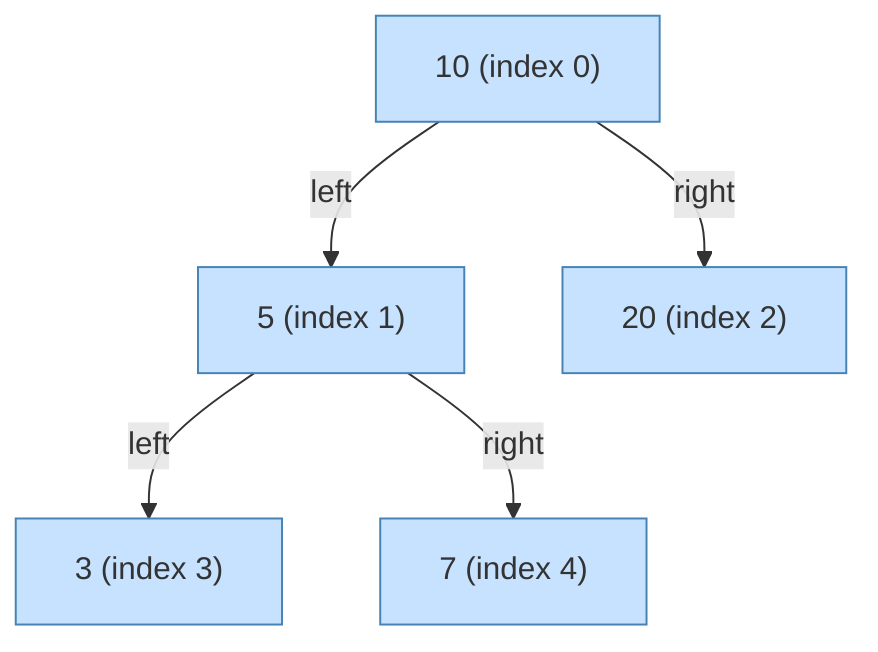

# Laboratory 5: Enumerable, LINQ and Extension Methods

## Starter code

> [!NOTE] > **Student** > 

## Extension methods for existing types

{}
**Identifier naming rules and conventions**

One of the fundamentals of writing readable and consistent code is sticking to conventions. Different programming languages have their own preferences for naming identifiers — variables, methods, properties, or classes.

**Common naming styles**

- `PascalCase`:
  - The first letter of each word is capitalized, without separators (e.g., `UserProfileId`, `HttpRequestHeaders`).
  - Commonly used in: **C#**, **Java** (for class, method, and property names).
- `camelCase`:
  - The first letter of the first word is lowercase and subsequent words start with an uppercase letter (e.g., `startDateTime`, `xmlParserSettings`).
  - Popular in: **JavaScript** (for variables and functions), **Java** (for variables and methods).
- `snake_case`:
  - All letters are lowercase and words are separated by underscores (e.g., `user_profile_id`, `json_response_data`).
  - Often used in: **Python**, **Rust**, databases, or as JSON field names.
- `kebab-case`:
  - Words are separated by hyphens (e.g., `html-element-id`).
  - Commonly encountered in: URLs, HTML attributes, filenames (e.g., in JavaScript/Node.js projects).

In projects that span multiple technology layers (e.g., C# backend, JavaScript frontend, communication via JSON), you often need to convert names between styles. For example, a C# property `EmailAddress` may be serialized to JSON as `email_address`.

**What you'll learn**

- How to create and use extension methods for the `string` type in `C#`.
- How to implement conversions between `PascalCase` and `snake_case` naming styles.

{}

### Task description

Your task is to implement two extension methods for the `string` class:

- `PascalToSnakeCase`, which for a valid identifier in `PascalCase` returns its `snake_case` equivalent.
- `SnakeToPascalCase`, which for a valid identifier in `snake_case` returns its `PascalCase` equivalent.

Example usage:

```csharp
var pascal = "HtmlElementId";
var snake = pascal.PascalToSnakeCase();

Console.WriteLine(snake); // "html_element_id"
```

{}
**Helpful resources:**

- [Microsoft Learn: C# identifier naming rules and conventions](https://learn.microsoft.com/en-us/dotnet/csharp/fundamentals/coding-style/identifier-names)
- [Microsoft Learn: Common C# code conventions](https://learn.microsoft.com/en-us/dotnet/csharp/fundamentals/coding-style/coding-conventions)
- [Microsoft Learn: How to implement and call a custom extension method](https://learn.microsoft.com/en-us/dotnet/csharp/programming-guide/classes-and-structs/how-to-implement-and-call-a-custom-extension-method)
- [Microsoft Learn: Using the StringBuilder Class in .NET](https://learn.microsoft.com/en-us/dotnet/standard/base-types/stringbuilder)

{}

### Example solution

An example solution can be found in [StringExtensions.cs](/labs/lab05/solution/tasks/StringExtensions.cs).

Unit tests are available in [StringExtensionsTests.cs](/labs/lab05/solution/tests/StringExtensionsTests.cs).

## Iterators, `yield`, and generating prime numbers

{}
**Iterators in practice**

Often we need to produce sequences whose length is unknown in advance or whose creation would be too expensive to build all at once. Instead of constructing the whole collection in memory and returning it, we can use iterators — a mechanism that yields elements on demand.

In C#, iterators are created using two keywords:

- `yield return` — returns a single element and suspends the method's execution until the next element is requested.

- `yield break` — immediately stops the iterator and ends the sequence.

The advantage is that you don't need to implement `IEnumerator` yourself; the compiler generates the state machine for you. The iterator preserves its state between calls, which results in more concise and readable code.

**Generating prime numbers**

The Sieve of Eratosthenes is a classic algorithm to compute all prime numbers less than a given number `n`, i.e., in the range `[2, n]`. The algorithm works by eliminating composite numbers.

**What you'll learn**

- Creating iterators in C# using `yield return` and `yield break`.
- Preserving method state between iterator invocations.
- Memory and performance optimizations when processing large datasets.

{}

### Task description

Implement the following method:

```csharp
public static class PrimeFinder
{
  public static IEnumerable<int> SieveOfEratosthenes(int upperBound);
}
```

The method should use `yield return` and `yield break` to generate prime numbers on demand.

Example usage:

```csharp
foreach (var prime in SieveOfEratosthenes(1000))
{
    if (prime > 850) break;
    Console.WriteLine(prime);
}
```

{}
**Helpful resources:**

- [Sieve of Eratosthenes](https://en.wikipedia.org/wiki/Sieve_of_Eratosthenes)
- [Microsoft Learn: yield statement - provide the next element](https://learn.microsoft.com/en-us/dotnet/csharp/language-reference/statements/yield)

{}

### Example solution

An example solution can be found in [PrimeFinder.cs](/labs/lab05/solution/tasks/PrimeFinder.cs).

Unit tests are available in [PrimeFinderTests.cs](/labs/lab05/solution/tests/PrimeFinderTests.cs).

## Implementing the `IEnumerable<T>` interface

{}
**Array-based tree representation**

Binary trees are a fundamental data structure for storing hierarchical data. While they are often implemented using pointers (or references) to child nodes, there is an alternative and efficient approach: an **array representation**.

In this model the root is stored at index `0` of an array. For any parent node at index `i`:

- Its left child is at index `2 * i + 1`.
- Its right child is at index `2 * i + 2`.

This approach eliminates the need to store references in each node, saving memory. The challenge is dynamically managing the array size when the tree grows and you need to add an element at an index beyond the current bounds.

**Example**



**Traversal (`IEnumerable`)**

To make the tree class useful, it should provide a way to iterate over its elements. The .NET standard is to implement `IEnumerable<T>`. For a binary tree, an `In-Order` traversal is common — for a BST it yields elements in sorted order. Using `yield return` allows implementing this traversal recursively in an elegant way.

**What you'll learn**

- Implementing a binary tree structure using a flat array.
- Mapping parent-child relationships to array indices.
- Dynamically resizing the array (`Array.Resize`) when needed.
- Implementing `IEnumerable<T>` for a custom collection.
- Creating a recursive `In-Order` iterator using `yield return`.

{}

### Task description

Implement the `ArrayBinaryTreeInt` class that implements the `IBinaryTree<int>` interface. This class should represent a binary tree of integers using an internal array.

Implement the following interface:

```csharp
public interface IBinaryTree<T> : IEnumerable<T>
{
  int Count { get; }
  T Get(int index);
  void SetRoot(T value);
  void SetLeft(int parentIndex, T value);
  void SetRight(int parentIndex, T value);
  bool Exists(int index);
  void Clear();
}
```

The implementing class should maintain correct `Count` logic, handle exceptions (e.g., adding a child to a non-existent parent), and dynamically resize the array when a child index exceeds the current array bounds.

Example usage:

```csharp
var tree = new ArrayBinaryTreeInt();
tree.SetRoot(10);
tree.SetLeft(0, 5);
tree.SetRight(0, 20);
tree.SetLeft(1, 3);
tree.SetRight(1, 7);

// Expected output (In-Order traversal): 3, 5, 7, 10, 20
foreach (var value in tree)
{
  Console.WriteLine(value);
}
```

{}
**Helpful resources:**

- [Binary Tree (Array implementation)](https://en.wikipedia.org/wiki/Binary_tree#Arrays)
- [Microsoft Learn: IEnumerable<T> Interface](https://learn.microsoft.com/en-us/dotnet/api/system.collections.generic.ienumerable-1?view=net-9.0)
- [Microsoft Learn: Array.Resize Method](https://learn.microsoft.com/en-us/dotnet/api/system.array.resize?view=net-9.0)

{}

### Example solution

An example solution can be found in [ArrayBinaryTreeInt.cs](/labs/lab05/solution/tasks/ArrayBinaryTreeInt.cs).

Unit tests are available in [ArrayBinaryTreeIntTests.cs](/labs/lab05/solution/tests/ArrayBinaryTreeIntTests.cs).

## `IEnumerable`, generics and LINQ

{}
**LINQ in practice**

In C#, LINQ (Language Integrated Query) allows you to express queries and operations on sequences (`IEnumerable<T>`) in a concise, declarative manner. With extension methods you can add your own operators to `IEnumerable<T>`, extending LINQ with commonly repeated processing patterns such as:

- `Fold(seed, func, resultSelector)` — generalizes aggregation (reduction), keeping an accumulator across elements and returning a final result.
- `Batch(size)` — splits a sequence into successive batches of a given `size`, useful for batch uploads or processing.
- `SlidingWindow(size)` — produces overlapping sliding windows of a specified `size`, useful for trend detection.

Thanks to LINQ's lazy evaluation and extension methods, processing can be both readable and efficient — elements are produced and filtered only when needed.

**What you'll learn**

- Creating generic LINQ-style extension methods.
- Working with an explicit enumerator object (`MoveNext`, `Current`).
- Solving practical data-processing problems using the implemented operators.

{}

### Task description

The task is split into three parts. Each part starts with implementing an operation that resembles existing LINQ methods, and then solving practical problems using that operation.

**Fold**

Implement a generic extension method `Fold` for any sequence (`IEnumerable<T>`) which:

- Accepts an initial accumulator value `seed` (possibly of a different type than the sequence elements).
- Invokes a provided accumulator function for each element, updating the accumulator state.
- After iterating the whole sequence, invokes a result selector function to transform the final accumulator state into the method result.

The method should return the result produced by the final function. Implement all steps manually (initializing the accumulator, iterating elements, computing the final result) using an explicit enumerator object.

**Challenges**

{}
<br>
Implement an extension method for integer sequences with the following requirements:

- The method is named `ComputeStatistics`.
- If the sequence is `null` or contains no elements, it should throw `ArgumentException` with the message `Source sequence must contain at least one element.`
- In a single pass (using the previously implemented `Fold`) compute:
  - minimum value,
  - maximum value,
  - arithmetic mean,
  - standard deviation.
- Return a tuple `(min, max, average, standardDeviation)`.

Example usage:

```csharp
var source = new[] { 2, 5, 3, 9, 4 };
var (min, max, average, std) = source.ComputeStatistics();

Console.WriteLine($"Min = {min}");            // 2
Console.WriteLine($"Max = {max}");            // 9
Console.WriteLine($"Average = {average:F2}"); // 4.60
Console.WriteLine($"StdDev = {std:F2}");      // 2.42
```

{}

{}
<br>
Implement an extension method for integer sequences with the following requirements:

- The method is named `LongestSequence`.
- If the sequence is `null` or empty, throw `ArgumentException` with the message `Source sequence must contain at least one element.`
- In a single pass (using `Fold`) find the longest contiguous subsequence of identical values and return:
  - `start` — starting index of that subsequence,
  - `end` — ending index (inclusive),
  - `value` — the repeated value.
- Indices are zero-based and refer to the original sequence.

Example usage:

```csharp
var source = new[] { 1, 1, 2, 2, 2, 3, 3, 2 };
//                   0  1  2  3  4  5  6  7

var (start, end, value) = source.LongestSequence();

Console.WriteLine($"Start = {start}"); // 2
Console.WriteLine($"End = {end}");     // 4
Console.WriteLine($"Value = {value}"); // 2

```

{}

**Batch**

Implement a generic extension method `Batch` for any sequence (`IEnumerable<T>`) which:

- Splits the input sequence into successive batches with a maximum size `size`, returning them lazily as `IEnumerable<IEnumerable<T>>`.
- The last batch may be smaller if the item count is not a multiple of `size`.

Use an explicit enumerator in the implementation.

**SlidingWindow**

Implement a generic extension method `SlidingWindow` for any sequence (`IEnumerable<T>`) which:

- Returns successive overlapping windows of fixed size `size`.
- If `size` is less than 1, throw `ArgumentException` with message `Window size must be at least 1.`
- Windows slide forward by one element, so for `[a,b,c,d]` and `size=3` it yields `[a,b,c]` then `[b,c,d]`.

Example usage:

```csharp
var source = Enumerable.Range(1, 5); // {1,2,3,4,5}
foreach (var window in source.SlidingWindow(3))
{
    Console.WriteLine($"[{string.Join(", ", window)}]");
}

/* Expected output
[1, 2, 3]
[2, 3, 4]
[3, 4, 5]
*/
```

**Challenges**

{}
<br>

Implement `FindSlidingWindowsWithRisingSum` which returns (as `IEnumerable<IEnumerable<int>>`) all windows of length 5 whose sum is greater than the sum of the immediately preceding window.

Example:

Given the sequence:

```csharp
var sequence = new [] { 5, 3, 1, 2, 4, 2, 10, -1, 2, 4, 7, -3 }
```

> The table below analyzes consecutive windows and their sums:

| Window | Elements            | Sum | Returned? |
| ------ | ------------------- | --- | --------- |
| 1      | `[5, 3, 1, 2, 4]`   | 15  | ❌        |
| 2      | `[3, 1, 2, 4, 2]`   | 12  | ❌        |
| 3      | `[1, 2, 4, 2, 10]`  | 19  | ✅        |
| 4      | `[2, 4, 2, 10, -1]` | 17  | ❌        |
| 5      | `[4, 2, 10, -1, 2]` | 17  | ❌        |
| 6      | `[2, 10, -1, 2, 4]` | 17  | ❌        |
| 7      | `[10, -1, 2, 4, 7]` | 22  | ✅        |
| 8      | `[-1, 2, 4, 7, -3]` | 9   | ❌        |

the returned collection is:

```csharp
[
  [ 1, 2, 4, 2, 10 ],
  [ 10, -1, 2, 4, 7 ]
]
```

{}

{}
<br>

Implement `FindSlidingWindowsWithDuplicates` which returns (as `IEnumerable<IEnumerable<int>>`) all windows of length 4 that contain at least one duplicated number.

Example:

Given the sequence:

```csharp
var sequence = new[] { 1, 2, 3, 4, 2, 5, 6, 2, 7, 8 }
```

> The table below analyzes consecutive windows and duplicate presence:

| Window | Elements       | Duplicates? | Returned? |
| ------ | -------------- | ----------- | --------- |
| 1      | `[1, 2, 3, 4]` | none        | ❌        |
| 2      | `[2, 3, 4, 2]` | 2           | ✅        |
| 3      | `[3, 4, 2, 5]` | none        | ❌        |
| 4      | `[4, 2, 5, 6]` | none        | ❌        |
| 5      | `[2, 5, 6, 2]` | 2           | ✅        |
| 6      | `[5, 6, 2, 7]` | none        | ❌        |
| 7      | `[6, 2, 7, 8]` | none        | ❌        |

the returned collection is:

```csharp
[
  [ 2, 3, 4, 2 ],
  [ 2, 5, 6, 2 ]
]
```

{}

{}
<br>

Implement `FindMostCommonTrigrams` which finds all most-frequently-occurring 3-letter sequences (trigrams) in the input text.

Assumptions:

- A trigram is any three consecutive **letters** in the text (non-letter characters are ignored).
- Letter case is ignored (`ABC` and `abc` are the same trigram).
- Return an `IEnumerable<string>` with all trigrams that occur most frequently (there may be more than one if they have the same count).
- If the text contains fewer than 3 letters, return an empty sequence.

Example:

For the text **_Anna and Antek are analyzing an annual analysis._** consider the character sequence: **_annaandantekareanalyzinganannualanalysis_**.

> The table below lists trigrams that appear more than once:

| Trigram | Count | Returned? |
| ------- | ----- | --------- |
| `"ana"` | 3     | ✅        |
| `"aly"` | 2     | ❌        |
| `"ann"` | 2     | ❌        |
| `"nal"` | 2     | ❌        |

the returned collection is:

```csharp
[
  "ana",
]
```

{}

### Example solution

An example solution can be found in [EnumerableExtensions.cs](/labs/lab05/solution/tasks/EnumerableExtensions.cs).

Unit tests are available in [EnumerableExtensionsTests.cs](/labs/lab05/solution/tests/EnumerableExtensionsTests.cs).

## LINQ and movie data analysis

{}
**What is a relational database?**

A relational database stores information in **tables** that are connected by **relationships**. A typical table has a **primary key** — a unique identifier for each record (row).

Tables can also include **foreign keys**, which reference identifiers from other tables.

**Joins (`JOIN`)**

To get a fuller picture — for example, "Who acted in which movie?" or "What are the average ratings for fantasy films?" — we often combine data from multiple tables using `JOIN` operations.

Two joins that are especially relevant here are:

- `INNER JOIN`, which combines two sets but only when matching rows exist in both tables.
- `LEFT JOIN`, which returns all rows from the left table even if there is no matching row in the right table.

**What you'll learn**

- Using LINQ queries to join, filter, and group data.
- Aggregating and sorting collections and extracting statistics (e.g., average ratings, counts).
- Working with related collections (`movies`, `actors`, `casts`, `ratings`) using `Join`, `GroupJoin`, and `SelectMany`.
- Creating nested result structures (for example, movies with their casts).
- Optimizing queries by filtering and projecting only the needed data.

{}

### Task description

The sample in-memory movie database is located in [SampleMovieDatabase.cs](/labs/lab05/solution/tasks/Databases/SampleMovieDatabase.cs). It stores collections of records for the different entities (`List<Movie>`, `List<Actor>`, etc.).

The data models represent the following records:

```csharp
public record Movie(
  int Id, // primary key
  string Title,
  int Year,
  [property: JsonConverter(typeof(JsonStringEnumConverter))]
  Genre Genre,
  int DurationMinutes
);

public record Actor(
  int Id, // primary key
  string Name
);

public record Rating(
  int Id, // primary key
  int MovieId, // foreign key
  int Score,
  DateTime CreatedAt
);

public record Cast( // association table
  int MovieId, // foreign key
  int ActorId, // foreign key
  string Role
);
```

Implement LINQ queries in `DatabaseQueries.cs` to analyze the movie dataset.

To display results we will use a simple helper that serializes the `query` object to JSON:

```csharp
public static void DisplayQueryResults<T>(T query)
{
  var options = new JsonSerializerOptions
  {
    WriteIndented = true
  };

  options.Converters.Add(new JsonStringEnumConverter());

  var json = JsonSerializer.Serialize(query, options);

  Console.WriteLine(json);
}
```

**Queries**

{}
<br>
Find unique actors who acted in fantasy movies.
{}
{}
<br>
For each genre, find the movie with the greatest duration.
{}
{}
<br>
List movies whose average rating exceeds 8, together with the list of actors who appeared in those movies.
{}
{}
<br>
For each actor, compute how many distinct roles they played and sort descending by that count.
{}
{}
<br>
Show the most recent movies with their average ratings, sorted descending by the average.
{}
{}
<br>
Compute and display the average movie rating for each genre.
{}
{}
<br>
Find actors who never appeared in any movie with the `Thriller` genre.
{}
{}
<br>
Show the three movies that received the most ratings.
{}
{}
<br>
List movies that have no ratings assigned.
{}
{}
<br>
Find actors who performed in the largest number of different movie genres.
{}

{}
**Implementation notes**

- For queries 2, 4, and 6 the result may differ depending on the type of join used. As an exercise, try both `INNER JOIN` and `LEFT JOIN` and compare results.
- Both approaches are acceptable for this exercise as long as you understand why results differ 😉.
- For query 2 there might be genres with no movies in the dataset.
- In query 3, some actors may not have played in any movie present in the database.
- For query 6 some genres may have no ratings.
- For simplicity, the tasks do not mandate exact columns to return from each record.

{}

### Example solution

An example solution is available in [DatabaseQueries.cs](/labs/lab05/solution/tasks/DatabaseQueries.cs). This code is executed from [Program.cs](/labs/lab05/solution/tasks/Program.cs).
