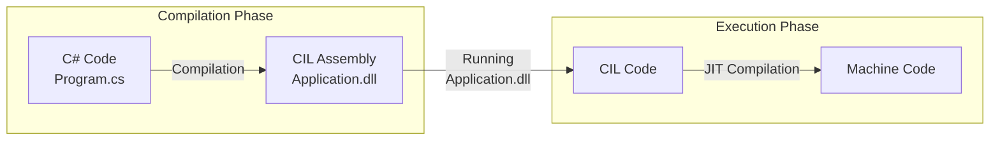

## The C# Language and the .NET Platform

The C# language was created at Microsoft by a team led by **Anders Hejlsberg** and was introduced in 2002 as part of the **.NET Framework**. The name C# (C Sharp) is inspired by musical notation, where a sharp raises a note by a semitone, symbolizing an evolution relative to the C++ language.

The .NET platform - which includes the C# **CoreCLR runtime** and the **Roslyn compiler** - initially available as **.NET Framework** only for Windows, was eventually complemented by **.NET Core** – a rewritten, multi-platform, and open-source version of the environment. For a time, both of these solutions were developed in parallel. Ultimately, the .NET Core line became the foundation for future development. Starting with .NET 5, the platform was symbolically unified under the single name **.NET**, becoming the successor to both .NET Core and .NET Framework. It was as part of this transformation that the entire environment – including the C# compiler (Roslyn) and the runtime (CoreCLR) – became an **open-source** project. Microsoft releases a new version of the platform every year (.NET 6, .NET 7, .NET 8, etc.). The latest changes can be tracked in the official documentation: [What's new in .NET](https://learn.microsoft.com/en-us/dotnet/core/whats-new/) and [What's new in C#](https://learn.microsoft.com/en-us/dotnet/csharp/whats-new/).

For years, C# has been one of the **most popular** programming languages, regularly ranking at the top of the [TIOBE index](https://www.tiobe.com/tiobe-index/csharp/) and Stack Overflow surveys. It finds wide application in web applications (ASP.NET Core), desktop (WPF, WinUI), cloud, and also in game development (Unity engine).

The language is **significantly simpler** to learn than C++. It was designed with developer productivity and safety in mind. The syntax of C# belongs to the C-family of languages, so it will be familiar to C, C++, or Java programmers.

### Main Features of the Language

C# is a **managed** language, which means that the code is executed under the control of the .NET runtime, not directly by the operating system. Mechanisms such as automatic memory management (**Garbage Collector**) eliminate entire classes of errors known from unmanaged languages, but this comes with a certain performance overhead.

It is also a **strongly typed and object-oriented** language. Strong typing means that data types must be defined and are checked at compile time, which helps detect errors at an early stage. As an object-oriented language, C# provides mechanisms such as classes, interfaces, encapsulation, inheritance, and polymorphism. Unlike C++, all program code must be contained within classes. At the same time, C# draws from other paradigms, offering support for functional programming (LINQ, lambda expressions), event-driven programming (events, delegates), and asynchronous programming (`async`/`await`).

### How Does C# Code Work? Compilation to CIL and JIT

Unlike C++, where there are many compilers, C# has one main, official implementation from Microsoft. To build and run an application, the **.NET SDK** is required.

The process of running C# code is as follows:
1.  The C# compiler (**Roslyn**) translates the source code into an **intermediate language** (Common Intermediate Language, CIL).
2.  The CIL code is saved in `.dll` or `.exe` files.
3.  Only when the application is launched does the .NET runtime (**CoreCLR**) compile the CIL code into machine code on the fly (**Just-In-Time (JIT)**).



This mechanism allows the same compiled CIL code to be run on different operating systems. It is worth noting that due to JIT compilation, C# code can potentially be slower than C++ code (especially on the first run of a given code fragment). This is due to the need to allocate memory for the machine code and the translation process itself. Subsequent calls to the same code fragment are much faster because the runtime uses the previously compiled version.

## Hello World

A new project can be created using the `dotnet` command-line interface:

```shell
dotnet new console -o Hello
```

After executing this command, a `Program.cs` file will be generated in the `Hello` directory with the following content:

```csharp
// Program.cs
Console.WriteLine("Hello, World!");
```

Since version 9.0, C# supports so-called **top-level statements**, which allow omitting the `Program` class and `Main` method definition for simple applications. The compiler generates them automatically, and the code becomes more concise.

We can run the application immediately:

```shell
dotnet run
```

In older project templates, the same code would look like this:

```csharp
using System;

namespace Hello
{
    class Program
    {
        static void Main(string[] args)
        {
            Console.WriteLine("Hello, World!");
        }
    }
}
```

> You can force the generation of the main program by adding the `--use-program-main` parameter when creating the project.

In this case, the entire structure is visible:
- `namespace Hello` groups the code into a logical unit.
- `class Program` is a container for data and methods.
- `static void Main(string[] args)` is the program's entry point.
- `using System;` imports the namespace where the `Console` class is defined. It is the equivalent of `#include` from C++.

The statement `Console.WriteLine("Hello, World!");` is a call to the static `WriteLine` method on the `Console` class.

> Popular Integrated Development Environments (IDEs) for C# include Visual Studio (Windows), Visual Studio Code (cross-platform), and JetBrains Rider (cross-platform). Under the hood, they all use the `dotnet` tool. You can also experiment online, for example, at [dotnetfiddle.net](https://dotnetfiddle.net/) or [sharplab.io](https://sharplab.io/).

## Basic Tools

To start writing programs, it's worth getting to know a few useful tools and types from the .NET standard library.

### Standard Input/Output

The `System.Console` class provides basic methods for interacting with the console.

The `Console.WriteLine()` method prints text to the standard output and adds a newline character. `Console.Write()` works similarly but without ending the line. `Console.ReadLine()` is used for reading data.

```csharp
Console.Write("Enter your name: ");
string name = Console.ReadLine();
int year = DateTime.Now.Year;
Console.WriteLine($"Hello, {name}! The year is {year}.");
```

The `$"..."` construct is **string interpolation**, a simple way to format text using variable values. It is a mechanism similar to `std::format` introduced in C++20 ([`std::format`](https://en.cppreference.com/w/cpp/utility/format/format)).

### The `string` Type

The `string` type (an alias for `System.String`) is the basic type for working with text. A key feature of a string is its **immutability**, which means that once a string is created, it cannot be modified. Any operation that looks like a modification (e.g., appending text or replacing characters) actually creates a completely new `string` object in memory with the new value.

```csharp
string txt = "Hello, ";
string txt2 = txt + "World!"; // "Hello, World!"

// txt2[5] = '?'; // ERROR: String is immutable!
string txt3 = txt2.Replace(',', '?'); // "Hello? World!"

string option = "first";
if (option == "first")
{
   // ...
}

Console.WriteLine(txt2.ToUpper()); // "HELLO, WORLD!"
```

### The `List<T>` Type

One of the most commonly used containers in the standard library is `List<T>`. It is the equivalent of `std::vector` from C++, i.e., a dynamic array that stores elements of a specific type. It is defined in the `System.Collections.Generic` namespace.

`List<T>` is the name of a so-called _generic type_ - a C# mechanism for generic programming. This mechanism is similar to templates in C++, although in C# it is simpler to use and has different limitations. Only after specifying the type of the stored elements, e.g., `List<int>`, `List<string>`, can it be used as a variable type.

By default, a created list is empty. It can be initialized with a given collection of elements.

```csharp
var numbers = new List<int> { 1, 2, 3, 4 };

Console.WriteLine($"Number of elements: {numbers.Count}"); // 4

numbers.Add(5); // {1, 2, 3, 4, 5}
numbers.Remove(3); // Removes the first occurrence of the value 3 -> {1, 2, 4, 5}

numbers[1] = 10; // {1, 10, 4, 5}

var anotherList = new List<int>(numbers); // Copying the list

// Iterating over elements
foreach (var number in numbers)
{
    Console.Write($"{number} ");
}
Console.WriteLine(); // New line after printing

numbers.Clear(); // Clearing the list -> {}
```

Classes in C# have **fields**, **properties**, and **methods**. Properties, such as `numbers.Count`, look like fields, but they hide logic underneath (get and set methods). Methods, such as `numbers.Add(5)`, perform operations on behalf of a given object.