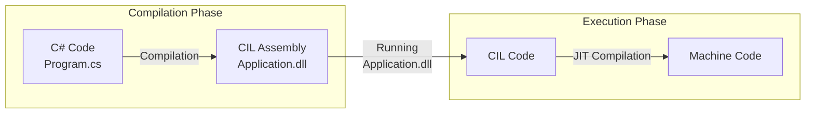

## Język C# i platforma .NET

Język C# został stworzony w firmie Microsoft przez zespół pod kierownictwem **Andersa Hejlsberga** i wprowadzony na rynek w 2002 roku jako część platformy **.NET Framework**. Nazwa C# (C Sharp) jest inspirowana notacją muzyczną, gdzie krzyżyk (sharp) podnosi nutę o pół tonu, co symbolizuje ewolucję w stosunku do języka C++.

Platforma .NET - czyli m.in. środowisko uruchomieniowe C# **CoreCLR** i kompilator C# **Roslyn** - początkowo dostępna jako **.NET Framework** tylko dla systemu Windows, została z czasem uzupełniona o **.NET Core** – napisaną od nowa, wieloplatformową i otwartą wersję środowiska. Przez pewien czas oba te rozwiązania były rozwijane równolegle. Ostatecznie linia .NET Core stała się podstawą dla przyszłego rozwoju. Począwszy od wersji .NET 5, platforma została symbolicznie zunifikowana pod jedną nazwą **.NET**, stając się następcą zarówno .NET Core, jak i .NET Framework. To właśnie w ramach tej transformacji całe środowisko – w tym kompilator C# (Roslyn) i środowisko uruchomieniowe (CoreCLR) – stało się projektem **open-source**. Microsoft co roku publikuje nową wersję platformy (.NET 6, .NET 7, .NET 8 itd.). Najnowsze zmiany można śledzić w oficjalnej dokumentacji: [Co nowego w .NET](https://learn.microsoft.com/en-us/dotnet/core/whats-new/) oraz [Co nowego w C#](https://learn.microsoft.com/en-us/dotnet/csharp/whats-new/).

C# od lat jest jednym z **najpopularniejszych** języków programowania, regularnie zajmując czołowe miejsca w [indeksie TIOBE](https://www.tiobe.com/tiobe-index/csharp/) i ankietach Stack Overflow. Znajduje szerokie zastosowanie w aplikacjach webowych (ASP.NET Core), desktopowych (WPF, WinUI), chmurowych, a także w tworzeniu gier (silnik Unity).

Język jest **znacznie prostszy** do nauki niż C++. Został zaprojektowany z myślą o produktywności i bezpieczeństwie programisty. Składnia C# należy do rodziny języków C, więc będzie znajoma dla programistów C, C++ czy Java.

### Główne cechy języka

C# jest językiem **zarządzanym** (managed), co oznacza, że kod jest wykonywany pod kontrolą środowiska uruchomieniowego .NET, a nie bezpośrednio przez system operacyjny. Mechanizmy, takie jak automatyczne zarządzanie pamięcią (**Garbage Collector**), eliminują całe klasy błędów znanych z języków nienadzorowanych (unmanaged), jednak wiąże się to z pewnym narzutem wydajnościowym.

Jest to również język **silnie typowany i obiektowy**. Silne typowanie oznacza, że typy danych muszą być zdefiniowane i są sprawdzane w czasie kompilacji, co pomaga wykrywać błędy na wczesnym etapie. Jako język obiektowy, C# dostarcza mechanizmy takie jak klasy, interfejsy, enkapsulację, dziedziczenie i polimorfizm. W odróżnieniu od C++, cały kod programu musi zawierać się w klasach. Jednocześnie, C# czerpie z innych paradygmatów, oferując wsparcie dla programowania funkcyjnego (LINQ, wyrażenia lambda), programowania sterowanego zdarzeniami (events, delegates) i asynchronicznego (`async`/`await`).

### Jak działa kod w C#? Kompilacja do CIL i JIT

W przeciwieństwie do C++, gdzie istnieje wiele kompilatorów, C# ma jedną główną, oficjalną implementację od Microsoftu. Do zbudowania i uruchomienia aplikacji potrzebny jest **zestaw narzędzi .NET SDK**.

Proces uruchamiania kodu C# wygląda następująco:
1.  Kompilator C# (**Roslyn**) tłumaczy kod źródłowy na **język pośredni** (Common Intermediate Language, CIL).
2.  Kod CIL jest zapisywany w plikach `.dll` lub `.exe`.
3.  Dopiero w momencie uruchomienia aplikacji, środowisko uruchomieniowe .NET (**CoreCLR**) kompiluje na bieżąco (**Just-In-Time (JIT)**) kod CIL do kodu maszynowego.



Ten mechanizm pozwala na uruchamianie tego samego skompilowanego kodu CIL na różnych systemach operacyjnych. Warto zaznaczyć, że ze względu na kompilację JIT, kod C# może być potencjalnie wolniejszy od kodu C++ (szczególnie przy pierwszym uruchomieniu danego fragmentu kodu). Wynika to z konieczności alokacji pamięci na kod maszynowy i samego procesu tłumaczenia. Kolejne wywołania tego samego fragmentu kodu są już znacznie szybsze, ponieważ środowisko uruchomieniowe korzysta ze skompilowanej wcześniej wersji.

## Hello World

Nowy projekt można utworzyć przy pomocy interfejsu linii poleceń `dotnet`:

```shell
dotnet new console -o Hello
```

Po wykonaniu tego polecenia, w katalogu `Hello` zostanie wygenerowany plik `Program.cs` z następującą zawartością:

```csharp
// Program.cs
Console.WriteLine("Hello, World!");
```

C# od wersji 9.0 wspiera tzw. **instrukcje najwyższego poziomu** (top-level statements), które pozwalają pominąć definicję klasy `Program` i metody `Main` dla prostych aplikacji. Kompilator generuje je automatycznie, a kod staje się bardziej zwięzły.

Aplikację możemy od razu uruchomić:

```shell
dotnet run
```

W starszych szablonach projektów, ten sam kod wyglądałby następująco:

```csharp
using System;

namespace Hello
{
    class Program
    {
        static void Main(string[] args)
        {
            Console.WriteLine("Hello, World!");
        }
    }
}
```

> Można wymusić generację programu main przez dodanie parametru `--use-program-main` przy tworzeniu projektu.

W tym przypadku widać całą strukturę:
- `namespace Hello` grupuje kod w logiczną całość.
- `class Program` to kontener dla danych i metod.
- `static void Main(string[] args)` to punkt wejścia programu.
- `using System;` importuje przestrzeń nazw, w której zdefiniowana jest klasa `Console`. Jest to odpowiednik `#include` z C++.

Instrukcja `Console.WriteLine("Hello, World!");` to wywołanie statycznej metody `WriteLine` na klasie `Console`.

> Popularne środowiska programistyczne (IDE) dla C# to Visual Studio (Windows), Visual Studio Code (wieloplatformowe) i JetBrains Rider (wieloplatformowe). Pod spodem wszystkie używają narzędzia `dotnet`. Można też eksperymentować online, np. [dotnetfiddle.net](https://dotnetfiddle.net/) lub [sharplab.io](https://sharplab.io/).

## Podstawowe narzędzia

Aby rozpocząć pisanie programów, warto poznać kilka użytecznych narzędzi i typów z biblioteki standardowej .NET.

### Standardowe wejście/wyjście

Klasa `System.Console` dostarcza podstawowe metody do interakcji z konsolą.

Metoda `Console.WriteLine()` wypisuje tekst na standardowe wyjście i dodaje znak nowej linii. `Console.Write()` działa analogicznie, ale bez kończenia linii. Do wczytywania danych służy `Console.ReadLine()`.

```csharp
Console.Write("Podaj swoje imię: ");
string name = Console.ReadLine();
int year = DateTime.Now.Year;
Console.WriteLine($"Witaj, {name}! Mamy rok {year}.");
```

Konstrukcja `$"..."` to **interpolacja stringów**, prosty sposób na formatowanie tekstu z użyciem wartości zmiennych. Jest to mechanizm podobny do wprowadzonego w C++20 [`std::format`](https://en.cppreference.com/w/cpp/utility/format/format).

### Typ `string`

Typ `string` (alias dla `System.String`) to podstawowy typ do pracy z tekstem. Kluczową cechą stringa jest **niezmienność (immutability)**, co oznacza, że raz utworzonego stringa nie można już zmodyfikować. Każda operacja, która wygląda jak modyfikacja (np. dodawanie tekstu lub zamiana znaków), w rzeczywistości tworzy w pamięci zupełnie nowy obiekt `string` z nową wartością.

```csharp
string txt = "Hello, ";
string txt2 = txt + "World!"; // "Hello, World!"

// txt2[5] = '?'; // BŁĄD: String jest niezmienny!
string txt3 = txt2.Replace(',', '?'); // "Hello? World!"

string option = "first";
if (option == "first")
{
   // ...
}

Console.WriteLine(txt2.ToUpper()); // "HELLO, WORLD!"
```

### Typ `List<T>`

Jednym z najczęściej używanych kontenerów w bibliotece standardowej jest `List<T>`. Jest to odpowiednik `std::vector` z C++, czyli dynamiczna tablica przechowująca elementy określonego typu. Definiuje go przestrzeń nazw `System.Collections.Generic`.

`List<T>` to nazwa tzw. _typu generycznego_ - mechanizmu języka C# do programowania generycznego. Jest to mechanizm podobny do szablonów (templates) z C++, choć w C# jest on prostszy w użyciu i ma inne ograniczenia. Dopiero po wskazaniu typu przechowywanych elementów, np. `List<int>`, `List<string>`, można go użyć jako typu zmiennej.

Domyślnie utworzona lista jest pusta. Można ją zainicjalizować podaną kolekcją elementów.

```csharp
var numbers = new List<int> { 1, 2, 3, 4 };

Console.WriteLine($"Liczba elementów: {numbers.Count}"); // 4

numbers.Add(5); // {1, 2, 3, 4, 5}
numbers.Remove(3); // Usuwa pierwsze wystąpienie wartości 3 -> {1, 2, 4, 5}

numbers[1] = 10; // {1, 10, 4, 5}

var anotherList = new List<int>(numbers); // Kopiowanie listy

// Iteracja po elementach
foreach (var number in numbers)
{
    Console.Write($"{number} ");
}
Console.WriteLine(); // Nowa linia po wypisaniu

numbers.Clear(); // Wyczyszczenie listy -> {}
```

Klasy w C# posiadają **pola**, **właściwości** (properties) i **metody**. Właściwości, takie jak `numbers.Count`, wyglądają jak pola, ale pod spodem ukrywają logikę (metody `get` i `set`). Metody, takie jak `numbers.Add(5)`, wykonują operacje na rzecz danego obiektu.
