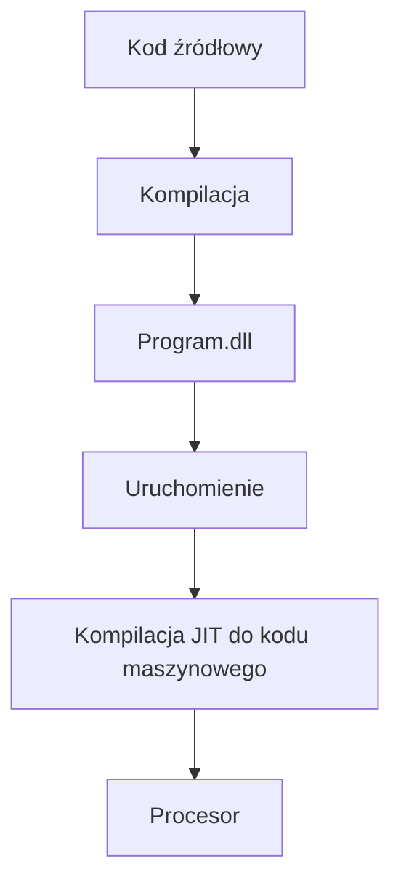

## Język C# i platforma .NET

Język autorstwa zespołu w firmie Microsoft pod kierownictwem duńskiego inżyniera [Andersa Hejlsberga](https://en.wikipedia.org/wiki/Anders_Hejlsberg). Pierwsza wersja języka pojawiła się w roku 2002 jako część inicjatywy .NET Framework. Nazwa C# (C Sharp) jest inspirowana notacją muzyczną, gdzie krzyżyk (sharp) oznacza podniesienie nuty o pół tonu. Jest to też nawiązanie do języka C++, gdzie znak '#' można postrzegać jako cztery połączone znaki '+'.

Platforma .NET ewoluowała od początkowego .NET Framework (przeznaczonego głównie dla systemu Windows), poprzez wieloplatformowy .NET Core, aż do obecnej, ujednoliconej platformy nazywanej po prostu .NET. Od tego momentu cała platforma .NET (w tym kompilator C# Roslyn i środowisko uruchomieniowe CoreCLR) jest rozwijana jako projekt open-source, dostępny na GitHubie.

Jest to środowisko uruchomieniowe, które pozwala na tworzenie aplikacji w wielu językach programowania (takich jak C#, F#, Visual Basic), kompilowanych do wspólnego języka pośredniego (Common Intermediate Language - CIL). Dzięki temu, kod napisany w jednym języku może współdziałać z kodem napisanym w innym, a aplikacje mogą być uruchamiane na różnych systemach operacyjnych. W przeciwieństwie do C++, C# posiada jedną główną, oficjalną implementację dostarczaną przez Microsoft (kompilator Roslyn, środowisko uruchomieniowe CoreCLR).

Komitet standaryzacyjny i Microsoft publikują nową wersję platformy co roku - .NET 5, .NET 6, .NET 7, .NET 8 itd.

Aby zapoznać się ze szczegółowymi zmianami w kolejnych wersjach, warto odwiedzić oficjalną dokumentację Microsoftu: [Co nowego w .NET](https://learn.microsoft.com/en-us/dotnet/core/whats-new/) oraz [Co nowego w C#](https://learn.microsoft.com/en-us/dotnet/csharp/whats-new/).

C# od lat jest jednym z **najpopularniejszych** języków programowania, regularnie zajmując czołowe miejsca w [indeksie TIOBE](https://www.tiobe.com/tiobe-index/csharp/) i ankietach Stack Overflow. Znajduje szerokie zastosowanie w aplikacjach webowych (ASP.NET Core), desktopowych (WPF, WinUI), chmurowych, a także w tworzeniu gier (silnik Unity).

Język jest **znacznie prostszy** do nauki niż C++. Został zaprojektowany z myślą o produktywności i bezpieczeństwie programisty. Składnia C# należy do rodziny języków C, więc będzie znajoma dla programistów C, C++ czy Java.

Jest to język **zarządzany** (managed), co oznacza, że kod jest wykonywany pod kontrolą środowiska uruchomieniowego .NET, a nie bezpośrednio przez system operacyjny. Kluczowe mechanizmy, takie jak automatyczne zarządzanie pamięcią (Garbage Collector), eliminują całe klasy błędów znanych z języków nienadzorowanych (unmanaged), jednak wiąże się to również z pewnym narzutem wydajnościowym, ponieważ GC musi okresowo przerywać działanie programu, aby zwolnić nieużywaną pamięć.

C# jest językiem **silnie typowanym i obiektowym**. Silne typowanie oznacza, że typy danych są ściśle określone i sprawdzane w czasie kompilacji, co pomaga wykrywać błędy na wczesnym etapie. Jako język obiektowy, dostarcza mechanizmy takie jak klasy, interfejsy, enkapsulację, dziedziczenie i polimorfizm, i narzuca to podejście jako podstawowy paradygmat. Jednocześnie, C# bogato czerpie z innych paradygmatów, oferując zaawansowane wsparcie dla programowania funkcyjnego (LINQ, wyrażenia lambda), programowania sterowanego zdarzeniami (events, delegates) i asynchronicznego (`async`/`await`).

## Hello World

Nowy projekt można utworzyć przy pomocy interfejsu linii poleceń `dotnet`:

```shell
# Utworzenie nowego projektu konsolowego w folderze "Hello"
dotnet new console -o Hello
cd Hello
```

Po wykonaniu tych komend, w katalogu `Hello` zostanie wygenerowany plik `Program.cs` z następującą zawartością:

```csharp
// Program.cs
Console.WriteLine("Hello, World!");
```

Aplikację możemy od razu uruchomić:

```shell
# Uruchomienie aplikacji
dotnet run
```

> Popularne środowiska programistyczne (IDE) dla C# to Visual Studio (Windows), Visual Studio Code (wieloplatformowe) i JetBrains Rider (wieloplatformowe). Pod spodem wszystkie używają narzędzi `dotnet`.

Do zbudowania i uruchomienia aplikacji potrzebny jest **zestaw narzędzi .NET SDK**. Kompilator C# (Roslyn) tłumaczy kod źródłowy na **język pośredni** (Intermediate Language, IL), który jest zapisywany w plikach `.dll` lub `.exe`. Dopiero podczas uruchamiania aplikacji, środowisko uruchomieniowe .NET (CoreCLR) kompiluje kod IL do kodu maszynowego (proces ten nazywa się Just-In-Time compilation, JIT).

Warto zaznaczyć, że ze względu na kompilację JIT, kod C# może być potencjalnie nieco wolniejszy od kodu C++ (szczególnie przy pierwszym uruchomieniu danego fragmentu kodu). Wynika to z konieczności alokacji pamięci na kod maszynowy i samego procesu tłumaczenia. Kolejne wywołania tego samego fragmentu kodu są już znacznie szybsze, ponieważ środowisko uruchomieniowe korzysta ze skompilowanej wcześniej wersji.



Istnieją również kompilatory online, np. [dotnetfiddle.net](https://dotnetfiddle.net/) lub [sharplab.io](https://sharplab.io/).

Przeanalizujmy strukturę programu. Nowoczesny C# wspiera tzw. **instrukcje najwyższego poziomu** (top-level statements), które pozwalają pominąć definicję klasy `Program` i metody `Main` dla prostych aplikacji. Kompilator generuje je automatycznie.

W starszych szablonach projektów, ten sam kod wyglądałby następująco:

```csharp
using System;

namespace Hello
{
    class Program
    {
        static void Main(string[] args)
        {
            Console.WriteLine("Hello, World!");
        }
    }
}
```

Zamiast dyrektywy `#include`, w C# używa się `using`, aby zaimportować typy z danej przestrzeni nazw (np. `using System;`). W ciele funkcji znajduje się instrukcja wypisania:

```csharp
Console.WriteLine("Hello, World!");
```

Jest to wywołanie statycznej metody `WriteLine` na klasie `Console` z przestrzeni nazw `System`.

## Podstawowe narzędzia

Aby rozpocząć pisanie programów, warto poznać kilka użytecznych narzędzi i typów z biblioteki standardowej .NET.

### Standardowe wejście/wyjście

Klasa `System.Console` dostarcza podstawowe metody do interakcji z konsolą.

Metoda `Console.WriteLine()` wypisuje tekst na standardowe wyjście i dodaje znak nowej linii. `Console.Write()` działa analogicznie, ale bez kończenia linii. Do wczytywania danych służy `Console.ReadLine()`.

```csharp
Console.Write("Podaj swoje imię: ");
string name = Console.ReadLine();
int year = DateTime.Now.Year;
Console.WriteLine($"Witaj, {name}! Mamy rok {year}.");
```

Konstrukcja `$"..."` to **interpolacja stringów**, prosty sposób na formatowanie tekstu z użyciem wartości zmiennych. Jest to mechanizm podobny do wprowadzonego w C++20 [`std::format`](https://en.cppreference.com/w/cpp/utility/format/format).

### Typ `string`

Typ `string` (alias dla `System.String`) to podstawowy typ do pracy z tekstem. Jest to typ referencyjny, ale zachowuje się podobnie do typów wartościowych, głównie ze względu na swoją **niezmienność (immutability)** - raz utworzonego stringa nie można zmodyfikować. Każda operacja "modyfikacji" w rzeczywistołości tworzy nowy obiekt w pamięci.

```csharp
string empty = "";
string txt = "Hello, ";
string txt2 = txt + "World!"; // "Hello, World!"

// txt2[5] = '?'; // BŁĄD: String jest niezmienny!
string txt3 = txt2.Replace(',', '?'); // "Hello? World!"

string option = "first";
if (option == "first") {
   // ...
}

Console.WriteLine(txt2.ToUpper()); // "HELLO, WORLD!"
```

### Typ `List<T>`

Najważniejszy kontener biblioteki standardowej to `List<T>`, analogiczny do `std::vector` z C++, czyli dynamiczna, ciągła tablica obiektów określonego typu. Definiuje go przestrzeń nazw `System.Collections.Generic`.

`List<T>` to nazwa tzw. _typu generycznego_ - mechanizmu języka C# do programowania generycznego. Jest to mechanizm podobny do szablonów (templates) z C++, choć w C# jest on prostszy w użyciu i ma inne ograniczenia. Dopiero po wskazaniu typu przechowywanych elementów, np. `List<int>`, `List<string>`, `List<MyClass>`, można go użyć jako typu zmiennej.

Domyślnie utworzona lista jest pusta. Można ją zainicjalizować podaną kolekcją elementów.

```csharp
var numbers = new List<int> { 1, 2, 3, 4 };

Console.WriteLine($"Liczba elementów: {numbers.Count}"); // 4

numbers.Add(5); // {1, 2, 3, 4, 5}
numbers.Remove(3); // Usuwa pierwsze wystąpienie wartości 3 -> {1, 2, 4, 5}

numbers[1] = 10; // {1, 10, 4, 5}

var anotherList = new List<int>(numbers); // Kopiowanie listy

// Iteracja po elementach
foreach (var number in numbers)
{
    Console.Write($"{number} ");
}
Console.WriteLine(); // Nowa linia po wypisaniu

numbers.Clear(); // Wyczyszczenie listy -> {}
```

Klasy w C# posiadają **pola**, **właściwości** (properties) i **metody**. Właściwości, takie jak `numbers.Count`, wyglądają jak pola, ale pod spodem ukrywają logikę (metody `get` i `set`). Metody, takie jak `numbers.Add(5)`, wykonują operacje na rzecz danego obiektu.