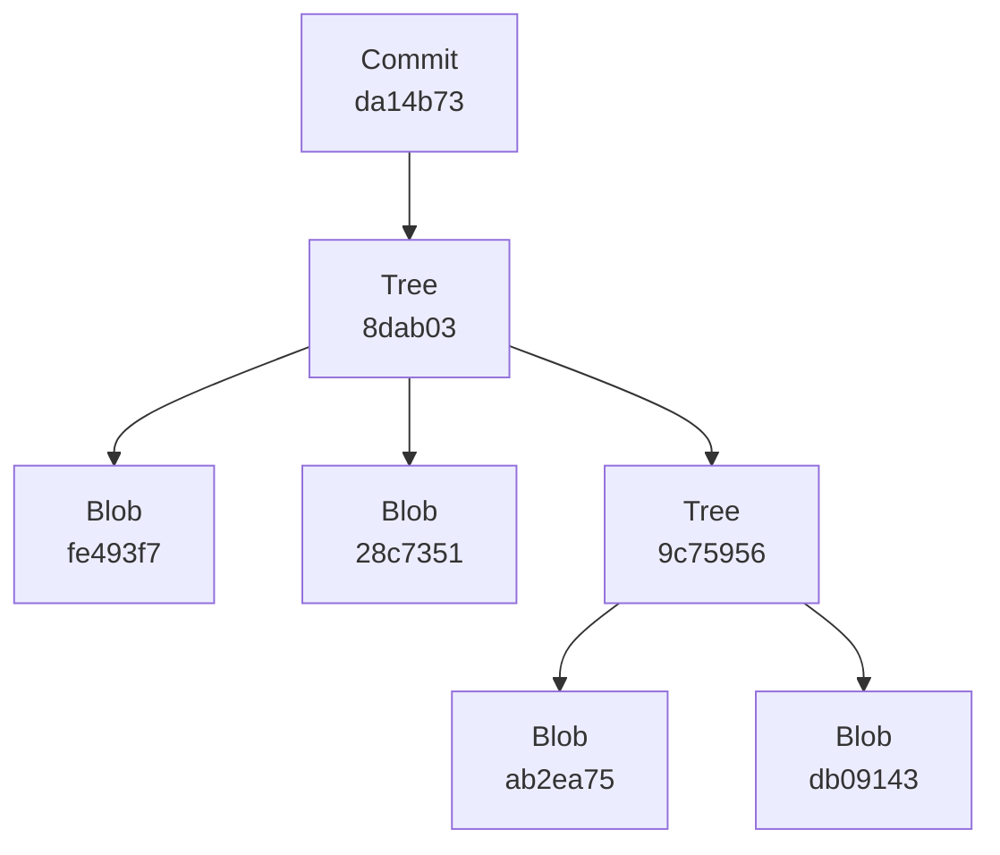
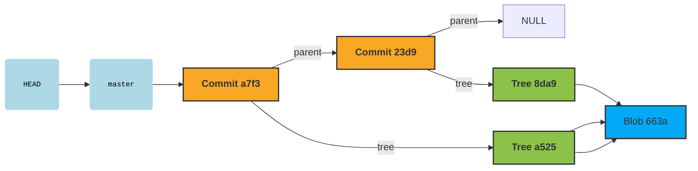
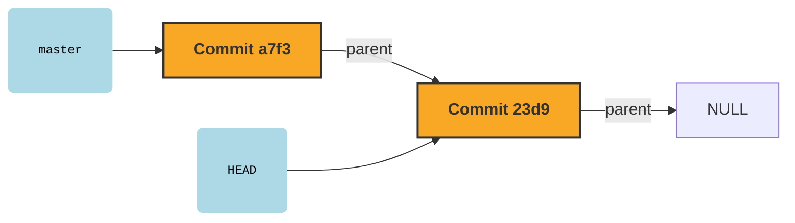
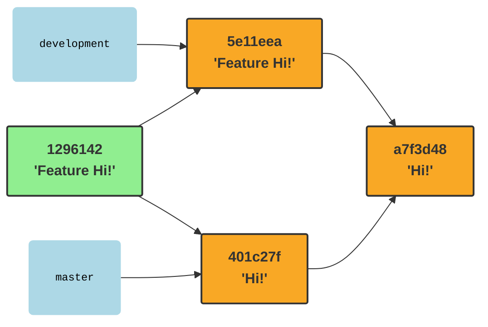
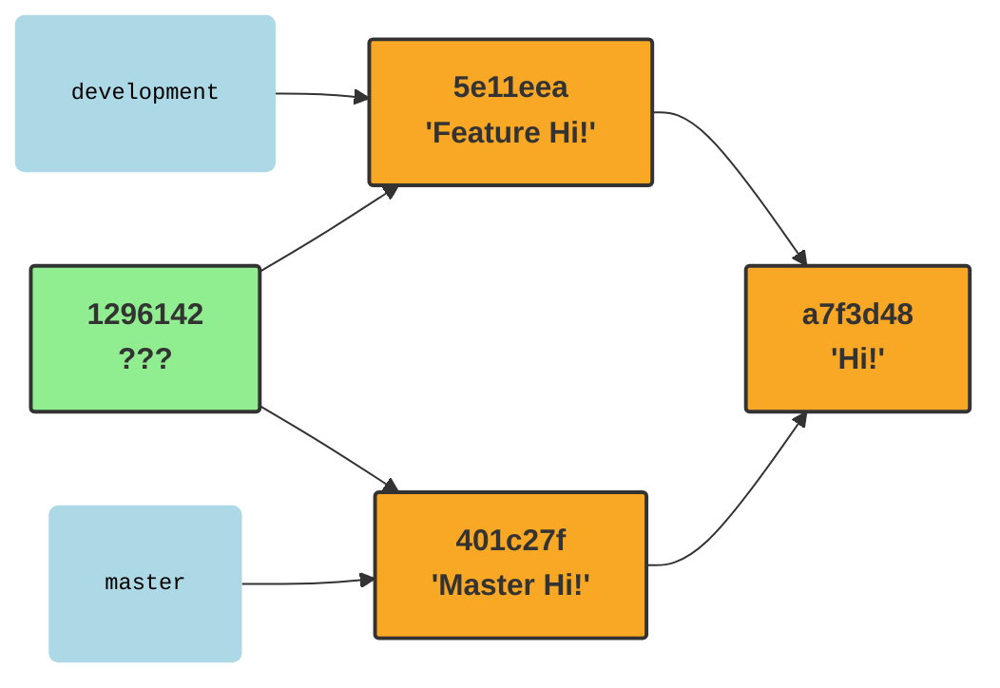

## Git

Git is a distributed version control system. It provides tools for managing a
**repository**. A repository is nothing more than a collection of saved states of the **working directory**.
Such a saved state is a **commit**.

A repository usually takes the form of a `.git` folder stored inside the working directory.
Inside are files describing commits, including the saved content of the working directory.

```shell
mkdir repo
cd repo
git init
ls -l .git
```

This command will create an empty repository in an empty working directory: one that does not yet contain
any saved versions.

```text
-rw-rw-r-- 1 user user   92 Mar 22 10:11 config        # Local repository configuration
-rw-rw-r-- 1 user user   73 Mar 22 10:11 description   # Human-readable repository description
-rw-rw-r-- 1 user user   23 Mar 22 10:11 HEAD          # Pointer to the "current" commit
drwxrwxr-x 4 user user 4096 Mar 22 10:11 objects       # Stored objects: commits, file states, directory states
drwxrwxr-x 4 user user 4096 Mar 22 10:11 refs          # References, i.e., names for commits
```

The working directory along with `.git` can be freely moved and copied; `.git` does not contain any absolute paths.
Deleting the `.git` directory removes the repository along with all version control information, but of course,
it does not touch the working directory itself.

### Objects

A repository consists of objects, stored in the `.git/objects` directory.
Git defines 4 types of objects (blob, tree, commit, annotated tag), of which the first 3 are the most important:

*   **blob**: the saved content of some file from the working directory
*   **tree**: the saved content of a directory (a dictionary)
*   **commit**: a saved state of the working directory with additional information about the version

Once created, objects are immutable; their content cannot be changed. Thanks to this, the content of objects
can be used for their identification! Git recognizes objects based on the SHA-1 hash of their content. The hash depends
solely on the content. A change in content = a change in identifier = a different object.

You can manually calculate the hash of a file with the `hash-object` command. You don't even need a repository for this:

```shell
echo Hi! > hi.txt
git hash-object hi.txt # 663adb09143767984f7be83a91effa47e128c735
```

The calculated hash will be the same on every machine because the file's content is the same.
Changing the content will change the hash.

A file added to the repository, e.g., as part of a commit, will be placed in the `objects` directory
as a blob object and will be identified by its hash.

```shell
cd repo
echo Hi! > hi.txt
git add hi.txt
git commit -m "Initial commit"
# The following command might not work on all systems as zlib-flate is not standard
# cat .git/objects/66/3adb09143767984f7be83a91effa47e128c735 | zlib-flate -uncompress | xxd
git cat-file blob 663ad
```

The `.git/objects` directory is partitioned by the first two characters of the hash.
As you can see in the example above, to identify objects,
it is sufficient to provide the first few characters of the SHA1 sum. Just enough
to avoid ambiguity.

Saving the state of a file is not enough for versioning a project:
you need to save the states of entire directories. The tree object is used for this.

Using the `git commit` command, we created several objects:

```shell
cd repo
find .git/objects -type f
git cat-file -t 8da9
git ls-tree 8da9
```

One of them is a tree. Its content is a listing of the directory whose state it describes.

```text
100644 blob 663adb09143767984f7be83a91effa47e128c735    hi.txt
```

Our object contains only one entry because the working directory had only 1 file at the time of the `git commit` command.
The tree object lists the elements of the directory, each of which is another git object. For each object, it contains:

*   permissions (100644 = rw-r--r--)
*   type (blob/tree)
*   object identifier (SHA1)
*   object name in the directory (hi.txt)

A tree can contain other tree objects. This allows for describing arbitrarily nested directory structures.



If a directory contains several files with the same content,
the tree will list the same object multiple times.

```shell
cd repo
cp hi.txt hey.txt
git add hey.txt
git commit -m "Copied hi.txt"
git ls-tree a5250
```

```text
100644 blob 663adb09143767984f7be83a91effa47e128c735    hey.txt
100644 blob 663adb09143767984f7be83a91effa47e128c735    hi.txt
```

The identifier of a tree object is the SHA1 hash of this list, which contains the hashes of the elements it contains.
A change in the content of `hi.txt` results in a change of its hash, which in turn will cause a change in the content of the root directory's tree
and consequently a change in its hash.

Commits are the main repository objects created when a project version is saved.

```shell
git cat-file commit a7f3
```

```text
tree a5250f7c6ad5260e28003ba5a0b1841b752918e3
parent 23d9585ca2a2fe493f79c75956ab4d815da14b73
author John Doe <john.doe@example.com> 1742665566 +0100
committer John Doe <john.doe@example.com> 1742665566 +0100

Copied hi.txt
```

From it, you can read:

*   the identifier of the saved state of the working directory (`tree`)
*   the identifiers of the previous commits (`parent`)
*   author (`author`)
*   authoring time (state saved) (`1742665566 +0100`)
*   committer (`committer`)
*   committing time (commit applied) (`1742665566 +0100`)
*   message describing the version (`Copied hi.txt`)

> A commit contains the state of the entire project, not the changes introduced!

As before, the SHA1 of a commit is a hash calculated from the above fields.
Changing any of them forces the creation of a new commit with a different SHA1.

### Branches

Using SHA1 sums is not the most pleasant experience for a human.
Instead of saying: take a look at version `23d9585ca2a2fe493f79c75956ab4d815da14b73`, it would be easier
to have a mnemonic name for the revision. Such references are commonly known as **branches**.

Branches can be listed:

```shell
git branch -v
# * master a7f3d48 Copied hi.txt
```

Technically, branches are files in the `.git/refs/heads/` folder that store the SHA1 of the commit they name:

```shell
cat .git/refs/heads/master
# a7f3d48e135b4f4deb9a985ed7058b70491d7c71
```

Listing branches is really just listing this directory.
Creating a branch pointing to a commit simply creates a similar file.

```shell
git branch feature a7f3d48
git branch -v
#   feature a7f3d48 Copied hi.txt
# * master  a7f3d48 Copied hi.txt
ls -l .git/refs/heads
# feature master
```

Hence the important fact:

> A branch is nothing more than a name for a commit!

Branches can be mutable. When a new commit is created, the active branch
is _moved_ to the new commit. Git also supports immutable names for commits,
which are called tags.

### HEAD

And what is an _active branch_? The repository contains a special reference named `HEAD`
(in the `.git/HEAD` file), which points to the current commit we are working on.
`HEAD` can point to a commit indirectly through a branch or directly.
The typical situation is an indirect pointer:

```shell
cat .git/HEAD
# ref: refs/heads/master
```

This is the situation where we colloquially say we are _on a branch_. `HEAD` points
to `master`, which points to a specific commit. Both `HEAD` and `master` are names for the same
commit.



To manipulate `HEAD`, the `git checkout` operation is used, which expects a commit
as an argument. Changing `HEAD` changes the state of the working directory to the one saved in the target commit.

```shell
git checkout 23d9
cat .git/HEAD
# 23d9585ca2a2fe493f79c75956ab4d815da14b73
```

`HEAD` now points directly to the commit. This is the so-called _detached HEAD state_: normal when browsing
old revisions.



The commit pointed to by `HEAD` automatically becomes the parent of newly created revisions.

```shell
git checkout master # HEAD -> master -> a7f3
touch empty.txt
git add empty.txt
git commit -m "Add empty file"
# [master eef04fe] Add empty file
#  1 file changed, 0 insertions(+), 0 deletions(-)
#  create mode 100644 empty.txt
git cat-file commit eef0
# tree 580e44691fcd53fb04aebbd71fe23b5c626afec8
# parent a7f3d48e135b4f4deb9a985ed7058b70491d7c71
# author John Doe <john.doe@example.com> 1742673019 +0100
# committer John Doe <john.doe@example.com> 1742673019 +0100
# 
# Add empty file
```

Additionally, during such an operation, the active branch is moved to the new commit.
In the case of a detached HEAD, there is no active branch, so it is not a natural state
for creating new commits.

### Index

Before producing a commit, we usually issue the `git add` command - why?
There are 3 independent states of the working directory that are involved in the process of creating a commit:

*   The working directory itself with the current state of the files
*   `HEAD` - the change is developed relative to it (it will be the parent)
*   The Index - an intermediate state to which we selectively add changes before creating a commit

This allows for the selective development of the content of the next commit. We can, for example, have
some private, messy changes in some files that we do not want to include in the new revision.
We also don't want to discard them because they are useful.

Technically, the index is located in the `.git/index` file. It can be printed with the `ls-files` command:

```shell
git ls-files --stage
# 100644 e69de29bb2d1d6434b8b29ae775ad8c2e48c5391 0       empty.txt
# 100644 663adb09143767984f7be83a91effa47e128c735 0       hey.txt
# 100644 663adb09143767984f7be83a91effa47e128c735 0       hi.txt
```

It looks surprisingly similar to a `tree` object because that's (almost) what it is!
At the moment of the `git commit` operation, it is the state of the index that is saved in the form of
a new `tree` object, around which a new `commit` object is created.

The `git checkout` operation restores not only the state of the working directory to what is saved
in the checked-out commit, but also synchronizes the state of the index with it.

In a _clean_ state of the repository, we have `HEAD == index == workdir`.

```shell
git status
# On branch master
# nothing to commit, working tree clean
```

By making changes in the working directory, we get: `HEAD == index != workdir`.

```shell
echo "not really" > empty.txt
git status 
# On branch master
# Changes not staged for commit:
#   (use "git add <file>..." to update what will be committed)
#   (use "git restore <file>..." to discard changes in working directory)
#         modified:       empty.txt
# 
# no changes added to commit (use "git add" and/or "git commit -a")
git diff
# git diff
# diff --git a/empty.txt b/empty.txt
# index e69de29..4d0c7d7 100644
# --- a/empty.txt
# +++ b/empty.txt
# @@ -0,0 +1 @@
# +not really
```

The `git diff` command compares the state of the working directory with the state of the index.

By adding the change to the index, we get `HEAD != index == workdir`:

```shell
git add empty.txt
git status
# On branch master
# Changes to be committed:
#   (use "git restore --staged <file>..." to unstage)
#         modified:       empty.txt
git diff
# 
git diff --cached
# diff --git a/empty.txt b/empty.txt
# index e69de29..4d0c7d7 100644
# --- a/empty.txt
# +++ b/empty.txt
# @@ -0,0 +1 @@
# +not really
```

`git diff --cached` shows the difference between the index and the `HEAD` state.
When a file is added to the index, new `blob` and `tree` objects are created, which will later
be saved in the new commit.

You can now change the state of the working directory again, resulting in `HEAD != index != workdir`:

```shell
echo "hey!" > empty.txt
# git status
# On branch master
# Changes to be committed:
#   (use "git restore --staged <file>..." to unstage)
#         modified:       empty.txt
# 
# Changes not staged for commit:
#   (use "git add <file>..." to update what will be committed)
#   (use "git restore <file>..." to discard changes in working directory)
#         modified:       empty.txt
# 
git diff
# diff --git a/empty.txt b/empty.txt
# index 4d0c7d7..d4c3701 100644
# --- a/empty.txt
# +++ b/empty.txt
# @@ -1 +1 @@
# -not really
# +hey!
```

Executing the `git commit` command now:

*   the index will be saved as a new `tree` object
*   a new `commit` object will be created:
    *   pointing to the newly created `tree`
    *   the current `HEAD` will be inserted into the `parent` attribute
*   the branch pointed to by `HEAD` will be moved to the new commit

This way, we will get `HEAD = index != workdir`. The last change made will remain
in the working directory. `git commit` does not touch the working directory.

```shell
git commit -m "Filled empty file"
# [master 401c27f] Filled empty file
#  1 file changed, 1 insertion(+)
git status
# On branch master
# Changes not staged for commit:
#   (use "git add <file>..." to update what will be committed)
#   (use "git restore <file>..." to discard changes in working directory)
#         modified:       empty.txt
# 
# no changes added to commit (use "git add" and/or "git commit -a")
```

### Reset

One of the basic operations, `git reset`, often causes difficulties due to
its multifunctionality. Contrary to its destructive-sounding name, `reset` actually
moves a branch to the specified commit. Additionally, it can simultaneously change the state of the index
and the working directory to the state of that revision.

`git reset` has 3 modes:

`git reset --soft` moves the reference saved in `HEAD` to the specified commit.
It does not change the state of the working directory or the index.

```shell
git reset --soft HEAD^
# git status
# On branch master
# Changes to be committed:
#   (use "git restore --staged <file>..." to unstage)
#         modified:       empty.txt
# 
# Changes not staged for commit:
#   (use "git add <file>..." to update what will be committed)
#   (use "git restore <file>..." to discard changes in working directory)
#         modified:       empty.txt
```

We have thus returned to the `HEAD != index != workdir` state, in a way reversing the `git commit` operation.
The commit, although unnamed, still exists; we can return to it:

```shell
git reset --soft 401c
```

`git reset --mixed` does what `--soft` does and additionally restores the state of the index to the specified commit:

```shell
git reset --mixed HEAD^
git diff
# diff --git a/empty.txt b/empty.txt
# index e69de29..d4c3701 100644
# --- a/empty.txt
# +++ b/empty.txt
# @@ -0,0 +1 @@
# +hey!
```

We now have `HEAD = index != workdir`. The working directory was not touched.

`git reset --hard` changes everything: the HEAD branch, the state of the index, and the state of the working directory
to the state of the specified revision. **It irreversibly discards changes in the working directory!**

```shell
git reset --hard 401c
git status
# On branch master
# nothing to commit, working tree clean
``` 

### Merge

A repository is a collection of commits. Each commit contains a list of references to its parents (0-n).
Therefore, every repository is a directed acyclic graph, where the nodes are commits,
and the edges are pointers to parents.

The graph can be visualized with the `git log` command:

```shell
git log --oneline --graph --all
# * 401c27f (HEAD -> master) Filled empty file
# * eef04fe Add empty file
# * a7f3d48 (feature) Copied hi.txt
# * 23d9585 Initial commit
```

For now, our graph is a list. The project has developed linearly.

One commit can be the parent of several different revisions. This usually happens when several authors
start developing the project at a similar time, starting from the same revision.

```shell
git checkout feature
echo "Feature Hi!" > hi.txt
git add hi.txt
git commit -m "Featurized hi.txt"
git log --oneline --graph --all
# * 5e11eea (HEAD -> feature) Featurized hi.txt
# | * 401c27f (master) Filled empty file
# | * eef04fe Add empty file
# |/  
# * a7f3d48 Copied hi.txt
# * 23d9585 Initial commit
```

At commit `a7f3d48`, the project history forked. Usually, at some point,
independently developed branches must be merged to create a single, coherent revision
integrating all parallel work. The `git merge` operation is used for this, creating commits
with multiple parents.

```shell
git merge --no-edit master
git log --oneline --graph --all
# *   1296142 (HEAD -> feature) Merge branch 'master' into feature
# |\  
# | * 401c27f (master) Filled empty file
# | * eef04fe Add empty file
# * | 5e11eea Featurized hi.txt
# |/  
# * a7f3d48 Copied hi.txt
# * 23d9585 Initial commit
git cat-file -p HEAD
# tree 8c1f710ff54a3848913a130fbd58b1247827b1ed
# parent 5e11eea4a4f3199d1a097e0716c4afa1c0724317
# parent 401c27fd94595bc9565d76e389fa5923febf2302
# author John Doe <john.doe@example.com> 1742684714 +0100
# committer John Doe <john.doe@example.com> 1742684714 +0100
# 
# Merge branch 'master' into feature
```

The newly created merge-commit merges the state of the working directory saved in its two parents.
One parent is always `HEAD`, the other is what we specified in the argument.
The integration was automatic because the changes were not conflicting.

To merge changes, git uses an algorithm known as _three-way merge_. It takes into account
three states of the working directory: two from the merged commits (`HEAD -> development` -> `5e11eea` and `master` -> `401c27f`)
and their nearest common ancestor: the fork point `a7f3d48`.



In the case above, the content of the blob is the same in one of the merged versions as in their common
ancestor. This makes the merge operation trivial: the version that is different is chosen.
The algorithm assumes that if the state in one of the branches has not changed and it has in the other, then
the latter is the desired change after the merge.

If all 3 versions are the same, the matter is clear.
But what if they are all different?
In that case, we are dealing with a **conflict** of changes.

```shell
git reset --hard HEAD^
git checkout master
echo "Master Hi!" > hi.txt
git add hi.txt && git commit -m "Masterized hi.txt"
git merge feature
# Auto-merging hi.txt
# CONFLICT (content): Merge conflict in hi.txt
# Automatic merge failed; fix conflicts and then commit the result.
```



The `git merge` operation is partially executed and has been stopped before
creating the merged commit. The working directory and the index now contain a partially merged state.
Files that the algorithm could not process automatically
contain markers in the places where conflicts were detected.

```shell
cat hi.txt 
# <<<<<<< HEAD
# Master Hi!
# =======
# Feature Hi!
# >>>>>>> feature
```

It is now the user's responsibility to manually resolve the conflicts,
replacing these marked sections with the correct content.

```shell
echo "Feature master Hi!" > hi.txt
git add hi.txt
git commit
```

Merge is just one of the tools for combining changes that git has.
We encourage you to familiarize yourself with others: `rebase`, `rebase -i`, `cherry-pick`.

### Remote

Git is a **distributed** version control system used for working on the same project
on multiple workstations. Typically, each author has their own repository on their machine
and synchronizes its content with remote repositories,
using a given network protocol to exchange objects (e.g., http or ssh).
Object identifiers (SHA1) calculated from their content are global identifiers,
they will be consistent across all repositories.

The addresses of remote repositories must be configured in the local repository in the `.git/config` file
using the `git remote` command. For learning purposes, you can point to another directory
on the same machine as a remote.

```shell
mkdir origin && cd origin
git init --initial-branch=main
```

```shell
cd ../repo
git remote add origin ../origin
```

When cloning a repository, git automatically adds a remote
named `origin` pointing to the location from which we are cloning.

There are only 4 commands that communicate with a remote repository:

*   `git clone`
*   `git fetch`
*   `git pull`
*   `git push`

Everything else does not touch the remote copy in any way.

`git push` updates remote references.
It causes the branch in the remote repository corresponding to the local branch
to point to the same commit as it does locally. Consequently, it sends objects: `commit`, `tree`, `blob`
that may not be present in the remote repository.

```shell
git push --set-upstream origin master
# Enumerating objects: 11, done.
# Counting objects: 100% (11/11), done.
# Delta compression using up to 8 threads
# Compressing objects: 100% (7/7), done.
# Writing objects: 100% (11/11), 976 bytes | 976.00 KiB/s, done.
# Total 11 (delta 0), reused 0 (delta 0), pack-reused 0
# To ../origin
#  * [new branch]      master -> master
# branch 'master' set up to track 'origin/master'.
```

By default, git does not know which remote branch corresponds to the local `master` branch.
We configure this once using `--set-upstream`.

The remote repository was empty - it contained no objects.
`git push` created the remote master branch, and then set it to commit `401c`.
To do this, it had to send this commit and all its dependencies, going through
the `parent` pointers all the way to the _beginning_ of the repository.

```shell
git branch -va
#   feature               a7f3d48 Copied hi.txt
# * master                401c27f Filled empty file
#   remotes/origin/master 401c27f Filled empty file
```

Operations on remote repositories not only manipulate references in the remote repository
but also their local counterparts. `git push` created a local repository reference `origin/master`
which points to the same thing as `master` in the `origin` repository. Such references are not branches;
they cannot be moved other than by communicating with the remote repository.

Changes can appear asynchronously in the repository: new commits, new branches:

```shell
cd ../origin
git checkout -b development master 
echo "int main() { return 0; }" > main.cpp
git add main.cpp && git commit -m "Added main.cpp"
```

`git fetch` updates the state of all local counterparts of remote branches,
downloading the necessary objects in the process.

```shell
cd ../repo
git fetch
# remote: Enumerating objects: 4, done.
# remote: Counting objects: 100% (4/4), done.
# remote: Compressing objects: 100% (2/2), done.
# remote: Total 3 (delta 1), reused 0 (delta 0), pack-reused 0
# Unpacking objects: 100% (3/3), 287 bytes | 287.00 KiB/s, done.
# From ../origin
#  * [new branch]      development -> origin/development
git branch -va
#   feature                    a7f3d48 Copied hi.txt
# * master                     401c27f Filled empty file
#   remotes/origin/development e0e64f5 Added main.cpp
#   remotes/origin/master      401c27f Filled empty file
```

A new reference `origin/development` has appeared in the local repository, pointing to the same new commit as in the remote repo.
We can now create a branch there and continue development from that point:

```shell
git checkout development
```

`git pull` is a combination of two operations: `git fetch` + `git merge [remote ref]`.
So it does exactly what fetch does and then merges the local branch with its remote counterpart,
potentially creating a merge commit.
