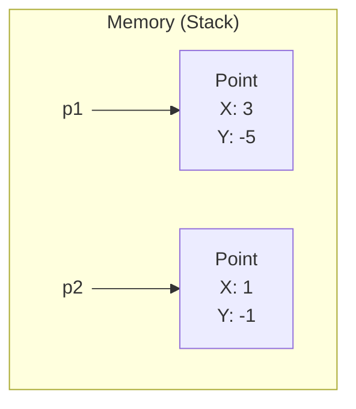
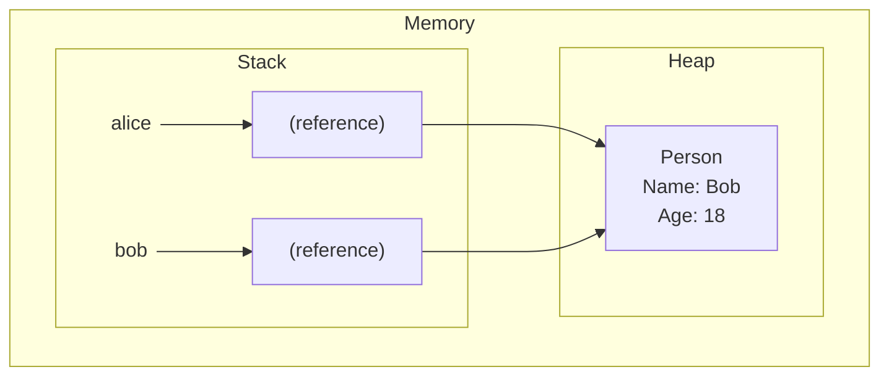

# Type System in C#

In C#, there are three categories of types that define how data is stored in memory and how it is handled:
- **Value types**
- **Reference types**
- **Pointer types**

For the purposes of this course, we will focus mainly on the first two categories, which form the foundation of programming in C#. Pointer types, used primarily in unmanaged code, are beyond the basic scope of this material.

## Value Types

Variables of value types store their values directly in their allocated location, most often on the **stack**. This means that each variable has its own, independent copy of the data.

**Built-in value types:**
- Numeric types (e.g., `int`, `uint`, `float`, `double`, `decimal`)
- `char`
- `bool`

**User-defined value types:**
- `struct`
- `enum`

## Reference Types

Variables of reference types store a **reference** (address) to an object that is located on the **heap**. The variable itself resides on the stack, but it points to data in another location.

**Built-in reference types:**
- `string`
- `object`
- Arrays (e.g., `int[]`, `string[]`)

**User-defined reference types:**
- `class`

## Assignment Semantics

The way C# copies data during an assignment operation (`=`) depends on whether we are dealing with a value type or a reference type.

### Value Types

When assigning a value type variable to another, a **full copy of the value** is created. Both variables operate independently of each other. Changing one does not affect the other.

```csharp
Point p1 = new Point();
p1.X = 3;
p1.Y = -5;

// p2 receives a COPY of the value from p1
Point p2 = p1;

// We modify only p2
p2.X = 1;
p2.Y = -1;

// The values of p1 remain unchanged
Console.WriteLine($"P1: {p1.X}, {p1.Y}"); // Output: P1: 3, -5
Console.WriteLine($"P2: {p2.X}, {p2.Y}"); // Output: P2: 1, -1

public struct Point { public float X, Y; }
```

The variables `p1` and `p2` occupy separate memory locations on the stack.



### Reference Types

When assigning a reference type variable, only the **reference** (address of the object) is copied. Both variables point to the **same object** in memory. Modifying the object's data through one variable is visible to the other.

```csharp
Person alice = new Person();
alice.Name = "Alice";
alice.Age = 16;

// bob receives a COPY of the REFERENCE pointing to the same object as alice
Person bob = alice;

// We modify the object through the bob variable
bob.Name = "Bob";
bob.Age = 18;

// The change is also visible to the alice variable, because it's the same object
Console.WriteLine($"Alice: {alice.Name}, {alice.Age}"); // Output: Alice: Bob, 18
Console.WriteLine($"Bob: {bob.Name}, {bob.Age}");       // Output: Bob: Bob, 18

public class Person { public string Name; public int Age; }
```

The `alice` and `bob` variables on the stack store the same address, which points to a single `Person` object on the heap.



## Null Values

- **Value types** by design cannot be `null`, as they must always contain a specific value (e.g., an `int` is initialized to `0` by default). Attempting to assign `null` will result in a compilation error.
- **Reference types** can store `null`, which means the variable does not point to any object.

```csharp
// Value type
Point p = new Point();
p.X = 3;
p.Y = -5;
// p = null; // Compilation error: Cannot convert null to 'Point' because it is a non-nullable value type

// Reference type
Person alice = new Person();
alice.Name = "Alice";
alice.Age = 16;
alice = null; // OK - the alice variable no longer points to any object

public struct Point { public float X, Y; }
public class Person { public string Name; public int Age; }
```

## Passing Parameters to Methods

In C#, all parameters are passed **by value** by default. However, the interpretation of this mechanism differs depending on the type:

- For **value types**: a **copy of the object** is passed to the method. Any modifications made to the parameter inside the method do not affect the original variable.
- For **reference types**: a **copy of the reference** is passed to the method. Both references (the original and the copy) point to the same object on the heap. Modifying the *state* of that object (e.g., changing the value of its fields) will be visible outside the method.

```csharp
// --- Example for a value type ---
Point p = new Point { X = 1, Y = 1 };
ModifyValueType(p);
// The value of 'p' did not change, because the method operated on a copy
Console.WriteLine($"Point after Modify: {p.X}, {p.Y}"); // Output: Point after Modify: 1, 1

// --- Example for a reference type ---
Person person = new Person { Name = "Alice", Age = 30 };
ModifyReferenceType(person);
// The state of the 'person' object changed, because the method modified the same object
Console.WriteLine($"Person after Modify: {person.Name}, {person.Age}"); // Output: Person after Modify: Bob, 30


void ModifyValueType(Point point) // 'point' is a copy of 'p'
{
    // We are only modifying the local copy
    point.X = 100;
    point.Y = 100;
}

void ModifyReferenceType(Person person) // 'person' is a copy of the reference
{
    // We modify the object the reference points to
    person.Name = "Bob";

    // The line below would not affect the original 'person' variable outside the method.
    // It would only change the local copy of the reference to point to a new object.
    // person = new Person { Name = "Charlie", Age = 40 };
}

public struct Point { public float X, Y; }
public class Person { public string Name; public int Age; }
```

- In the case of `ModifyValueType`, the method operates on a completely independent copy of the `Point` struct. The changes are not visible outside.
- In the case of `ModifyReferenceType`, the method receives a copy of the reference, which points to the same `Person` object. The change to the `Name` property is permanent because it modifies the shared object. However, if we were to assign a new instance (`new Person(...)`) to the `person` parameter, it would only affect the local copy of the reference, and the original variable outside the method would still point to the original object.
