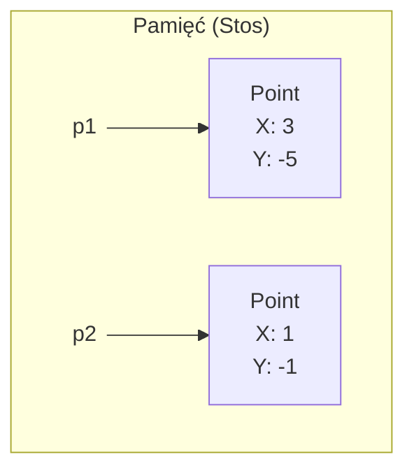
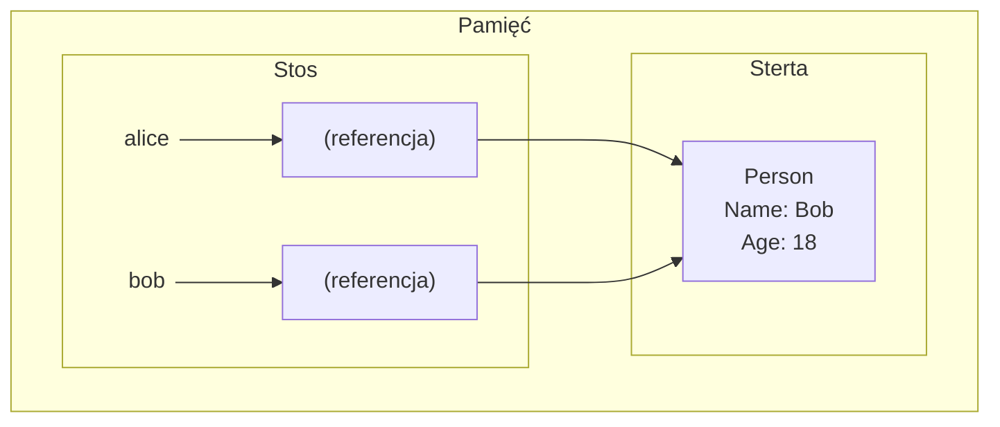

# System typów w C#

W C# istnieją trzy kategorie typów, które definiują, jak dane są przechowywane w pamięci i jak się z nimi pracuje:
- **Typy bezpośrednie** (*value types*)
- **Typy referencyjne** (*reference types*)
- **Typy wskaźnikowe** (*pointer types*)

Na razie skupimy się głównie na dwóch pierwszych kategoriach, które stanowią fundament programowania w C#.

## Typy bezpośrednie (*value types*)

Zmienne typów bezpośrednich przechowują swoje wartości bezpośrednio w miejscu alokacji, **najczęściej na stosie**.

**Wbudowane typy bezpośrednie:**
- Typy numeryczne (np. `int`, `uint`, `float`, `double`, `decimal`)
- `char`
- `bool`

**Niestandardowe typy bezpośrednie:**
- `struct` (struktury)
- `enum` (typy wyliczeniowe)

## Typy referencyjne (*reference types*)

Zmienne typów referencyjnych przechowują **referencję** (adres) do obiektu, który znajduje się na **stercie**.

**Wbudowane typy referencyjne:**
- `string`
- `object`
- Tablice (np. `int[]`, `string[]`)

**Niestandardowe typy referencyjne:**
- `class` (klasy)

## Semantyka przypisania

Sposób, w jaki C# kopiuje dane przy operacji przypisania (`=`), zależy od tego, czy mamy do czynienia z typem bezpośrednim, czy referencyjnym.

### Typy bezpośrednie

Przy przypisywaniu zmiennej typu bezpośredniego do innej zmiennej, tworzona jest **pełna kopia wartości**. Obie zmienne działają niezależnie od siebie. Zmiana jednej nie wpływa na drugą.

```csharp
Point p1 = new Point();
p1.X = 3;
p1.Y = -5;

// p2 otrzymuje KOPIĘ wartości z p1
Point p2 = p1;

// Modyfikujemy tylko p2
p2.X = 1;
p2.Y = -1;

// Wartości p1 pozostają bez zmian
Console.WriteLine($"P1: {p1.X}, {p1.Y}"); // Output: P1: 3, -5
Console.WriteLine($"P2: {p2.X}, {p2.Y}"); // Output: P2: 1, -1

public struct Point { public float X, Y; }
```

Zmienne `p1` i `p2` zajmują osobne miejsca w pamięci na stosie.



### Typy referencyjne

Przy przypisywaniu zmiennej typu referencyjnego, kopiowana jest jedynie **referencja** (adres obiektu). Obie zmienne wskazują na **ten sam obiekt** w pamięci. Modyfikacja danych obiektu poprzez jedną zmienną jest widoczna dla drugiej.

```csharp
Person alice = new Person();
alice.Name = "Alice";
alice.Age = 16;

// bob otrzymuje KOPIĘ REFERENCJI wskazującej na ten sam obiekt co alice
Person bob = alice;

// Modyfikujemy obiekt poprzez zmienną bob
bob.Name = "Bob";
bob.Age = 18;

// Zmiana jest widoczna także dla zmiennej alice, bo to ten sam obiekt
Console.WriteLine($"Alice: {alice.Name}, {alice.Age}"); // Output: Alice: Bob, 18
Console.WriteLine($"Bob: {bob.Name}, {bob.Age}");       // Output: Bob: Bob, 18

public class Person { public string Name; public int Age; }
```

Zmienne `alice` i `bob` na stosie przechowują ten sam adres, który wskazuje na pojedynczy obiekt `Person` na stercie.



## Wartości `null`

- **Typy bezpośrednie** z założenia nie mogą przyjmować wartości `null`, ponieważ zawsze muszą zawierać konkretną wartość (np. `int` domyślnie inicjalizowany jest jako `0`). Próba przypisania `null` zakończy się błędem kompilacji.
- **Typy referencyjne** mogą przechowywać `null`, co oznacza, że zmienna nie wskazuje na żaden obiekt.

```csharp
// Typ bezpośredni
Point p = new Point();
p.X = 3;
p.Y = -5;
// p = null; // Błąd kompilacji

// Typ referencyjny
Person alice = new Person();
alice.Name = "Alice";
alice.Age = 16;
alice = null; // OK - zmienna alice nie wskazuje już na żaden obiekt

public struct Point { public float X, Y; }
public class Person { public string Name; public int Age; }
```

## Przekazywanie parametrów do metod

W C# wszystkie parametry domyślnie przekazywane są **przez wartość** (*by value*). Interpretacja tego mechanizmu różni się jednak w zależności od typu:

- Dla **typów bezpośrednich**: do metody trafia **kopia obiektu**. Wszelkie modyfikacje wykonane na parametrze wewnątrz metody nie mają wpływu na oryginalną zmienną.
- Dla **typów referencyjnych**: do metody trafia **kopia referencji**. Obie referencje (oryginalna i kopia) wskazują na ten sam obiekt na stercie. Modyfikacja *stanu* tego obiektu (np. zmiana wartości jego pól) będzie widoczna na zewnątrz metody.

```csharp
// --- Przykład dla typu bezpośredniego ---
Point p = new Point { X = 1, Y = 1 };
ModifyValueType(p);
// Wartość 'p' nie uległa zmianie, bo metoda operowała na kopii
Console.WriteLine($"Point after Modify: {p.X}, {p.Y}"); // Output: Point after Modify: 1, 1

// --- Przykład dla typu referencyjnego ---
Person person = new Person { Name = "Alice", Age = 30 };
ModifyReferenceType(person);
// Stan obiektu 'person' uległ zmianie, bo metoda modyfikowała ten sam obiekt
Console.WriteLine($"Person after Modify: {person.Name}, {person.Age}"); // Output: Person after Modify: Bob, 30

void ModifyValueType(Point point) // 'point' jest kopią 'p'
{
    // Modyfikujemy tylko lokalną kopię
    point.X = 100;
    point.Y = 100;
}

void ModifyReferenceType(Person person) // 'person' jest kopią referencji
{
    // Modyfikujemy obiekt, na który wskazuje referencja
    person.Name = "Bob";

    // Poniższa linia nie miałaby wpływu na oryginalną zmienną 'person' poza metodą.
    // Zmieniłaby tylko lokalną kopię referencji, aby wskazywała na nowy obiekt.
    // person = new Person { Name = "Charlie", Age = 40 };
}

public struct Point { public float X, Y; }
public class Person { public string Name; public int Age; }
```

- W przypadku `ModifyValueType`, metoda operuje na w pełni niezależnej kopii struktury `Point`. Zmiany są niewidoczne na zewnątrz.
- W przypadku `ModifyReferenceType`, metoda otrzymuje kopię referencji, która wskazuje na ten sam obiekt `Person`. Zmiana właściwości `Name` jest trwała, ponieważ modyfikuje współdzielony obiekt. Gdybyśmy jednak przypisali do parametru `person` nową instancję (`new Person(...)`), wpłynęłoby to tylko na lokalną kopię referencji, a oryginalna zmienna poza metodą nadal wskazywałaby na pierwotny obiekt.
