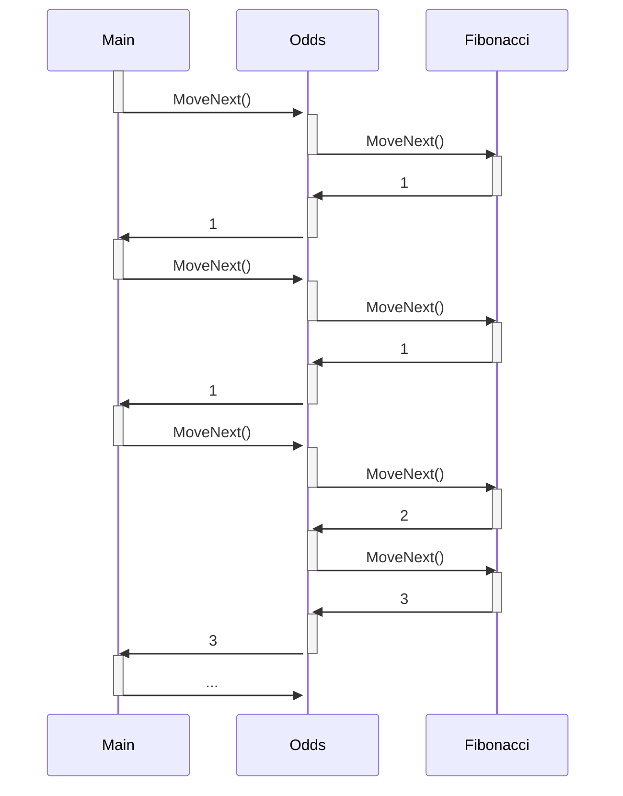

# Enumerators

An enumerator is a concept similar to iterators in C++. An enumerator is a read-only, forward-only cursor that allows for one-directional traversal of a sequence of values.

For an object to be called an enumerator, it must have a public parameterless `bool MoveNext()` method and a `Current` property. Most often, the `System.Collections.Generics.IEnumerator<T>` interface (or less commonly `System.Collections.IEnumerator`) is implemented, which provides the aforementioned method and property.

The definitions of these interfaces are as follows:

```csharp
public interface IEnumerator
{
    bool MoveNext();
    object Current { get; }
    void Reset();
}

public interface IEnumerator<out T> : IDisposable, IEnumerator
{
    T Current { get; }
}
```

Often, the `Reset` method is not implemented; that is, it throws a `NotSupportedException`.

## Enumerable Type

An enumerable type, in turn, is an object that is capable of creating a new enumerator. It must have a public `GetEnumerator()` method that returns an enumerator (this can be an extension method). And here again, the system interface `System.Collections.Generic.IEnumerable<T>` (or less commonly `System.Collections.IEnumerable`) is most often implemented.

```csharp
public interface IEnumerable
{
    IEnumerator GetEnumerator();
}

public interface IEnumerable<out T> : IEnumerable
{
    IEnumerator<T> GetEnumerator();
}
```

## The `foreach` Loop

All system collections, arrays, and strings are enumerable. Anything that is enumerable can be used inside a `foreach` loop:

```csharp
List<int> collection = [1, 2, 3, 4, 5, 6, 7, 8];

foreach(int item in collection)
{
    Console.WriteLine(item);
}
```

The `foreach` loop is syntactic sugar; the compiler transforms this expression as follows:

```csharp
IEnumerator<int> enumerator = collection.GetEnumerator();
try
{
    while (enumerator.MoveNext())
    {
        var item = enumerator.Current;
        Console.WriteLine(item);
    }
}
finally
{
    enumerator?.Dispose();
}
```

## Iterator Method

A **coroutine** is a special type of function that **has the ability to suspend its execution** at any moment and **return control** to the code that called it, and then, after some time, **resume execution** exactly from the place where it was suspended.

Iterator methods are one of two examples of coroutines in C#. Such a method must return `IEnumerable<T>` or `IEnumerator<T>` (or `IEnumerable` or `IEnumerator`) and use the `yield` statement. Such a method is treated in a special way by the compiler. The compiler creates a state machine in its place, which remembers the state of the iteration, i.e., local variables and information about the suspension point.

```csharp
public static IEnumerable<int> Fibonacci(int count)
{
    for (int i = 0, prev = 1, curr = 1; i < count; i++)
    {
        yield return prev;
        (prev, curr) = (curr, prev + curr);
    }
}
```

{}
```csharp
[CompilerGenerated]
private sealed class <Fibs>d__1 : IEnumerable<int>, IEnumerable, IEnumerator<int>, IEnumerator, IDisposable
{
    private int <>1__state;
    private int <>2__current;
    private int <>l__initialThreadId;
    private int count;
    public int <>3__count;
    private int <i>5__1;
    private int <prev>5__2;
    private int <curr>5__3;

    int IEnumerator<int>.Current
    {
        [DebuggerHidden]
        get
        {
            return <>2__current;
        }
    }

    object IEnumerator.Current
    {
        [DebuggerHidden]
        [return: Nullable(0)]
        get
        {
            return <>2__current;
        }
    }

    [DebuggerHidden]
    public <Fibs>d__1(int <>1__state)
    {
        this.<>1__state = <>1__state;
        <>l__initialThreadId = Environment.CurrentManagedThreadId;
    }

    [DebuggerHidden]
    void IDisposable.Dispose()
    {
    }

    private bool MoveNext()
    {
        int num = <>1__state;
        if (num != 0)
        {
            if (num != 1)
            {
                return false;
            }
            <>1__state = -1;
            int num2 = <curr>5__3;
            int num3 = (<curr>5__3 = <prev>5__2 + <curr>5__3);
            <prev>5__2 = num2;
            <i>5__1++;
        }
        else
        {
            <>1__state = -1;
            <i>5__1 = 0;
            <prev>5__2 = 1;
            <curr>5__3 = 1;
        }
        if (<i>5__1 < count)
        {
            <>2__current = <prev>5__2;
            <>1__state = 1;
            return true;
        }
        return false;
    }

    bool IEnumerator.MoveNext()
    {
        //ILSpy generated this explicit interface implementation from .override directive in MoveNext
        return this.MoveNext();
    }

    [DebuggerHidden]
    void IEnumerator.Reset()
    {
        throw new NotSupportedException();
    }

    [DebuggerHidden]
    IEnumerator<int> IEnumerable<int>.GetEnumerator()
    {
        <Fibs>d__1 <Fibs>d__;
        if (<>1__state == -2 && <>l__initialThreadId == Environment.CurrentManagedThreadId)
        {
            <>1__state = 0;
            <Fibs>d__ = this;
        }
        else
        {
            <Fibs>d__ = new <Fibs>d__1(0);
        }
        <Fibs>d__.count = <>3__count;
        return <Fibs>d__;
    }

    [DebuggerHidden]
    IEnumerator IEnumerable.GetEnumerator()
    {
        return ((IEnumerable<int>)this).GetEnumerator();
    }
}
```
{}

An iterator method is invoked after `MoveNext` is called on the enumerator from its last state. The next value is calculated, the `yield return` statement returns the calculated value by writing it to the `Current` property, and control returns to the caller.

There is also a `yield break` statement, which also returns control to the caller, but it causes `MoveNext` to return `false`, indicating no further elements.

```csharp
public static IEnumerable<int> Fibonacci(int count)
{
    for (int i = 0, prev = 1, curr = 1; i < count; i++)
    {
        if (i > 45) yield break;
        yield return prev;
        (prev, curr) = (curr, prev + curr);
    }
}
```

## Composition of Iterator Methods

Iterator methods can be composed with each other. Let's assume we have two methods:

```csharp
public static IEnumerable<int> Fibonacci(int n)
{
    int current = 0, next = 1;
    for (int i = 0; i < n; i++)
    {
        yield return current;
        (current, next) = (next, current + next);
    }
}

public static IEnumerable<int> Odds(IEnumerable<int> sequence)
{
    foreach (var item in sequence)
    {
        if (item % 2 == 1) yield return item;
    }
}
```

They can be composed as follows:

```csharp
var sequence = Odds(Fibonacci(10));
Console.WriteLine("Odd elements of the fibonacci sequence:");
foreach (var item in sequence)
{
    Console.WriteLine(item);
}
```

The flow of control is depicted in the sequence diagram:



The `Odds` method acts as a filter for the `Fibonacci` sequence; most LINQ methods are based on this principle.

> [!NOTE]
> **Source Code - IteratorMethods**
> 

## Implementing a Custom Enumerable Type

For our own custom type to be enumerable, the easiest way is to implement the `IEnumerable` interface. Most often, the `GetEnumerator` method is implemented as an iterator using the `yield` statement.

```csharp
public class Stack<T> : IEnumerable<T>
{
    private T[] _items = new T[8];
    public int Count { get; private set; }

    public void Push(T item)
    {
        if (_items.Length == Count)
        {
            Array.Resize(ref _items, _items.Length * 2);
        }
        _items[Count++] = item;
    }

    public T Pop()
    {
        if (Count == 0)
        {
            throw new InvalidOperationException("Stack is empty");
        }
        return _items[--Count];
    }

    public IEnumerator<T> GetEnumerator()
    {
        int count = Count;
        while (count-- > 0)
        {
            yield return _items[count];
        }
    }

    IEnumerator IEnumerable.GetEnumerator()
    {
        return GetEnumerator();
    }
}
```

Such an enumerable stack can be successfully used in a `foreach` statement:

```csharp
Stack<string> stack = new Stack<string>();
stack.Push("The");
stack.Push("quick");
stack.Push("brown");
stack.Push("fox");
stack.Push("jumps");
stack.Push("over");
stack.Push("the");
stack.Push("lazy");
stack.Push("dog");

foreach (var str in stack)
{
    Console.WriteLine(str);
}
```

> [!NOTE]
> **Source Code - EnumerableStack**
> 
