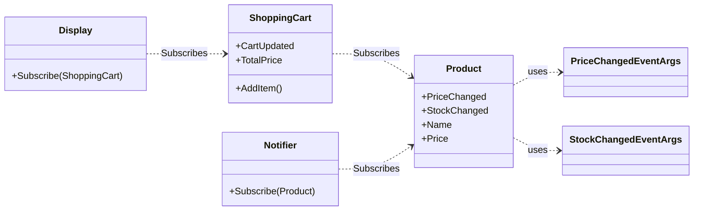

## Events

An event is a mechanism that allows a class or object (the publisher) to notify other classes or objects (subscribers) about the occurrence of a specific action. It is an implementation of the **Observer** design pattern, which enables the creation of loosely coupled components.

In C# an event is, in practice, a regular delegate with additional encapsulation. The `event` keyword restricts access to the delegate, allowing only the addition (`+=`) and removal (`-=`) of subscribers, which prevents unwanted modifications from the outside.

### Implementing an Event

A typical event implementation scheme includes three elements:

1.  **`EventArgs` class**: An object that stores information about the event.
2.  **Publisher**: The class that declares and raises the event.
3.  **Subscribers**: The classes that react to the event.

#### 1. Defining Event Data

It is good practice to create a dedicated class inheriting from `System.EventArgs`, by means of which we can pass additional information about the event. Besides the information that the event occurred, we can, for example, find out what the old price was, or where the click occurred and with which button.

```csharp
public class PriceChangedEventArgs : EventArgs
{
    public decimal NewPrice { get; }
    public decimal OldPrice { get; }

    public PriceChangedEventArgs(decimal newPrice, decimal oldPrice)
    {
        NewPrice = newPrice;
        OldPrice = oldPrice;
    }
}
```

#### 2. Declaration and Raising in the Publisher

The publisher declares the event using the `event` keyword and some delegate, most often the system delegate `EventHandler<T>` is used. Raising the event should take place in a dedicated, protected virtual method `On...`, which allows deriving classes to modify the behavior associated with raising the event.

```csharp
public class Product
{
    public event EventHandler<PriceChangedEventArgs>? PriceChanged;
    
    public required string Name { get; init; }
    private decimal _price;
    public decimal Price 
    {
        get => _price;
        set
        {
            if (value == _price) return;
            OnPriceChanged(new PriceChangedEventArgs(value, _price));
            _price = value;
        }
    }

    protected virtual void OnPriceChanged(PriceChangedEventArgs e)
    {
        PriceChanged?.Invoke(this, e);
    }
}
```

> [!IMPORTANT]
> Definition of the system delegate `EventHandler`:
> ```csharp
> public delegate void EventHandler<TEventArgs>(object? sender, TEventArgs e);
> ```

#### 3. Subscription in the Subscriber

The subscriber defines a method that matches the delegate's signature.

```csharp
public class Notifier
{
    // Event handler, with matching signature:
    public void HandlePriceChanged(object sender, PriceChangedEventArgs e)
    {
        if (sender is Product product)
        {
            Console.WriteLine($"Price of {product.Name} changed. {e.OldPrice:C} -> {e.NewPrice:C}");
        }
    }
}
```

Next, it uses the `+=` operator to start listening:

```csharp
var product = new Product { Name = "Laptop", Price = 1199.90m };
var notifier = new Notifier();

product.PriceChanged += notifier.HandlePriceChanged;

product.Price -= 200.0m;

// Unsubscribing, to avoid memory leaks:
product.PriceChanged -= notifier.HandlePriceChanged;
```

> [!NOTE]
> 

### The Role of the `event` Keyword

The above example will work identically, regardless of whether we use the `event` keyword.

The `event` keyword is crucial for encapsulation. If we were to expose the delegate itself publicly:

```csharp
public EventHandler<PriceChangedEventArgs> PriceChanged;
```

...any external code could:

- Raise the event: `product.PriceChanged(null, null);`
- Clear the list of subscribers: `product.PriceChanged = null;`

The `event` keyword restricts these possibilities, exposing from the outside **only the `+=` and `-=` operations**. This guarantees that only the owner class can raise the event.

## Event-Driven Programming

Event-driven programming is a paradigm in which the control flow of the application is determined by asynchronously occurring events. In contrast to procedural programming, where the program executes in a linear, predefined sequence, in event-driven programming the main application logic is passive and waits for events to perform appropriate reactions.

Event-driven programming is the foundation of how all user interfaces work. Actions, such as a button click or a text change, generate events that modify the application's internal state. A change in this state can then trigger subsequent events, causing the interface to automatically update to reflect the new state.

### Example

The diagram above illustrates the flow of events in an example system:

*   The `Product` class is the main **publisher** – it informs about changes to its price and stock level.
*   `Notifier` and `ShoppingCart` are **subscribers** to events from `Product`. `Notifier` reacts to changes in stock, and `ShoppingCart` to price changes to recalculate its value.
*   `ShoppingCart` is also a **publisher** for the `Display` class. After every change in the cart, it informs `Display` about the need to refresh the view.

This creates a chain of reactions: a change in `Product` causes an update in `ShoppingCart`, which in turn triggers an update in `Display`.



> [!NOTE]
> 
