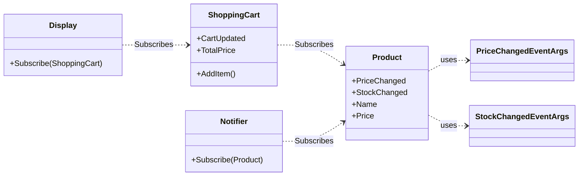

## Zdarzenia

Zdarzenie (ang. *event*) to mechanizm pozwalający klasie lub obiektowi (wydawcy) na powiadamianie innych klas lub obiektów (subskrybentów) o wystąpieniu określonej akcji. Jest to implementacja wzorca projektowego **Obserwator**, która umożliwia tworzenie luźno powiązanych komponentów.

W C# zdarzenie jest w praktyce zwykłym delegatem z dodatkową enkapsulacją. Słowo kluczowe `event` ogranicza dostęp do delegatu, pozwalając jedynie na dodawanie (`+=`) i usuwanie (`-=`) subskrybentów, co zapobiega niepożądanym modyfikacjom z zewnątrz.

### Implementacja zdarzenia

Typowy schemat implementacji zdarzenia obejmuje trzy elementy:

1.  **Klasę `EventArgs`**: Obiekt przechowujący informacje o zdarzeniu.
2.  **Wydawcę (Publisher)**: Klasę, która deklaruje zdarzenie i je wywołuje.
3.  **Subskrybentów (Subscribers)**: Klasy, które reagują na zdarzenie.

#### 1. Definicja danych zdarzenia

Dobrą praktyką jest stworzenie dedykowanej klasy dziedziczącej po `System.EventArgs`, za pomocą której możemy przekazywać dodatkowe informacje o zdarzeniu. Oprócz informacji o tym, że zdarzenie miało miejsce, możemy na przykład dowiedzieć się, jaka była stara cena, albo w którym miejscu nastąpiło kliknięcie i którym przyciskiem.

```csharp
public class PriceChangedEventArgs : EventArgs
{
    public decimal NewPrice { get; }
    public decimal OldPrice { get; }

    public PriceChangedEventArgs(decimal newPrice, decimal oldPrice)
    {
        NewPrice = newPrice;
        OldPrice = oldPrice;
    }
}
```

#### 2. Deklaracja i wywołanie w wydawcy

Wydawca deklaruje zdarzenie przy użyciu słowa kluczowego `event` i jakiegoś delegatu, najczęściej korzysta się z systemowego delegatu `EventHandler<T>`. Wywołanie zdarzenia powinno odbywać się w dedykowanej, chronionej metodzie wirtualnej `On...`, co pozwala klasom dziedziczącym na modyfikację zachowania związanego z wywoływaniem zdarzenia.

```csharp
public class Product
{
    public event EventHandler<PriceChangedEventArgs>? PriceChanged;
    
    public required string Name { get; init; }
    private decimal _price;
    public decimal Price 
    {
        get => _price;
        set
        {
            if (value == _price) return;
            OnPriceChanged(new PriceChangedEventArgs(value, _price));
            _price = value;
        }
    }

    protected virtual void OnPriceChanged(PriceChangedEventArgs e)
    {
        PriceChanged?.Invoke(this, e);
    }
}
```

> [!IMPORTANT]
> Definicja systemowego delegatu `EvenetHandler`:
> ```csharp
> public delegate void EventHandler<TEventArgs>(object? sender, TEventArgs e);
> ```

#### 3. Subskrypcja w subskrybencie

Subskrybent definiuje metodę zgodną z sygnaturą delegatu.

```csharp
public class Notifier
{
    // Event handler, with matching signature:
    public void HandlePriceChanged(object sender, PriceChangedEventArgs e)
    {
        if (sender is Product product)
        {
            Console.WriteLine($"Price of {product.Name} changed. {e.OldPrice:C} -> {e.NewPrice:C}");
        }
    }
}
```

Następnie używa operatora `+=` do rozpoczęcia nasłuchiwania:

```csharp
var product = new Product { Name = "Laptop", Price = 1199.90m };
var notifier = new Notifier();

product.PriceChanged += notifier.HandlePriceChanged;

product.Price -= 200.0m;

// Unsubscribing, to avoid memory leaks:
product.PriceChanged -= notifier.HandlePriceChanged;
```

> [!NOTE]
> 

### Rola słowa kluczowego `event`

Powyższy przykład zadziała identycznie, bez względu na to czy użyjemy słowa kluczowego `event`.

Słowo kluczowe `event` jest kluczowe dla enkapsulacji. Gdybyśmy wystawili publicznie sam delegat:

```csharp
public EventHandler<PriceChangedEventArgs> PriceChanged;
```

...każdy zewnętrzny kod mógłby:

- Wywołać zdarzenie: `product.PriceChanged(null, null);`
- Wyzerować listę subskrybentów: `product.PriceChanged = null;`

Słówko `event` ogranicza te możliwości, udostępniając z zewnątrz **jedynie na operacje `+=` i `-=`**. Gwarantuje to, że tylko klasa-właściciel może wywołać zdarzenie.

## Programowanie sterowane zdarzeniami

Programowanie sterowane zdarzeniami to paradygmat, w którym przepływ sterowania aplikacji jest determinowany przez asynchronicznie występujące zdarzenia. W odróżnieniu od programowania proceduralnego, gdzie program wykonuje się w liniowej, z góry zdefiniowanej sekwencji, w programowaniu sterowanym zdarzeniami główna logika aplikacji jest pasywna i oczekuje na zdarzenia, aby wykonać odpowiednie reakcje.

Programowanie sterowane zdarzeniami to podstawa działania wszystkich interfejsów użytkownika. Akcje, takie jak kliknięcie przycisku czy zmiana tekstu, generują zdarzenia, które modyfikują wewnętrzny stan aplikacji. Zmiana tego stanu może następnie wyzwolić kolejne zdarzenia, powodując automatyczną aktualizację interfejsu, aby odzwierciedlić nowy stan.

### Przykład

Powyższy diagram ilustruje przepływ zdarzeń w przykładowym systemie:

*   Klasa `Product` jest głównym **wydawcą** – informuje o zmianach swojej ceny oraz stanu magazynowego.
*   `Notifier` i `ShoppingCart` to **subskrybenci** zdarzeń z `Product`. `Notifier` reaguje na zmiany w magazynie, a `ShoppingCart` na zmiany cen, aby przeliczyć swoją wartość.
*   `ShoppingCart` jest jednocześnie **wydawcą** dla klasy `Display`. Po każdej zmianie w koszyku informuje on `Display` o konieczności odświeżenia widoku.

Tworzy to łańcuch reakcji: zmiana w `Product` powoduje aktualizację `ShoppingCart`, która z kolei wyzwala aktualizację `Display`.



> [!NOTE]
> 