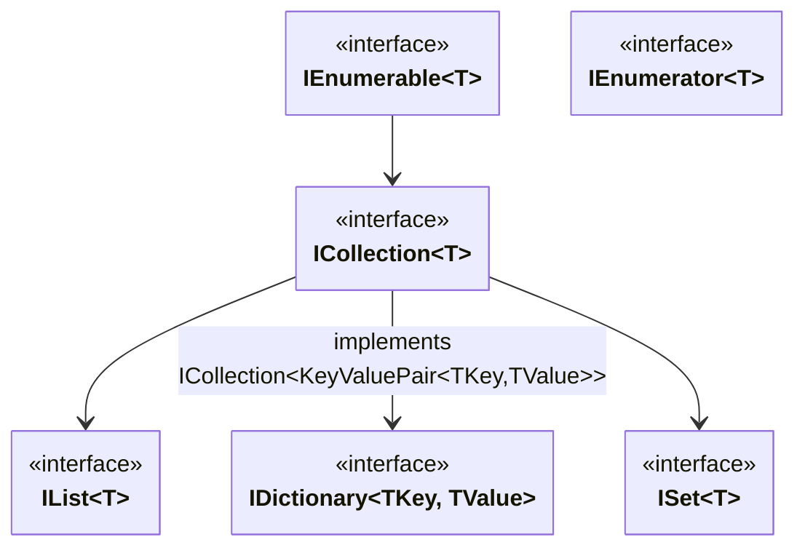

--- 
title: "Collections"
weight: 20
---

# Collections

The collections built into the C# standard library are organized into different namespaces:

* **System.Collections** - contains non-generic collections that use the `object` type to store objects.
* **System.Collections.Generic** - the most commonly used, generic collections, which we will be focusing on.
* **System.Collections.Concurrent** - generic, thread-safe collections.
* **System.Collections.Immutable** - generic collections that do not allow modification.
* **System.Collections.ObjectModel** - provides templates for custom collections.

## Collection Hierarchy

The base for all collections is the `IEnumerable<T>` interface, which only guarantees that an object can be iterated over. This can be an infinite sequence of elements generated on the fly.

`ICollection<T>` extends `IEnumerable<T>` and represents a modifiable, finite collection.

Further in the hierarchy, we have only specialized collections: lists (`IList<T>`), dictionaries (`IDictionary<TKey, TValue>`), and sets (`ISet<T>`).



### The ICollection<T> Interface

`ICollection<T>` represents a modifiable, finite collection to which elements can be added and removed. It extends the possibility of iteration with basic operations of adding and removing elements, checking their count (`Count`), and whether a given element is in the collection (`Contains`).

```csharp
public interface ICollection<T> : IEnumerable<T>
{
    int Count { get; }
    bool IsReadOnly { get; }
    void Add(T item);
    bool Remove(T item);
    bool Contains(T item);
    void Clear();
    void CopyTo(T[] array, int arrayIndex);
}
```

### The IList<T> Interface

The list interface additionally introduces the ability to reference elements using an index.

```csharp
public interface IList<T> : ICollection<T>
{
    T this [int index] { get; set; }
    int IndexOf(T item);
    void Insert(int index, T item);
    void RemoveAt(int index);
}
```

#### The List<T> Class

The most popular concrete implementation of this interface is `List<T>`. Underneath, it is a dynamically expanding array, similar to the `std::vector` type from C++. The `List<T>` class additionally provides several useful methods: `Sort`, `BinarySearch`, `Find`.

```csharp
var planets = new List<string> { "Mercury", "Earth", "Mars" };
Console.WriteLine("Initial list:");
planets.ForEach(p => Console.WriteLine($"- {p}"));

planets.Insert(1, "Venus");

var gasGiants = new List<string> { "Jupiter", "Saturn", "Uranus", "Neptune" };
planets.AddRange(gasGiants);

planets.RemoveAt(planets.Count - 1);

bool hasMars = planets.Contains("Mars");
Console.WriteLine($"\nDoes the list contain Mars? {hasMars}");

string? sPlanet = planets.Find(p => p.StartsWith("S"));
Console.WriteLine($"Found planet starting with 'S': {sPlanet}");

int indexOfEarth = planets.IndexOf("Earth");
Console.WriteLine($"Index of Earth in the list: {indexOfEarth}");

planets.Sort();

Console.WriteLine("\nFinal list of planets (sorted):");
foreach (var planet in planets)
{
    Console.WriteLine($"- {planet}");
}

planets.Clear();
Console.WriteLine($"\nNumber of planets after clearing: {planets.Count}");
```

> `Array` also implements the `IList<T>` interface. The `Add`, `Remove`, `Insert`, and `RemoveAt` methods throw a `NotSupportedException`, as these are operations that change the size of the collection.

### The IDictionary<TKey, TValue> Interface

Dictionaries are collections of key-value pairs in which the keys are unique. The dictionary interface provides two properties that allow access to a collection of only the keys (`Keys`) or only the values (`Values`). Most often, working with a dictionary involves using the indexer. We can use it to add new values, update existing ones, and retrieve existing values. Accessing a value that is not in the dictionary throws a `KeyNotFoundException`, so if we are not sure if a value exists, it is better to use the `TryGetValue` method. Inserting a new value or updating a value using the indexer always succeeds. The `Add` method, on the other hand, throws an `ArgumentException` if the value is already in the dictionary.

```csharp
public interface IDictionary<TKey, TValue> : ICollection<KeyValuePair<TKey, TValue>>
{
    TValue this[TKey key] { get; set; }
    ICollection<TKey> Keys { get; }
    ICollection<TValue> Values { get; }
    void Add(TKey key, TValue value);
    bool Remove(TKey key);
    bool ContainsKey(TKey key);
    bool TryGetValue(TKey key, out TValue value);
}
```

#### The Dictionary<TKey, TValue> Class

The most commonly used implementation of a dictionary is `Dictionary<TKey, TValue>`. Its internal implementation is a hash table, which corresponds to the `std::unordered_map` type from C++. In C#, every object has an `Equals` and `GetHashCode` method, making it a candidate for being a key in such a dictionary. Of course, these methods must be implemented correctly for `Dictionary<TKey, TValue>` to work properly.

- **If two objects are equal (according to `Equals()`), they must return the same hash code (from `GetHashCode()`)**.
  - The reverse rule does not have to be met.
- `GetHashCode` and `Equals` should be implemented together.
- `GetHashCode` and `Equals` should use the same fields.
- The key's hash must not change; the fields used by `GetHashCode` should be immutable.

Example of a correct implementation of `GetHashCode` and `Equals`:

```csharp
public sealed class BookId : IEquatable<BookId>
{
    public string Isbn { get; }
    public string Format { get; }

    public BookId(string isbn, string format)
    {
        Isbn = isbn;
        Format = format;
    }

    public bool Equals(BookId? other)
    {
        if (other is null) return false;
        if (ReferenceEquals(this, other)) return true;

        return Isbn == other.Isbn && Format == other.Format;
    }

    public override bool Equals(object? obj)
    {
        return obj is BookId other && Equals(other);
    }

    public override int GetHashCode()
    {
        return HashCode.Combine(Isbn, Format);
    }
}
```

Example usage of the `Dictionary<TKey, TValue>` implementation:

```csharp
var openWith = new Dictionary<string, string>();

openWith.Add("txt", "notepad.exe");
openWith.Add("bmp", "paint.exe");
openWith.Add("dib", "paint.exe");
openWith.Add("rtf", "wordpad.exe");

try
{
    openWith.Add("txt", "vim.exe");
}
catch (ArgumentException)
{
    Console.WriteLine("An element with Key = \"txt\" already exists.");
}

Console.WriteLine($"Initial value for 'rtf': {openWith["rtf"]}");
openWith["rtf"] = "winword.exe"; // This updates the value.
Console.WriteLine($"New value for 'rtf': {openWith["rtf"]}");

openWith["doc"] = "winword.exe"; // This adds a new value.

if (openWith.TryGetValue("tif", out string? tifProgram))
{
    Console.WriteLine($"Value for 'tif': {tifProgram}");
}
else
{
    Console.WriteLine("Key 'tif' is not found.");
}

if (!openWith.ContainsKey("ht"))
{
    openWith.Add("ht", "hypertrm.exe");
    Console.WriteLine($"Value added for key 'ht': {openWith["ht"]}");
}

Console.WriteLine("\n--- Dictionary Contents ---");
foreach (var pair in openWith)
{
    Console.WriteLine($"Key: {pair.Key}, Value: {pair.Value}");
}

Console.WriteLine("\n--- Just Values ---");
foreach (var value in openWith.Values)
{
    Console.WriteLine($"Value: {value}");
}

Console.WriteLine("\n--- Just Keys ---");
foreach (var key in openWith.Keys)
{
    Console.WriteLine($"Key: {key}");
}

Console.WriteLine("\nRemoving 'doc'...");
if (openWith.Remove("doc"))
{
    Console.WriteLine("Key 'doc' removed from the dictionary.");
}
```

> If we want the dictionary to be sorted by keys, there is also the `SortedDictionary<TKey, TValue>` implementation, which provides this. It is the equivalent of `std::map` from C++, internally using red-black trees.

### The ISet<T> Interface

The `ISet<T>` interface represents a set in the mathematical sense. It stores only unique elements - duplicates are automatically ignored. The `Add` method returns `true` if the element was added, and `false` if the element already existed in the set. The rest of the methods in the set are set operations or methods for checking relationships between sets.

```csharp
public interface ISet<T> : ICollection<T>
{
    bool Add(T item);
    void UnionWith(IEnumerable<T> other);
    void IntersectWith(IEnumerable<T> other);
    void ExceptWith(IEnumerable<T> other);
    void SymmetricExceptWith(IEnumerable<T> other);
    bool IsSubsetOf(IEnumerable<T> other);
    bool IsSupersetOf(IEnumerable<T> other);
    bool IsProperSupersetOf(IEnumerable<T> other);
    bool IsProperSubsetOf(IEnumerable<T> other);
    bool Overlaps(IEnumerable<T> other);
    bool SetEquals(IEnumerable<T> other);
}
```

The most popular implementations of this interface are the `HashSet<T>` class, which operates based on a hash table (like `Dictionary`), and `SortedSet<T>`, which operates based on red-black trees (like `SortedDictionary`).

### Other Collections

Besides the main branches of the hierarchy, there are other important collections that **directly implement `ICollection<T>`** without being a list, dictionary, or set:

- `LinkedList<T>` - A generic doubly-linked list. Unlike `List<T>`, it is optimized for frequent addition and removal of elements at any place in the list, as this does not require shifting subsequent elements.
- `Queue<T>` - Implements a **FIFO** (First-In, First-Out) queue, internally using a **dynamically sized array**. The main methods are `Enqueue` (adds to the end) and `Dequeue` (retrieves from the beginning).
- `Stack<T>` - Implements a **LIFO** (Last-In, First-Out) stack, also internally using a **dynamically sized array**. The main methods are `Push` (adds to the top) and `Pop` (retrieves from the top).

> It is also worth mentioning `BitArray` from the `System.Collections` namespace. It is a specialized, **non-generic** collection that allows for the efficient storage and manipulation of an array of bits (true/false values), using only one bit for each value.

### Collection Initializers

This syntax, available for a long time, requires the use of `new` and curly braces `{...}`. The compiler translates it into a series of `Add` method calls or insertions via an indexer (since C# 6.0).

```csharp
// Initializer for a List<T>
var numbers = new List<int> { 1, 2, 3 };

// Initializer for a Dictionary<TKey, TValue> (using pairs)
var cityPopulations = new Dictionary<string, int>
{
    { "Tokyo", 37_000_000 },
    { "Delhi", 32_000_000 }
};

// For types defining an indexer (C# 6.0):
var cityPopulationsByIndexer = new Dictionary<string, int>
{
    ["Shanghai"] = 28_000_000,
    ["London"] = 9_000_000
};
```

### Collection Expressions (C# 12)

Starting with C# 12, a new, even more concise syntax known as **collection expressions** was introduced. It uses square brackets `[...]` and allows the compiler to infer the collection type from the context (the type of the variable it is being assigned to).

```csharp
List<int> numbers1 = [1, 2, 3, 4];

int[] numbers2 = [5, 6, 7, 8];

// Spread operator `..` to concatenate collections.
var combined = [..numbers1, ..numbers2, 9, 10];
// 'combined' contains { 1, 2, 3, 4, 5, 6, 7, 8, 9, 10 }
```

