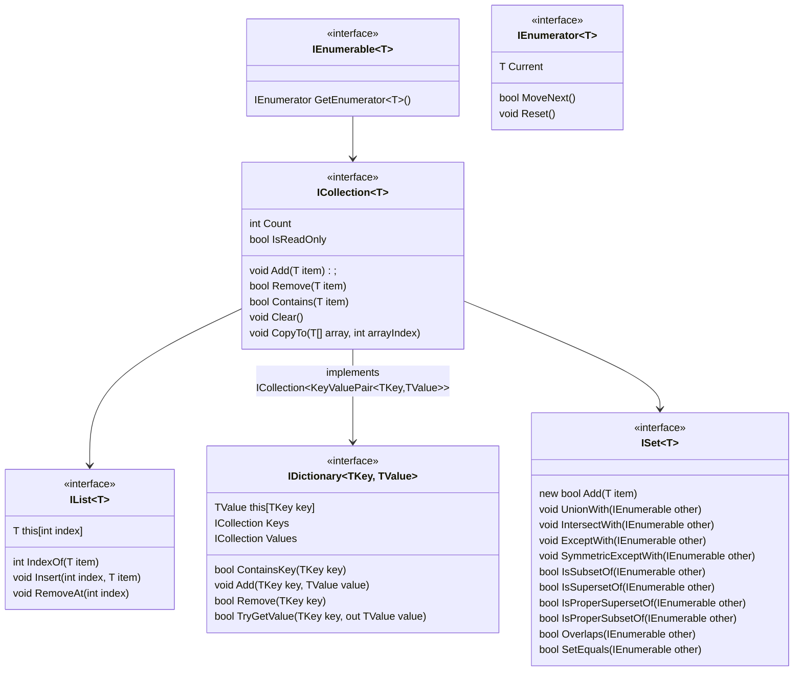

# Kolekcje

Kolekcje wbudowane w bibliotekę standardową C# są posegregowane w różnych przestrzeniach nazw:

* **System.Collections** - zawiera niegeneryczne kolekcje, używające typu `object` do przechowywania obiektów
* **System.Collections.Generic** - najczęściej używane, generyczne kolekcje, nimi będziemy się zajmować
* **System.Collections.Concurrent** - generyczne kolekcje, bezpieczne wielowątkowo
* **System.Collections.Immutable** - generyczne kolekcje, nie pozwalające na modyfikację
* **System.Collections.ObjectModel** - dostarcza szablony dla własnych kolekcji

## Hierarchia kolekcji

Bazą dla wszystkich kolekcji jest interfejs `IEnumerable<T>`, który jedynie gwarantuje, że po obiekcie można się przeiterować. Może to być nieskończona sekwencja, na bieżąco generowanych elementów.

`ICollection<T>` rozszerza `IEnumerable<T>` i reprezentuje modyfikowalną skończoną kolekcję.

Dalej w hierarchii mamy już tylko wyspecjalizowane kolekcje: listy (`IList<T>`), słowniki (`IDictionary<TKey, TValue>`) i zbiory (`ISet<T>`).



### Interfejs ICollection<T>

`ICollection<T>` reprezentuje modyfikowalną skończoną kolekcję, w której można dodawać i usuwać elementy. Rozszerza możliwość iteracji o podstawowe operacje dodawania i usuwania elementów, sprawdzania ich liczby (`Count`) oraz czy dany element znajduje się w kolekcji (`Contains`).

```csharp
public interface ICollection<T> : IEnumerable<T>
{
    int Count { get; }
    bool IsReadOnly { get; }
    void Add(T item);
    bool Remove(T item);
    bool Contains(T item);
    void Clear();
    void CopyTo(T[] array, int arrayIndex);
}
```

### Interfejs IList<T>

Interfejs listy dodatkowo wprowadza możliwość odwoływania się do elementów za pomocą indeksu.

```csharp
public interface IList<T> : ICollection<T>
{
    T this [int index] { get; set; }
    int IndexOf(T item);
    void Insert(int index, T item);
    void RemoveAt(int index);
}
```

#### Klasa List<T>

Najpopularniejszą konkretną implementacją tego interfejsu jest `List<T>`. Pod spodem jest to dynamicznie rozszerzana tablica, podobnie jak typ `std::vector` z C++. Klasa `List<T>` dodatkowo dostarcza kilka przydatnych metod: `Sort`, `BinarySearch`, `Find`.

```csharp
var planets = new List<string> { "Mercury", "Earth", "Mars" };
Console.WriteLine("Initial list:");
planets.ForEach(p => Console.WriteLine($"- {p}"));

planets.Insert(1, "Venus");

var gasGiants = new List<string> { "Jupiter", "Saturn", "Uranus", "Neptune" };
planets.AddRange(gasGiants);

planets.RemoveAt(planets.Count - 1);

bool hasMars = planets.Contains("Mars");
Console.WriteLine($"\nDoes the list contain Mars? {hasMars}");

string? sPlanet = planets.Find(p => p.StartsWith("S"));
Console.WriteLine($"Found planet starting with 'S': {sPlanet}");

int indexOfEarth = planets.IndexOf("Earth");
Console.WriteLine($"Index of Earth in the list: {indexOfEarth}");

planets.Sort();

Console.WriteLine("\nFinal list of planets (sorted):");
foreach (var planet in planets)
{
    Console.WriteLine($"- {planet}");
}

planets.Clear();
Console.WriteLine($"\nNumber of planets after clearing: {planets.Count}");
```

> `Array` również implementuje interfejs `IList<T>`. Metody `Add`, `Remove`, `Insert` i `RemoveAt` rzucają wyjątkiem `NotSupportedException`, jako że są to operacje które zmieniają rozmiar kolekcji.

### Interfejs IDictionary<TKey, TValue>

Słowniki są kolekcjami par klucz-wartość, w których klucze są unikalne. Interfejs słownika dostarcza dwóch właściwości, które pozwalają na dostęp do kolekcji tylko kluczy `Keys` lub tylko wartości `Values`. Najczęściej praca ze słownikiem polega na używaniu indeksatora. Możemy go używać zarówno do dodawania nowych wartości, aktualizowania obecnych oraz pobierania już istniejących wartości. Dostęp do wartości, której nie ma w słowniku, rzuca wyjątkiem `KeyNotFoundException`, dlatego jeżeli nie jesteśmy pewni czy wartość istnieje lepiej użyć metody `TryGetValue`. Wstawianie nowej lub aktualizacja wartości za pomocą indeksatora zawsze się udaje. Metoda `Add` z kolei, jeżeli wartość już jest w słowniku, to rzuca wyjątkiem `ArgumentException`.

```csharp
public interface IDictionary<TKey, TValue> : ICollection<KeyValuePair<TKey, TValue>>
{
    TValue this[TKey key] { get; set; }
    ICollection<TKey> Keys { get; }
    ICollection<TValue> Values { get; }
    void Add(TKey key, TValue value);
    bool Remove(TKey key);
    bool ContainsKey(TKey key);
    bool TryGetValue(TKey key, out TValue value);
}
```

#### Klasa Dictionary<TKey, TValue>

Najczęściej używaną implementacją słownika jest `Dictionary<TKey, TValue>`. Jego wewnętrzną implementacją jest tablica mieszająca (*hash table*), co odpowiadałoby typowi `std::unordered_map` z C++. W C# każdy obiekt posiada metodę `Equals` i `GetHashCode`, dzięki czemu jest kandydatem na bycie kluczem w takim słowniku. Oczywiście te metody muszą być odpowiednio zaimplementowane, żeby `Dictionary<TKey, TValue>` działał poprawnie. 

- **Jeśli dwa obiekty są równe (według `Equals()`), to muszą zwracać ten sam hash (z `GetHashCode()`)**. 
  - Odwrotna zasada nie musi być spełniona.
- `GetHashCode` i `Equals` powinny być implementowane razem
- `GetHashCode` i `Equals` powinny używać tych samych pól
- Hash klucza nie może się zmieniać, pola, których używa `GetHashCode` powinny być niezmienne.

Przykład poprawnej implementacji `GetHashCode` i `Equals`:

```csharp
public sealed class BookId : IEquatable<BookId>
{
    public string Isbn { get; }
    public string Format { get; }

    public BookId(string isbn, string format)
    {
        Isbn = isbn;
        Format = format;
    }

    public bool Equals(BookId? other)
    {
        if (other is null) return false;
        if (ReferenceEquals(this, other)) return true;

        return Isbn == other.Isbn && Format == other.Format;
    }

    public override bool Equals(object? obj)
    {
        return obj is BookId other && Equals(other);
    }

    public override int GetHashCode()
    {
        return HashCode.Combine(Isbn, Format);
    }
}
```

Przykładowe użycie implementacji `Dictionary<TKey, TValue>`:

```csharp
var openWith = new Dictionary<string, string>();

openWith.Add("txt", "notepad.exe");
openWith.Add("bmp", "paint.exe");
openWith.Add("dib", "paint.exe");
openWith.Add("rtf", "wordpad.exe");

try
{
    openWith.Add("txt", "vim.exe");
}
catch (ArgumentException)
{
    Console.WriteLine("An element with Key = \"txt\" already exists.");
}

Console.WriteLine($"Initial value for 'rtf': {openWith["rtf"]}");
openWith["rtf"] = "winword.exe"; // This updates the value.
Console.WriteLine($"New value for 'rtf': {openWith["rtf"]}");

openWith["doc"] = "winword.exe"; // This adds a new value.

if (openWith.TryGetValue("tif", out string? tifProgram))
{
    Console.WriteLine($"Value for 'tif': {tifProgram}");
}
else
{
    Console.WriteLine("Key 'tif' is not found.");
}

if (!openWith.ContainsKey("ht"))
{
    openWith.Add("ht", "hypertrm.exe");
    Console.WriteLine($"Value added for key 'ht': {openWith["ht"]}");
}

Console.WriteLine("\n--- Dictionary Contents ---");
foreach (var pair in openWith)
{
    Console.WriteLine($"Key: {pair.Key}, Value: {pair.Value}");
}

Console.WriteLine("\n--- Just Values ---");
foreach (var value in openWith.Values)
{
    Console.WriteLine($"Value: {value}");
}

Console.WriteLine("\n--- Just Keys ---");
foreach (var key in openWith.Keys)
{
    Console.WriteLine($"Key: {key}");
}

Console.WriteLine("\nRemoving 'doc'...");
if (openWith.Remove("doc"))
{
    Console.WriteLine("Key 'doc' removed from the dictionary.");
}
```

> Jeżeli zależy nam żeby słownik był posortowany po kluczach, to istnieje również implementacja `SortedDictionary<TKey, TValue>`, która nam to zapewnia. To odpowiednik `std::map` z C++, wewnętrznie używający drzew czerwono-czarnych.

### Interfejs ISet<T>

Interfejs `ISet<T>` reprezentuje zbiór w matematycznym sensie. Przechowuje on wyłącznie unikalne elementy - duplikaty są automatycznie ignorowane. Metoda `Add` zwraca `true`, jeśli element został dodany, a `false`, jeśli element już istniał w zbiorze. Reszta metod w zbiorze to operacje mnogościowe lub sprawdzające relacje między zbiorami.

```csharp
public interface ISet<T> : ICollection<T>
{
    bool Add(T item);
    void UnionWith(IEnumerable<T> other);
    void IntersectWith(IEnumerable<T> other);
    void ExceptWith(IEnumerable<T> other);
    void SymmetricExceptWith(IEnumerable<T> other);
    bool IsSubsetOf(IEnumerable<T> other);
    bool IsSupersetOf(IEnumerable<T> other);
    bool IsProperSupersetOf(IEnumerable<T> other);
    bool IsProperSubsetOf(IEnumerable<T> other);
    bool Overlaps(IEnumerable<T> other);
    bool SetEquals(IEnumerable<T> other);
}
```

Najpopularniejszą implementacją tego interfejsu jest klasa `HashSet<T>`, działająca w oparciu o tablicę mieszającą (tak jak `Dictionary`) i `SortedSet<T>`, działająca w oparciu o drzewa czerwono-czarne (tak jak `SortedDictionary`).

### Inne kolekcje

Poza głównymi gałęziami hierarchii, istnieją inne ważne kolekcje, które **bezpośrednio implementują `ICollection<T>`**, nie będąc listą, słownikiem ani zbiorem:

- `LinkedList<T>` - Generyczna lista dwukierunkowa. W przeciwieństwie do `List<T>`, jest zoptymalizowana pod kątem częstego dodawania i usuwania elementów w dowolnym miejscu listy, ponieważ nie wymaga to przesuwania kolejnych elementów.
- `Queue<T>` - Implementuje kolejkę **FIFO** (First-In, First-Out), wewnętrznie używając **dynamicznie rozszerzanej tablicy**. Główne metody to `Enqueue` (dodaje na końcu) i `Dequeue` (pobiera z początku).
- `Stack<T>` - Implementuje stos **LIFO** (Last-In, First-Out), również wewnętrznie używając **dynamicznie rozszerzanej tablicy**. Główne metody to `Push` (dodaje na wierzch) i `Pop` (pobiera z wierzchu).

> Warto również wspomnieć o `BitArray` z przestrzeni nazw `System.Collections`. Jest to specjalistyczna, **niegeneryczna** kolekcja, która pozwala na efektywne przechowywanie i manipulowanie tablicą bitów (wartości `true`/`false`), używając tylko jednego bitu na każdą wartość.
