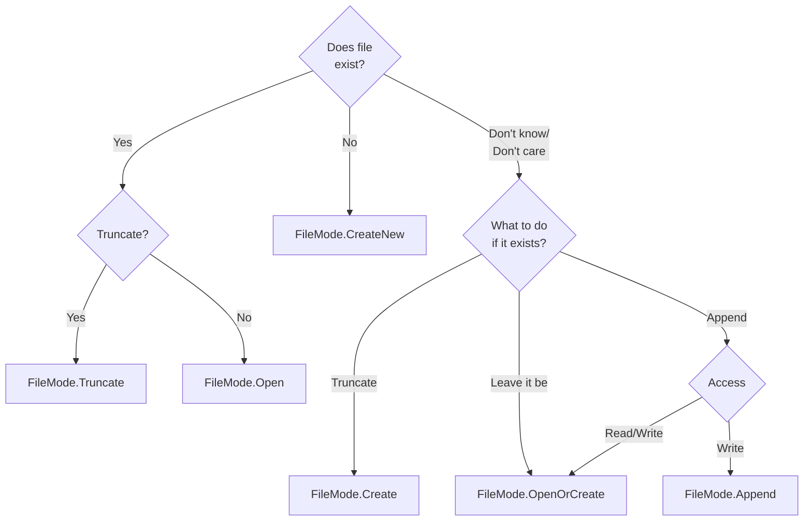
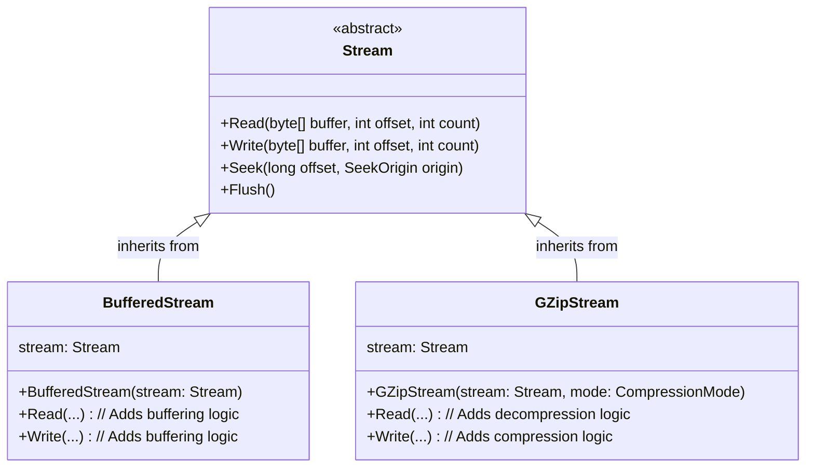

# Streams

Streams in C# are an abstraction for input/output (*I/O*) operations. A stream represents a sequence of bytes that can be read or written. The data source can be memory, files, pipes, or a network connection. Regardless of what it is, streams allow you to work with data in a uniform way.

## Stream Capabilities

Streams allow for three basic operations: read (`Read`), write (`Write`), and position (`Seek`). You can check if a stream supports these operations using the `Can*` properties:

```csharp
using Stream stream = new FileStream("lorem.txt", FileMode.Open);
Console.WriteLine($"Can read: {stream.CanRead}");
Console.WriteLine($"Can write: {stream.CanWrite}");
Console.WriteLine($"Can Seek: {stream.CanSeek}");
```

## Working with Streams

Streams provide methods similar in their operation to those from the POSIX API. The main difference is how exceptions are handled. In C#, stream-related methods throw errors using exceptions inheriting from `IOException`.

> Working with a "raw stream" is usually inconvenient/unadvisable; it's better to do it through [stream adapters]() or by using the [file facade]().

> Most stream operations have their asynchronous (non-blocking) counterparts, e.g., `Read` - `ReadAsync`. At this stage, we will omit their existence.

### Reading

The method `int Read(byte[] buffer, int offset, int count)` has analogous parameters to the `read` function from the POSIX API. Similarly, it returns the number of bytes read, which may differ from the number of bytes we would like to read. The end of the stream is signaled by returning a value of `0`.

```csharp
using Stream stream = new FileStream("lorem.txt", FileMode.Open);

byte[] buffer = new byte[256];
int read;

while ((read = stream.Read(buffer, 0, buffer.Length)) > 0)
{
    Console.WriteLine($"Read {read} bytes");
}
```

> You can also read a single byte from the stream using the `ReadByte` method, but this is not very efficient.

### Writing

Analogously, the method `void Write(byte[] buffer, int offset, int count)` has analogous parameters to the `write` function from the POSIX API.

```csharp
using Stream stream = new FileStream("lorem.txt", FileMode.Create);
byte[] buffer = new byte[256];

for (int i = byte.MinValue; i <= byte.MaxValue; i++)
{
    buffer[i - byte.MinValue] = (byte)i;
}
stream.Write(buffer, 0, buffer.Length);
```

> You can also write a single byte to the stream using the `WriteByte` method, but this is not very efficient.

### Positioning

Some streams support the position change operation. These are usually streams whose source is files and memory. Network streams and pipes will not support this operation.

```csharp
using Stream stream = new FileStream("lorem.txt", FileMode.Open);

stream.Position = 0;
stream.Position = stream.Length;

stream.Seek(offset: 10, SeekOrigin.Begin);
stream.Seek(offset: -10, SeekOrigin.End);
stream.Seek(offset: -10, SeekOrigin.Current);
```

### Flushing and Closing Streams

Data that we write to a stream is usually not immediately saved to the destination (file, network, etc.). I/O operations are often buffered, either by the operating system or another mechanism. To force the buffers to be written, we use the `Flush` method on the stream. Closing a stream automatically flushes it. We close a stream with the `Dispose` or `Close` method. Both methods are equivalent and do the same thing.

It is best to use the `using` statement — it causes the resources associated with it to be automatically released at the end of the block by calling the `Dispose` method. This avoids errors related to unclosed resources.

```csharp
using Stream stream = new FileStream("lorem.txt", FileMode.Open);

byte[] buffer = new byte[256];
int read;

while ((read = stream.Read(buffer, 0, buffer.Length)) > 0)
{
    Console.WriteLine($"Read {read} bytes");
}
```

Is converted by the compiler to:

```csharp
Stream stream = new FileStream("lorem.txt", FileMode.Open);

try
{
    byte[] buffer = new byte[256];
    int read;

    while ((read = stream.Read(buffer, 0, buffer.Length)) > 0)
    {
        Console.WriteLine($"Read {read} bytes");
    }
}
finally
{
    stream?.Dispose();
}
```

## File Streams

The `FileStream` class represents a data stream whose source is a file. A file can be opened in many ways; `FileStream` provides many constructors with many options.

```csharp
// FileStream constructors:
public FileStream(string path, FileMode mode);
public FileStream(string path, FileMode mode, FileAccess access);
public FileStream(string path, FileMode mode, FileAccess access, FileShare share);
public FileStream(string path, FileMode mode, FileAccess access, FileShare share, int bufferSize);
public FileStream(string path, FileMode mode, FileAccess access, FileShare share, int bufferSize, FileOptions options);
// and more...
```

In addition to `FileStream` constructors, the `File` class also provides static methods for opening files:

```csharp
// Using constructor:
FileStream fs1 = new FileStream("file1.txt", FileMode.OpenOrCreate, FileAccess.ReadWrite);

// File façade methods:
FileStream fs2 = File.Create("file2.txt");
FileStream fs3 = File.OpenRead("file3.txt");
FileStream fs4 = File.OpenWrite("file4.txt");
FileStream fs5 = File.Open("file5.txt", FileMode.OpenOrCreate, FileAccess.ReadWrite);
```

The `FileMode` enum specifies how the file should be opened. The table below describes the available options:

| Value | Action when file **exists** | Action when file **does not exist** |
| :--- | :--- | :--- |
| `CreateNew` | Throws `IOException` | Creates a new file |
| `Create` | **Overwrites** (deletes content) | Creates a new file |
| `Open` | Opens the file | Throws `FileNotFoundException` |
| `OpenOrCreate`| Opens the file | Creates a new file |
| `Truncate` | **Overwrites** (deletes content) | Throws `FileNotFoundException` |
| `Append` | Opens the file and sets the cursor to the end | Creates a new file |



The `FileAccess` enum determines how we can use the stream, and takes one of the values: `Read`, `Write`, `ReadWrite`.

### Facade

The `File` class provides a facade, which is a simplified interface that provides methods for reading or writing an entire file in one simple call, hiding all the technical details related to file operations.

1. `ReadAllText` and `WriteAllText`:
   ```csharp
   string content = File.ReadAllText("lorem.txt");
   File.WriteAllText("lorem.txt.bak", content);
   ```

2. `ReadAllLines` and `WriteAllLines`:
   ```csharp
   string[] lines = File.ReadAllLines("lorem.txt");
   File.WriteAllLines("lorem.txt.bak", lines);
   ```

3. `ReadAllBytes` and `WriteAllBytes`:
   ```csharp
   byte[] bytes = File.ReadAllBytes("lorem.bin");
   File.WriteAllBytes("lorem.bin.bak", bytes);
   ```

4. `AppendAllText`:
   ```csharp
   const string logFile = "log.txt";
   for (int i = 0; i < 100; i++)
   {
       File.AppendAllText(logFile, $"[Info] This is a log entry no. {i}");
   }
   ```

5. `ReadLines` and `AppendAllLines`:
   ```csharp
   IEnumerable<string> lines = File.ReadLines("lorem.txt");
   int errors = lines
           .Where(line => line.Contains("Error"))
           .Count();
   ```
   ```csharp
   IEnumerable<string> lines = File.ReadLines("lorem.txt");
   File.AppendAllLines("lorem.txt.bak", lines);
   ```

> [!WARNING]
> `ReadAll*` methods load the entire file content into memory at once. They should not be used if the file is known to be large. For large files, the `ReadLines` method works much better, as it lazily reads subsequent lines as a sequence of strings on the fly.

## Stream Decorators

The Decorator pattern allows for dynamically adding new functionality to an object without changing its class. This is done by wrapping the original object in a new decorator object that has the same interface. The decorator delegates the original tasks to the wrapped object and additionally performs its own operations.



### `BufferedStream`

`BufferedStream` adds buffering to a stream. It wraps another stream (e.g., FileStream) and maintains a buffer in memory (e.g., 4KB). If we try to read a smaller amount of bytes from it, `BufferedStream` will actually read 4KB from the file at once and write them to an internal buffer, from which we will read until the buffer is exhausted. The same would apply to writing. Reading from and writing to RAM is much faster than file operations on disk, and buffering minimizes the number of costly I/O operations.

```csharp
// Write 100K bytes to a file:
File.WriteAllBytes("file.bin", new byte [100_000]);

using Stream fs = File.OpenRead("file.bin");
// Add 20k bytes buffering
using Stream bs = new BufferedStream(fs, 20_000);

bs.ReadByte();
Console.WriteLine(fs.Position); // 20000
```

### Compression

The standard library provides three compression methods represented by the stream decorators `GZipStream`, `DeflateStream`, `BrotliStream`. When we wrap a stream in, for example, `GZipStream` and write data to it, `GZipStream` first compresses this data before passing it on to the wrapped stream. During reads, the process is reversed: `GzipStream` reads compressed data from the wrapped stream and decompresses it before returning it.

1. Compression

   ```csharp
   using Stream fsIn = File.OpenRead("file.txt");

   using Stream fsOut = File.Create("file.txt.gz");
   using Stream cs = new GZipStream(fsOut, CompressionMode.Compress);
   
   byte[] buffer = new byte[4096];
   int read;
   
   while ((read = fsIn.Read(buffer, 0, buffer.Length)) > 0)
   {
       cs.Write(buffer, 0, read);
   }
   ```

2. Decompression
   ```csharp
   using Stream fsIn = File.OpenRead("file.txt.gz");
   using Stream ds = new GZipStream(fsIn, CompressionMode.Decompress);
   
   using Stream fsOut = File.Create("file.txt");
   
   byte[] buffer = new byte[4096];
   int read;
   
   while ((read = ds.Read(buffer, 0, buffer.Length)) > 0)
   {
       fsOut.Write(buffer, 0, read);
   }
   ```

### Combining Decorators

Naturally, since decorators are streams themselves, we can combine decorators into chains.

```csharp
using Stream fs = new FileStream("dane.bin.gz", FileMode.Create);
using Stream bs = new BufferedStream(fs);
using Stream cs = new GZipStream(bs, CompressionMode.Compress);

byte[] data = new byte[1000];
cs.Write(data, 0, data.Length);
```

In the above example, the data we write goes through the following path:

```
data -> GZipStream (compression) -> BufferedStream (buffering) -> FileStream (disk write).
```

## Stream Adapters

The biggest advantage over the POSIX API is stream adapters. For streams, we have adapters that adapt streams to work with text `StreamReader` and `StreamWriter`, and adapters to work with binary data `BinaryReader` and `BinaryWriter`. Adapters also wrap a stream, but unlike decorators, they are not streams themselves. Usually, when working with streams, an adapter ends up at the end of the decorator chain.

### Text Adapters

Text adapters add the ability to read and write characters, words, and entire lines of text to a stream. They allow operations such as `string? ReadLine()`, `string? ReadToEnd()`, `void WriteLine(string str)`, `void Write(string str)`.

1. `StreamReader`
   ```csharp
   using FileStream fs = File.OpenRead("lorem.txt");
   using StreamReader sr = new StreamReader(fs);
   
   while (sr.ReadLine() is { } line)
   {
       Console.WriteLine(line);
   }
   ```

2. `StreamWriter`
   ```csharp
   using FileStream fs = File.OpenWrite("fizzbuzz.txt");
   using StreamWriter sw = new StreamWriter(fs);

   for (int i = 1; i <= 100; i++)
   {
       sw.Write($"{i} : ");
       if (i % 3 == 0 && i % 5 == 0)
           sw.WriteLine("FizzBuzz");
       else if (i % 3 == 0)
           sw.WriteLine("Fizz");
       else if (i % 5 == 0)
           sw.WriteLine("Buzz");
       else
           sw.WriteLine(i);
   }
   ```

### Binary Adapters

Binary adapters, in turn, are used when working with binary data. These adapters allow for the serialization and deserialization of basic types to bytes. They allow operations such as `int ReadInt32()`, `void Write(int value)`, `double ReadDouble()`, `void Write(double value)`, `string ReadString()`.

1. `BinaryWriter`
   ```csharp
   using FileStream fs = File.OpenWrite("player.bin");
   using BinaryWriter bw = new BinaryWriter(fs);
   
   Player player = new Player("Bob", 100, 2500, 10, new Vector2(48.5f, 32.5f));
   
   bw.Write(player.Name);
   bw.Write(player.Health);
   bw.Write(player.Experience);
   bw.Write(player.Money);
   bw.Write(player.Position.X);
   bw.Write(player.Position.Y);
   ```
   
   ```csharp
   public record Player(string Name, int Health, long Experience, long Money, Vector2 Position);
   ```

2. `BinaryReader`
   ```csharp
   using FileStream fs = File.OpenRead("player.bin");
   using BinaryReader br = new BinaryReader(fs);
   
   string name = br.ReadString();
   int health = br.ReadInt32();
   long experience = br.ReadInt64();
   long money = br.ReadInt64();
   float posX = br.ReadSingle();
   float posY = br.ReadSingle();
   
   Player player = new Player(name, health, experience, money, new Vector2(posX, posY));
   
   Console.WriteLine(player);
   ```