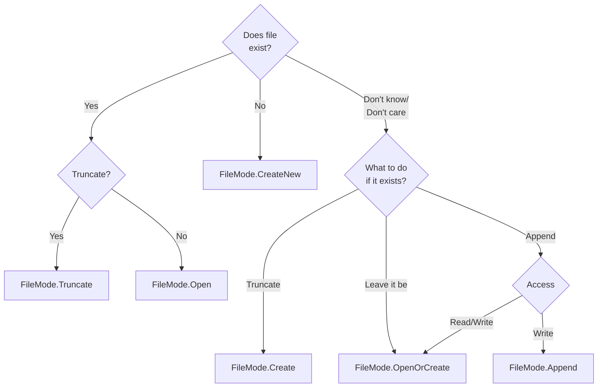
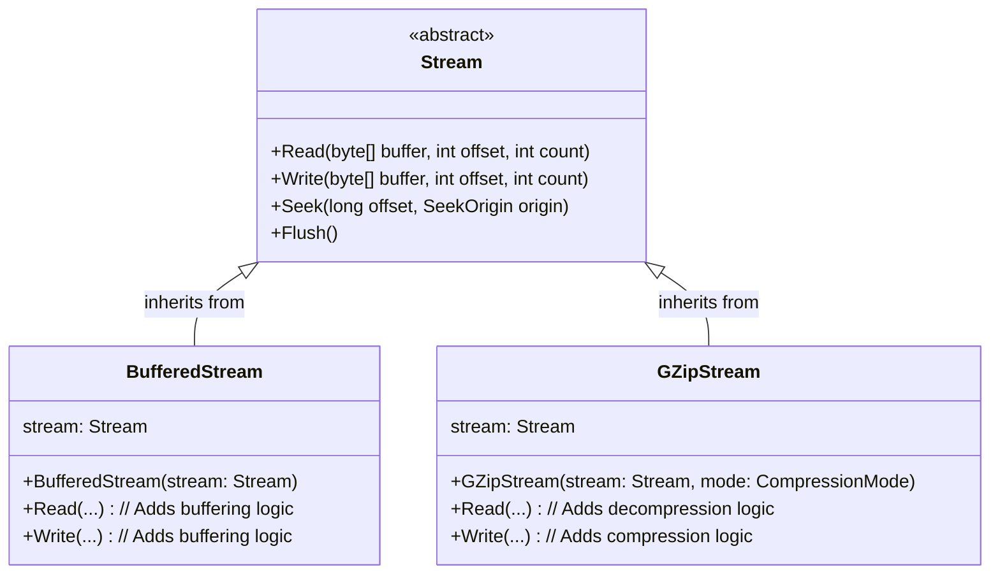

# Strumienie

Strumienie w C# są abstrakcją dla operacji wejścia/wyjścia (*I/O*). Strumień reprezentuje sekwencję bajtów, którą można czytać lub zapisywać. Źródłem danych może być pamięć, pliki, łącza, czy połączenie sieciowe. Niezależnie od tego, co to jest, strumienie pozwalają pracować z danymi w jednolity sposób.

## Możliwości strumienia

Strumienie pozwalają na trzy podstawowe operacje: odczyt (`Read`), zapis (`Write`) i pozycjonowanie (`Seek`). Można sprawdzić, czy strumień wspiera te operacje za pomocą właściwości `Can*`:

```csharp
using Stream stream = new FileStream("lorem.txt", FileMode.Open);
Console.WriteLine($"Can read: {stream.CanRead}");
Console.WriteLine($"Can write: {stream.CanWrite}");
Console.WriteLine($"Can Seek: {stream.CanSeek}");
```

## Praca ze strumieniem

Strumienie dostarczają metody podobne w swoim działaniu do tych z API POSIXa. Główną różnicą jest sposób obsługi wyjątków. W C# metody związane ze strumieniami zgłaszają błędy za pomocą wyjątków dziedziczących po `IOException`. 

> Praca z "surowym strumieniem" jest zazwyczaj niewygodna/niewskazana, lepiej to robić przez [adaptery strumieni]() lub korzystając z [fasady pliku]()

> Większość operacji na strumieniach ma swoje odpowiedniki asynchroniczne (nieblokujące), np. `Read` - `ReadAsync`. Na tym etapie przemilczymy ich istnienie.

### Odczyt

Metoda `int Read(byte[] buffer, int offset, int count)` ma analogiczne parametry do funkcji `read` z POSIX API. Podobnie, zwraca ilość przeczytanych bajtów, która może się różnić od ilości bajtów, które chcielibyśmy przeczytać. Koniec strumienia jest sygnalizowany przez zwrócenie wartości `0`.

```csharp
using Stream stream = new FileStream("lorem.txt", FileMode.Open);

byte[] buffer = new byte[256];
int read;

while ((read = stream.Read(buffer, 0, buffer.Length)) > 0)
{
    Console.WriteLine($"Read {read} bytes");
}
```

> Można też przeczytać pojedynczy bajt ze strumienia metodą `ReadByte`, ale nie jest to zbyt efektywne.

### Zapis

Analogicznie, metoda `void Write(byte[] buffer, int offset, int count)` ma analogiczne parametry do funkcji `write` z POSIX API.

```csharp
using Stream stream = new FileStream("lorem.txt", FileMode.Create);
byte[] buffer = new byte[256];

for (int i = byte.MinValue; i <= byte.MaxValue; i++)
{
    buffer[i - byte.MinValue] = (byte)i;
}
stream.Write(buffer, 0, buffer.Length);
```

> Można też zapisać pojedynczy bajt do strumienia metodą `WriteByte`, ale nie jest to zbyt efektywne.

### Pozycjonowanie

Niektóre strumienie wspierają operację zmiany pozycji. Zazwyczaj są to strumienie, których źródłem są pliki i pamięć. Strumienie sieciowe i łącza nie będą wspierały tej operacji.

```csharp
using Stream stream = new FileStream("lorem.txt", FileMode.Open);

stream.Position = 0;
stream.Position = stream.Length;

stream.Seek(offset: 10, SeekOrigin.Begin);
stream.Seek(offset: -10, SeekOrigin.End);
stream.Seek(offset: -10, SeekOrigin.Current);
```

### Opróżnianie i zamykanie strumieni

Dane, które wpisujemy do strumienia, zazwyczaj nie są od razu zapisywane do miejsca docelowego (plik, sieć, itp.). Operacje `I/O` są często buforowane, czy to przez system operacyjny, czy inny mechanizm. Aby wymusić zapis buforów, na strumieniu używamy metody `Flush`. Zamknięcie strumienia powoduje jego automatyczne opróżnienie. Strumień zamykamy metodą `Dispose` lub `Close`. Obie te metody są równoważne i robią to samo.

Najlepiej jest używać instrukcji `using` — powoduje ona, że na końcu bloku zasoby z nią związane są automatycznie zwalniane poprzez wywołanie metody `Dispose`. Dzięki temu unikamy błędów związanych z niezamkniętymi zasobami.

```csharp
using Stream stream = new FileStream("lorem.txt", FileMode.Open);

byte[] buffer = new byte[256];
int read;

while ((read = stream.Read(buffer, 0, buffer.Length)) > 0)
{
    Console.WriteLine($"Read {read} bytes");
}
```

Jest zamieniane przez kompilator na:

```csharp
Stream stream = new FileStream("lorem.txt", FileMode.Open);

try
{
    byte[] buffer = new byte[256];
    int read;

    while ((read = stream.Read(buffer, 0, buffer.Length)) > 0)
    {
        Console.WriteLine($"Read {read} bytes");
    }
}
finally
{
    stream?.Dispose();
}
```

## Strumienie plików

Klasa `FileStream` reprezentuje strumień danych, którego źródłem jest plik. Plik można otworzyć na wiele sposobów, `FileStream` dostarcza wiele konstruktorów z wieloma opcjami.

```csharp
// FileStream constructors:
public FileStream(string path, FileMode mode);
public FileStream(string path, FileMode mode, FileAccess access);
public FileStream(string path, FileMode mode, FileAccess access, FileShare share);
public FileStream(string path, FileMode mode, FileAccess access, FileShare share, int bufferSize);
public FileStream(string path, FileMode mode, FileAccess access, FileShare share, int bufferSize, FileOptions options);
// and more...
```

Poza konstruktorami `FileStream`, klasa `File` również dostarcza statyczne metody do otwierania plików:

```csharp
// Using constructor:
FileStream fs1 = new FileStream("file1.txt", FileMode.OpenOrCreate, FileAccess.ReadWrite);

// File façade methods:
FileStream fs2 = File.Create("file2.txt");
FileStream fs3 = File.OpenRead("file3.txt");
FileStream fs4 = File.OpenWrite("file4.txt");
FileStream fs5 = File.Open("file5.txt", FileMode.OpenOrCreate, FileAccess.ReadWrite);
```

Enum `FileMode` określa, jak plik ma być otwarty. Poniższa tabela opisuje dostępne możliwości:

| Wartość | Działanie, gdy plik **istnieje** | Działanie, gdy plik **nie istnieje** |
| :--- | :--- | :--- |
| `CreateNew` | Rzuca `IOException` | Tworzy nowy plik |
| `Create` | **Nadpisuje** (usuwa zawartość) | Tworzy nowy plik |
| `Open` | Otwiera plik | Rzuca `FileNotFoundException` |
| `OpenOrCreate`| Otwiera plik | Tworzy nowy plik |
| `Truncate` | **Nadpisuje** (usuwa zawartość) | Rzuca `FileNotFoundException` |
| `Append` | Otwiera plik i ustawia kursor na końcu | Tworzy nowy plik |



Enum `FileAccess` decyduje o tym, jak możemy korzystać ze strumienia, i przyjmuje jedną z wartości: `Read`, `Write`, `ReadWrite`.

### Fasada

Klasa `File` udostępnia fasadę, czyli uproszczony interfejs, który dostarcza metody czytające lub zapisujące cały plik w jednym prostym wywołaniu, ukrywając wszystkie szczegóły techniczne związane z operacjami na plikach.

1. `ReadAllText` i `WriteAllText`:
   ```csharp
   string content = File.ReadAllText("lorem.txt");
   File.WriteAllText("lorem.txt.bak", content);
   ```

2. `ReadAllLines` i `WriteAllLines`:
   ```csharp
   string[] lines = File.ReadAllLines("lorem.txt");
   File.WriteAllLines("lorem.txt.bak", lines);
   ```

3. `ReadAllBytes` i `WriteAllBytes`:
   ```csharp
   byte[] bytes = File.ReadAllBytes("lorem.bin");
   File.WriteAllBytes("lorem.bin.bak", bytes);
   ```

4. `AppendAllText`:
   ```csharp
   const string logFile = "log.txt";
   for (int i = 0; i < 100; i++)
   {
       File.AppendAllText(logFile, $"[Info] This is a log entry no. {i}");
   }
   ```

5. `ReadLines` i `AppendAllLines`:
   ```csharp
   IEnumerable<string> lines = File.ReadLines("lorem.txt");
   int errors = lines
           .Where(line => line.Contains("Error"))
           .Count();
   ```
   ```csharp
   IEnumerable<string> lines = File.ReadLines("lorem.txt");
   File.AppendAllLines("lorem.txt.bak", lines);
   ```

> [!WARNING]
> Metody `ReadAll*` wczytują jednorazowo całą zawartość pliku do pamięci. Nie należy ich używać, jeżeli wiadomo, że plik jest duży. Dużo lepiej dla dużych plików sprawdzi się metoda `ReadLines`, która leniwie, na bieżąco doczytuje kolejne linie w postaci sekwencji stringów.

## Dekoratory strumieni

Wzorzec Dekorator pozwala na dynamiczne dodawanie nowej funkcjonalności do obiektu bez zmiany jego klasy. Robi się to poprzez opakowanie oryginalnego obiektu w nowy obiekt-dekorator, który posiada ten sam interfejs. Dekorator deleguje oryginalne zadania do opakowanego obiektu, a dodatkowo wykonuje swoje własne operacje.



### `BufferedStream` 

`BufferedStream` dodaje buforowanie do strumienia. Opakowywuje on inny strumień (np. FileStream) i utrzymuje w pamięci bufor (np. 4KB). Gdy spróbujemy odczytać z niego mniejszą ilość bajtów, `BufferedStream` w rzeczywistości odczyta na raz z pliku 4KB i zapisze je do wewnętrznego bufora, z którego będziemy czytać aż bufor się nie wyczerpie. Analogicznie byłoby z zapisem. Czytanie z i zapis do pamięci RAM jest dużo szybsze niż operacje na plikach na dysku, a buforowanie pozwala na minimalizację ilości kosztownych operacji I/O.

```csharp
// Write 100K bytes to a file:
File.WriteAllBytes("file.bin", new byte [100_000]);

using Stream fs = File.OpenRead("file.bin");
// Add 20k bytes buffering
using Stream bs = new BufferedStream(fs, 20_000);

bs.ReadByte();
Console.WriteLine(fs.Position); // 20000
```

### Kompresja

Biblioteka standardowa dostarcza trzy metody kompresji reprezentowane przez dekoratory strumieni `GZipStream`, `DeflateStream`, `BrotliStream`. Gdy opakowujemy strumień w np. `GZipStream` i zapisujemy do niego dane, `GZipStream` najpierw kompresuje te dane zanim przekaże je dalej do opakowanego strumienia. Podczas odczytów proces jest odwrotny: `GzipStream` czyta skompresowane dane z opakowanego strumienia i dekompresuje je zanim je zwróci.

1. Kompresja

   ```csharp
   using Stream fsIn = File.OpenRead("file.txt");

   using Stream fsOut = File.Create("file.txt.gz");
   using Stream cs = new GZipStream(fsOut, CompressionMode.Compress);
   
   byte[] buffer = new byte[4096];
   int read;
   
   while ((read = fsIn.Read(buffer, 0, buffer.Length)) > 0)
   {
       cs.Write(buffer, 0, read);
   }
   ```

2. Dekompresja
   ```csharp
   using Stream fsIn = File.OpenRead("file.txt.gz");
   using Stream ds = new GZipStream(fsIn, CompressionMode.Decompress);
   
   using Stream fsOut = File.Create("file.txt");
   
   byte[] buffer = new byte[4096];
   int read;
   
   while ((read = ds.Read(buffer, 0, buffer.Length)) > 0)
   {
       fsOut.Write(buffer, 0, read);
   }
   ```

### Łączenie dekoratorów

Naturalnie, jako że dekoratory są same w sobie strumieniami, to dzięki temu możemy łączyć dekoratory w łańcuchy.

```csharp
using Stream fs = new FileStream("dane.bin.gz", FileMode.Create);
using Stream bs = new BufferedStream(fs);
using Stream cs = new GZipStream(bs, CompressionMode.Compress);

byte[] data = new byte[1000];
cs.Write(data, 0, data.Length);
```

W powyższym przykładzie dane, które zapisujemy, przechodzą przez następującą drogę:

```
data -> GZipStream (compression) -> BufferedStream (buffering) -> FileStream (disk write).
```

## Adaptery strumieni

Największą przewagą nad API POSIX są adaptery strumieni. Dla strumieni mamy adaptery, które przystosowują strumienie do pracy z tekstem `StreamReader` i `StreamWriter`, i adaptery do pracy z danymi binarnymi `BinaryReader` i `BinaryWriter`. Adaptery również opakowują strumień, ale w odróżnieniu od dekoratorów nie są same w sobie strumieniami. Zazwyczaj przy pracy ze strumieniami na końcu łańcucha dekoratorów ląduje adapter.

### Adaptery tekstu

Adaptery tekstu dodają do strumienia możliwość odczytu i zapisu znaków, słów i całych linii tekstu. Pozwalają na operacje takie jak `string? ReadLine()`, `string? ReadToEnd()`, `void WriteLine(string str)`, `void Write(string str)`.

1. `StreamReader`
   ```csharp
   using FileStream fs = File.OpenRead("lorem.txt");
   using StreamReader sr = new StreamReader(fs);
   
   while (sr.ReadLine() is { } line)
   {
       Console.WriteLine(line);
   }
   ```

2. `StreamWriter`
   ```csharp
   using FileStream fs = File.OpenWrite("fizzbuzz.txt");
   using StreamWriter sw = new StreamWriter(fs);

   for (int i = 1; i <= 100; i++)
   {
       sw.Write($"{i} : ");
       if (i % 3 == 0 && i % 5 == 0)
           sw.WriteLine("FizzBuzz");
       else if (i % 3 == 0)
           sw.WriteLine("Fizz");
       else if (i % 5 == 0)
           sw.WriteLine("Buzz");
       else
           sw.WriteLine(i);
   }
   ```

### Adaptery binarne

Z kolei adapterów binarnych używamy, gdy pracujemy z danymi binarnymi. Adaptery te pozwalają na serializację i deserializację typów podstawowych na bajty. Pozwalają na operacje takie jak `int ReadInt32()`, `void Write(int value)`, `double ReadDouble()`, `void Write(double value)`, `string ReadString()`.

1. `BinaryWriter`
   ```csharp
   using FileStream fs = File.OpenWrite("player.bin");
   using BinaryWriter bw = new BinaryWriter(fs);
   
   Player player = new Player("Bob", 100, 2500, 10, new Vector2(48.5f, 32.5f));
   
   bw.Write(player.Name);
   bw.Write(player.Health);
   bw.Write(player.Experience);
   bw.Write(player.Money);
   bw.Write(player.Position.X);
   bw.Write(player.Position.Y);
   ```
   
   ```csharp
   public record Player(string Name, int Health, long Experience, long Money, Vector2 Position);
   ```

2. `BinaryReader`
   ```csharp
   using FileStream fs = File.OpenRead("player.bin");
   using BinaryReader br = new BinaryReader(fs);
   
   string name = br.ReadString();
   int health = br.ReadInt32();
   long experience = br.ReadInt64();
   long money = br.ReadInt64();
   float posX = br.ReadSingle();
   float posY = br.ReadSingle();
   
   Player player = new Player(name, health, experience, money, new Vector2(posX, posY));
   
   Console.WriteLine(player);
   ```
