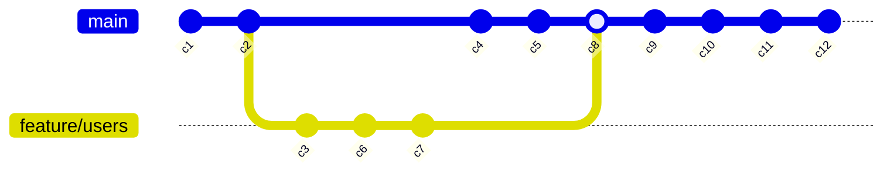

# Lab2: Enumerable, Lambda Expressions, LINQ, Extension Methods

> [!NOTE]
> The lab assignment is divided into two parts.
>
> - The first part concerns extension methods, `Enumerable`, and the `yield` statement.
> - The second part covers LINQ queries and lambda expressions.
>
> These parts are independent of each other and can be completed in any order.

## Commit Graph

The `Repository` class represents a simplified version of a version control system repository. The repository includes the following properties:

- `Objects`: A dictionary of objects, indexed by their hash.
- `Branches`: A dictionary of branches (pointers to objects stored in the repository), indexed by the branch name.
- `HEAD`: A pointer to the current point in the change history where the user is located.
- `Authors`: A dictionary of authors, indexed by their ID.

One of the object types stored in the version control system is a commit. In our simplified model, it has a `ParentHashes` array containing the hashes of its parents. Note that a structure defined this way is not a tree, but a directed graph.

Implement the following extension methods:

- `TryGetCommit`, which has a `hash` parameter and an `out` parameter `commit`. It returns `true` if an object with the given hash is in the repository and is of type `Commit`. Otherwise, it returns `false`.
- `GetCommitOrThrow`, which has a `hash` parameter. If a commit object with the given hash is in the repository, the method returns the commit object, otherwise it throws an exception with message: `$"Commit {hash} not found"`.

Next, implement the following extension methods:

- `TraverseBranchByFirstParent`, which lazily returns a sequence of `Commit` objects by iterating through the first parents, starting from the object with the `startHash` (a method parameter, defaulting to the value of the `HEAD` pointer in the repository).
- `TraverseByRevision`, which works similarly to `TraverseBranchByFirstParent`, but iterates through the `Commit` objects as defined by the `pattern` string.

> [!NOTE]
> To implement the `TraverseByRevision` method, use the provided `Revision` class and its static `Parse` method.
> Familiarize yourself with the model representing a `Revision`. In our simplified model, the pattern will consist of a `BaseRef`, which can be:
>
> - an object hash (e.g., `9ea45df2a43d1df035b20e211ce771785e59e12b`),
> - a branch name (e.g., `master`),
> - or the `HEAD` symbol,
>
> as well as a collection of modifiers denoted by the symbols `~` and `^`.
> These symbols have the following meanings:
>
> - `~N`, where `N` is a positive integer, moves back `N` commits in the history, following the first parents.
> - `^N`, where `N` is a positive integer, moves back one commit to a specific parent, where `N` specifies which parent it is (1-indexed).
>
> Examples:
>
> - `HEAD~` refers to the first parent of the object pointed to by `HEAD` (the same as `HEAD~1`, `HEAD^`, and `HEAD^1`).
> - `HEAD~2` refers to the "grandparent" of the object pointed to by `HEAD`, following the first parent.
> - `HEAD^2` refers to the second parent of the object pointed to by `HEAD`.
>
> The `~` and `^` symbols can be combined, e.g., `HEAD~3^2~^2`.
>
> The `TraverseByRevision` method should operate according to the following steps:
>
> 1. Convert the input string `pattern` into an instance of the `Revision` class.
> 2. Try to find the identifier (hash) corresponding to `BaseRef` in the following order:
>
> - if `BaseRef` matches a branch name – use the hash value that the branch points to,
> - if `BaseRef` is `HEAD` – use the current `HEAD` value of the repository,
> - if `BaseRef` exists as a key in the repository’s objects – treat it as a direct hash value,
> - otherwise – raise an error `Base reference not found`.
>
> 3. Based on the obtained hash, retrieve the corresponding object from the repository and return it as the first element of the result sequence.
>
> 4. For each modifier in the `Modifiers` collection, apply the `Apply` method, iterating and returning subsequent commits from the repository.
>
> 5. In case of errors while retrieving objects, raise an error.

Implement the `IRevisionModifier` interface for `ParentModifier` and `AncestorModifier` to simplify the implementation of `TraverseByRevision`. The `Apply` method uses the repository to lazily return a collection of object hashes according to the semantics of the implementing modifiers.

Report errors in the graph structure (missing parents/ancestors or objects not found) by throwing an exception of your choice with sample messages like:

- `"Commit '{hash}' not found"`
- `"Commit {hash} does not have parent #{index}"`
- `"Commit 'hash' has no parent"`

### Scoring

- `TryGetCommit` and `GetCommitOrThrow` - 1 pt.
- `TraverseBranchByFirstParent` - 1 pt.
- `ParentModifier` and `AncestorModifier` - 0.5 pts each.
- `TraverseByRevision` - 1.5 pts.

## Repository Queries

In this part of the assignment, we want to obtain significant information about our repository:

1.  Which commit had the most changed lines (additions + deletions)?
2.  On average, how many files do individual authors change per commit?
3.  Who is the author of the most commits?
4.  Which commit was the first to add a given file to the repository?
5.  Which files have the most collaborating authors?

> [!NOTE]
> The queries are independent of each other and can be completed in any order.
>
> Details for each query, i.e., the information to be returned and its order, are provided in the XML comments above each method in the `RepositoryQueries` class.
> Additionally, the output of each query for the sample repository is included in the `output.txt` file.

### Scoring

Each query is worth 1.5 pts. You can receive a maximum of 7.5 pts for all queries.

### Sample Repository

The history of the sample repository is shown in the diagram below:

Detailed information about the contents of each commit can be found in the `SampleRepository.cs` file.
