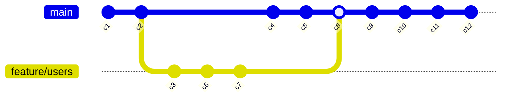

# Lab2: Enumerable, Lambda Expressions, LINQ, Extension Methods

> [!NOTE]
> Zadanie laboratoryjne jest podzielone na dwie części.
>
> - Pierwsza część dotyczy metod rozszerzających, `Enumerable` oraz instrukcji `yield`.
> - Druga część obejmuje zapytania LINQ oraz wyrażenia lambda.
>
> Części te są niezależne od siebie i można je realizować w dowolnej kolejności.

## Commit Graph

Klasa `Repository` reprezentuje uproszczenie repozytorium w systemie kontroli wersji. Repozytorium zawiera następujące właściwości:

- `Objects`: Słownik obiektów, indeksowany ich skrótem (ang. _hash_).
- `Branches`: Słownik gałęzi (wskaźników na obiekt przechowywany w repozytorium), indeksowany nazwą gałęzi.
- `HEAD`: Wskaźnik na moment w historii zmian, w którym obecnie znajduje się użytkownik.
- `Authors`: Słownik autorów, indeksowany ich identyfikatorem.

Jednym z typów obiektów przechowywanych w systemie kontroli wersji jest commit. W naszym uproszczonym modelu posiada on tablicę `ParentHashes`, zawierającą skróty jego rodziców. Zauważ, że tak zdefiniowana struktura nie jest drzewem, lecz grafem skierowanym.

Zaimplementuj metody rozszerzające:

- `TryGetCommit`, która posiada parametr `hash` praz parametr wyjściowy `commit`. Zwraca `true` jeżeli obiekt o danym skrócie znajduje się w repozytorium i reprezentuje obiekt o typie `Commit`. W przeciwnym przypadku zwraca `false`.
- `GetCommitOrThrow`, która posiada parametr `hash`. Jeżeli obiekt o danym skrócie istnieje, to go zwraca, w przeciwnym wypadku rzuca wyjątkiem z wiadomością: `$"Commit {hash} not found"`.

Następnie, zaimplementuj metody rozszerzające:

- `TraverseBranchByFirstParent`, która w sposób leniwy zwraca kolejne obiekty typu `Commit`, iterując po pierwszych rodzicach obiektu początkowego o skrócie `startHash` (parametr metody, o domyślnej równy wartości wskaźnika `HEAD` w repozytorium).
- `TraverseByRevision`, która działa w sposób podobny do `TraverseBranchByFirstParent`, jednak iteruje po kolejnych obiektach typu `Commit` w sposób zdefiniowany przez wzorzec `pattern`.

> [!NOTE]
> Do implementacji metody `TraverseByRevision` wykorzystaj gotową klasę `Revision` i jej statyczną metodę `Parse`.
> Zapoznaj się z modelem reprezentującym `Revision`. W naszym uproszczonym modelu wzorzec będzie składał się z podstawy `BaseRef`, która może być:
>
> - skrótem obiektu (np. `9ea45df2a43d1df035b20e211ce771785e59e12b`),
> - nazwą gałęzi (np. `master`),
> - lub symbolem `HEAD`,
>
> A także kolekcji modyfikatorów oznaczanych symbolami `~` oraz `^`.
> Symbole te mają następujące znaczenie:
>
> - `~N`, gdzie `N` to dodatnia liczba całkowita, powoduje cofnięcie się w historii o `N` commitów, idąc po pierwszych rodzicach.
> - `^N`, gdzie `N` to dodatnia liczba całkowita, powoduje cofnięcie się w historii o jednego rodzica wstecz, przy czym liczba `N` określa, który to jest rodzic (indeksowanie od 1).
>
> Przykłady:
>
> - `HEAD~` jest wskazaniem na pierwszego rodzica obiektu, na który wskazuje `HEAD` (to samo co `HEAD~1` oraz `HEAD^` i `HEAD^1`).
> - `HEAD~2` jest wskazaniem na "dziadka" obiektu, na który wskazuje `HEAD`, idąc po pierwszym rodzicu.
> - `HEAD^2` jest wskazaniem na drugiego rodzica obiektu, na który wskazuje `HEAD`.
>
> Symbole `~` i `^` można łączyć ze sobą, otrzymując np. `HEAD~3^2~^2`.
>
> Metoda `TraverseByRevision` powinna działać zgodnie z następującymi krokami:
>
> 1. Zamień wejściowy ciąg znaków `pattern` na obiekt klasy `Revision`.
> 2. Próbuj znaleźć identyfikator (skrót) odpowiadający `BaseRef` w następującej kolejności:
>
> - jeżeli `BaseRef` odpowiada nazwie gałęzi - użyj wartości skrótu, na którą wskazuje ta gałąź,
> - jeżeli `BaseRef` to `HEAD` - użyj aktualnej wartości `HEAD` repozytorium,
> - jeżeli `BaseRef` występuje jako klucz w obiektach repozytorium - traktuj go jako bezpośrednią wartość skrótu,
> - w przeciwny razie - zgłoś błąd `Base reference not found`.
>
> 3. Na podstawie uzyskanego skrótu pobierze obiekt z repozytorium i zwróć go jako pierwszy element sekwencji wynikowej.
> 4. Dla każdego z modyfikatorów z kolekcji `Modifiers` zastosuj metodę `Apply`, iterując i zwracając kolejne commity z repozytorium.
> 5. W przypadku błędów pobierania obiektów - zgłoś błąd.

Zaimplementuj interfejs `IRevisionModifier` dla `ParentModifier` oraz `AncestorModifier`, aby uprościć implementację `TraverseByRevision`. Metoda `Apply` wykorzystuje repozytorium, aby zwrócić w sposób leniwy kolekcję skrótów obiektów zgodnie z semantyką implementujących ją modyfikatorów.

Błędy w strukturze grafu (brakujący rodzice/przodkowie lub nieznalezione obiekty) zgłoś w postaci wybranego przez siebie wyjątku z przykładowymi wiadomościami:

- `"Commit '{hash}' not found"`,
- `"Commit {hash} does not have parent #{index}"`,
- `"Commit 'hash' has no parent"`.

### Punktacja

- `TryGetCommit` i `GetCommitOrThrow` - 1 pkt.
- `TraverseBranchByFirstParent` - 1 pkt.
- `ParentModifier` i `AncestorModifier` - po 0.5 pkt.
- `TraverseByRevision` - 1.5 pkt.

## Repository Queries

W tej części zadania będziemy chcieli uzyskać istotne informacje na temat naszego repozytorium:

1. Który commit zawierał najwięcej zmienionych linii (dodania + usunięcia).
2. Ile plików średnio zmieniają poszczególni autorzy na commit?
3. Kto jest autorem największej liczby commit'ów?
4. Który commit był pierwszym, który dodawał do repozytorium dany plik?
5. Które pliki mają najwięcej współpracujących ze sobą autorów?

> [!NOTE]
> Zapytania są niezależne od siebie i można je realizować w dowolnej kolejności.
>
> Szczegóły każdego z zapytań tzn. zwracane informacje i ich kolejność zostały umieszczone w komentarzach XML nad poszczególnymi metodami w klasie `RepositoryQueries`.
> Dodatkowo, odpowiedzi poszczególnych zapytań dla przykładowego repozytorium zostały zawarte w pliku `output.txt`.

### Punktacja

Każde z zapytań jest warte 1.5 pkt. Za wszystkie zapytania można zatem otrzymać maksymalnie 7.5 pkt.

### Przykładowe repozytorium

Historię przykładowego repozytorium przedstawia poniższy diagram:

Szczegółowe informacje o zawartości poszczególnych commit'ów znajdują się w pliku `SampleRepository.cs`.
